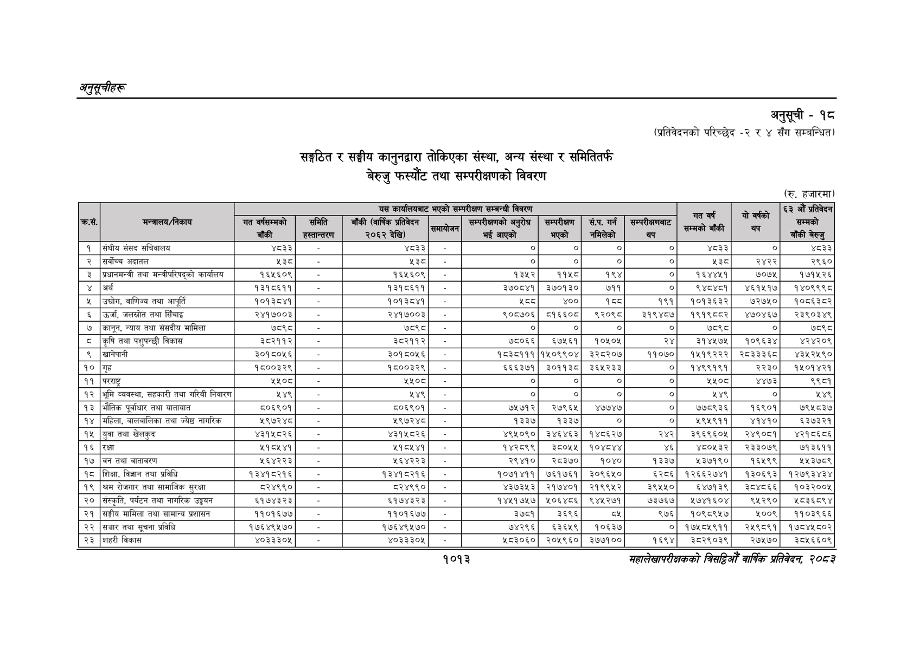

# Page 1075 QA

## Rendered page


## Extracted text

```text
अनुतूचीहरू
सङ्गठित र सङ्घीय कानुनद्वारा तोकिएका संस्था, अन्य संस्था र समितितर्फ बेरुजु फस्यौट तथा सम्परीक्षणको विवरण
अनुसूची -१८
(प्रतिवेदनको परिच्छेद -२ र ४ सँग सम्बन्धित)
(रु. हजारमा)
महालेखापरीक्षकको विडियो वार्षिक प्रतिवेकक २०५३
१०१३

(रु. हजारमा)

| क्रस.    | मन्त्रालय/निकाय                              | यस कार्यालयबाट भएको सम्परीक्षण सम्बन्धी विवरण   | यस कार्यालयबाट भएको सम्परीक्षण सम्बन्धी विवरण   | यस कार्यालयबाट भएको सम्परीक्षण सम्बन्धी विवरण   | यस कार्यालयबाट भएको सम्परीक्षण सम्बन्धी विवरण   | यस कार्यालयबाट भएको सम्परीक्षण सम्बन्धी विवरण   | यस कार्यालयबाट भएको सम्परीक्षण सम्बन्धी विवरण   | यस कार्यालयबाट भएको सम्परीक्षण सम्बन्धी विवरण   | यस कार्यालयबाट भएको सम्परीक्षण सम्बन्धी विवरण   | रात वर्ष 3517   | यो वर्षको तप   | ६३ औं प्रतिवेदन सम्मको   |
|----------|----------------------------------------------|-------------------------------------------------|-------------------------------------------------|-------------------------------------------------|-------------------------------------------------|-------------------------------------------------|-------------------------------------------------|-------------------------------------------------|-------------------------------------------------|-----------------|----------------|--------------------------|
| क्रस.    | मन्त्रालय/निकाय                              | गत वर्षसम्मको बाँकी                             | समिति हस्तान्तरण                                | बाँकी (वार्षिक प्रतिवेदन २०६२ देखि)             | समायोजन                                         | सम्परीक्षणको अनुरोध भई आएको                     | &#124; सम्परीक्षण &#124; भएको                   | सं.प. गर्न &#124; नमिलेको                       | सम्परीक्षणबाट थप                                |                 |                | बाँकी बेरुजु             |
| १        | ।&#124;संघीय संसद सचिवालय                    | ४८३३                                            | । - ]                                           | ४८३३                                            |                                                 | । ०                                             | &#124; ०]                                       | &#124; ०] &#124;                                | ०]                                              | ४८३३ &#124;     | ०]             | ४८३३                     |
| २        | सर्वोच्च अदातल                               | 1                                               | [-                                              | 1                                               | &#124;. &#124;]                                 | [ ०]                                            | ०] [                                            | ०] &#124;                                       | ०]                                              | 1               | २४२२           | २९६०                     |
| ३        | प्रधानमन्त्री तथा मन्त्रीपरिषद्को कार्यालय   | १६५६०९                                          | -                                               | १६५६०९]                                         | - ।                                             | १३५२                                            | [ ११५८                                          | १९४                                             | रा                                              | १६४४५१          | ७०७५           | १७१५२६                   |
| ४        | अर्थ                                         | १३१८६११                                         | लि                                              | १३१८६११                                         | &#124;. ]                                       | ३७०८४१&#124;                                    | ३७०१३०                                          | ७११ &#124;                                      | ०]                                              | ९४८४८१          | ४६१५१७         | १४०९९९८                  |
| ५        | उद्योग, वाणिज्य तथा आपूर्ति                  | १०१३८४१                          
```

## Flags
- table_page
