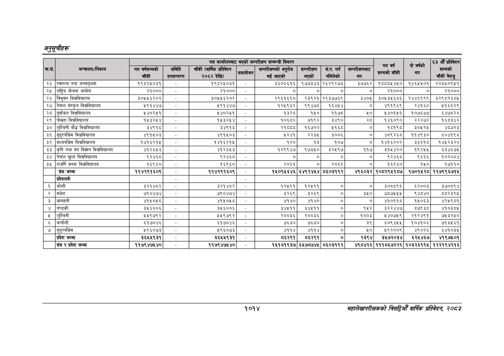

# Page 1076 QA

## Rendered page


## Extracted text

```text
अनुतूचीहरू
१०१४
सहालेखापरीक्षकको वार्षिक प्रतिवेदन २०८२

| क्रस.   | मन्त्रालय/निकाय                         | यस कार्यालयबाट भएको सम्परीक्षण सम्बन्धी विवरण   | यस कार्यालयबाट भएको सम्परीक्षण सम्बन्धी विवरण   | यस कार्यालयबाट भएको सम्परीक्षण सम्बन्धी विवरण   | यस कार्यालयबाट भएको सम्परीक्षण सम्बन्धी विवरण   | यस कार्यालयबाट भएको सम्परीक्षण सम्बन्धी विवरण   | यस कार्यालयबाट भएको सम्परीक्षण सम्बन्धी विवरण   | यस कार्यालयबाट भएको सम्परीक्षण सम्बन्धी विवरण   | यस कार्यालयबाट भएको सम्परीक्षण सम्बन्धी विवरण   | रात वर्ष o A                | यो वर्षको      | &#124; औं प्रतिवेदन सम्मको   |
|---------|-----------------------------------------|-------------------------------------------------|-------------------------------------------------|-------------------------------------------------|-------------------------------------------------|-------------------------------------------------|-------------------------------------------------|-------------------------------------------------|-------------------------------------------------|-----------------------------|----------------|------------------------------|
| क्रस.   | मन्त्रालय/निकाय                         | गत वर्षसम्मको बाँकी                             | समिति हस्तान्तरण                                | बाँकी (वार्षिक प्रतिवेदन २०६२ देखि)             | 58                                              | सम्परीक्षणको अनुरोध &#124; भई आएको              | सम्परीक्षण &#124; भएको                          | सं.प. गर्न                                      | &#124; सम्परीक्षणबाट थप                         |                             | -              | बाँकी बेरुजु                 |
| २४      | &#124;स्वास्थ्य तथा जनसङ्ख्या           | १९८२५०३१ ।                                      | - ]                                             | १९८२५०३१                                        | &#124; - ]                                      | ३६०६६१६&#124;                                   | ९७७३४३&#124;                                    | २६२९२७३                                         | ३७७६२&#124;                                     | १८८८५४५०&#124;              | १४६५५०१&#124;  | २०३५०९५१                     |
| २४५     | [राष्ट्रिय योजना आयोग                   | २१०००]                                          | - ।                                             | २१०००]                                          | -                                               | &#124; ०                                        | ०]                                              | [                                               | ०]                                              | Rq000[                      | ०]             | २१०००                        |
| २६      | &#124;त्रिभुवन विश्वविद्यालय            | ३०५५६२०२]                                       | -                                               | ३०५५६२०२]                                       | - &#124;                                        | २९६१६९०&#124;]                                  |                                                 | २३९२१&#124;२९३७७६९                              | ३४०५&#124;                                      | ३०१३५६८६&#124;              | २४४६९९९&#124;  | ३२९८२६८४५                    |
| २७      | &#124;नेपाल संस्कृत विश्वविद्यालय       | २९१ ४४७ ।                                       | [।-                                             | ५९१४४७                                          | &#124; - &#124;                                 | १२५९३२&#124;                                    | ९९४७८                                           | [                                               | ०]                                              | ४९१९६९                      | २४१६०          | २१६१२९                       |
| २८      | पूर्वाञ्चल विश्वविद्यालय                | २४०२५१                                          | -                                               | ५४०२५१                                          | &#124; - ]     
```

## Flags
- table_page
