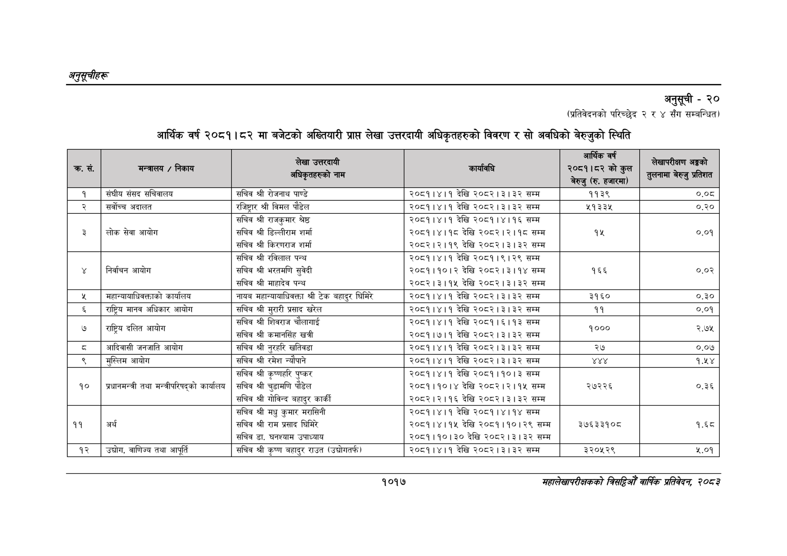

# Page 1079 QA

## Rendered page


## Extracted text

```text
अनुतूचीहरू
अनुसूची -२०
(प्रतिवेदनको परिच्छेद २ र ४ सँग सम्बन्धित)
आर्थिक वर्ष २०८१।८२ मा बजेटको अख्तियारी प्राप्त लेखा उत्तरदायी अधिकृतहरुको विवरण र सो अवधिको बेरुजुको स्थिति
१०१७
सहालेखापरीक्षकको वार्षिक प्रतिवेदन २०८२

|  |  |  |  | लि | . ३. गा |
| --- | --- | --- | --- | --- | --- |
| , र, |  | कलो - ० |  | पा काका कुन | हतार |
| १ | संघीय संसद सचिवालय | सचिव श्री रोजनाथ पाण्डे | २०८१।४।१ देखि २०८२।३।३२ सम्म | ११३९ | ०.०८ |
| २ | सर्वोच्च अदालत | रजिष्ट्रार श्री विमल पौडेल | २०८१।४।१ देखि २०८२।३।३२ सम्म | ५१३३५ | ०.२० |
| ३ | लोक सेवा आयोग | सचिव श्री राजकुमार श्रेष्ठ सचिव श्री डिल्लीराम शर्मा सचिव श्री किरणराज शर्मा | २०८१।४।१ देखि २०८१।४।१६ सम्म २०८१।४।१८ देखि २०८२।२।१८ सम्म २०८२।२।१९ देखि २०८२।३।३२ सम्म | १५ | ०.०१ |
| ४ | निर्वाचन आयोग | सचिव श्री रविलाल पन्थ सचिव श्री भरतमणि सुवेदी सचिव श्री माहादेव पन्थ | २०८१।४।१ देखि २०८१।९।२९ सम्म २०८१।१०।२ देखि २०८२। ३।१४ सम्म २०८२।३।१५ देखि २०८२।३।३२ सम्म | १६६ | ०.०२ |
| ५ | महान्यावबाधिकक्ताको कार्यालय | नायब महान्यायाधिवक्ता श्री टेक बहादुर घिमिरे | २०८१।४।१ देखि २०८२।३।३२ सम्म | ३१६० | ०.३० |
| ६ | राष्ट्रिय मानव अधिकार आयोग | सचिव श्री मुरारी प्रसाद खरेल | २०८१।४।१ देखि २०८२।३।३२ सम्म | ११ | ०.०१ |
| ४ | - राष्ट्रिय दलित आयोग | सचिव श्री शिवराज चौलागाई सचिव श्री कमानसिंह खत्री | २०८१।४।१ देखि २०८१।६।१३ सम्म २०८१।७।१ देखि २०८२।३।३२ सम्म | ९०० |  |
| छ | आदिवासी जनजाति आयोग | सचिव श्री नुरहरि खतिवडा | २०८१।४।१ देखि २०८२।३।३२ सम्म | २७ | ०.०७ |
| ९ | मुस्लिम आयोग | सचिव श्री रमेश न्यौपाने | २०८१।४।१ देखि २०८२।३।३२ सम्म | १४४१ | १.५४ |
| १० | प्रधानमन्त्री तथा मन्त्रीपरिषद्को कार्यालय | सचिव श्री कृष्णहरि पुष्कर सचिव श्री चुडामणि पौडेल सचिव श्री गोविन्द बहादुर कार्की | २०८१।४।१ देखि २०८१।१०।३ सम्म २०८१।१०।४ देखि २०८२।२।१५ सम्म २०८२।२।१६ देखि २०८२।३।३२ सम्म | २७२२६ | ०.३६ |
| ११ | अर्थ | सचिव श्री मधु कुमार मरासिनी सचिव श्री राम प्रसाद घिमिरे सचिव डा. घनश्याम उपाध्याय | २०८१।४।१ देखि २०८१।४।१४ सम्म २०८१।४।१५ देखि २०८१।१०।२९ सम्म २०८१।१०।३० देखि २०८२।३।३२ सम्म | ३७६३३१०८ | १.६८ |
| १२ | उच्चोग, वाणिज्य तथा आपूर्ति | सचिव श्री कृष्ण बहादुर राउत (उद्योगतर्फ) | २०८१।४।१ देखि २०८२।३।३२ सम्म | ३२०५२९ | ५.०१ |
```

## Flags
- table_page
- medium_quality_table
