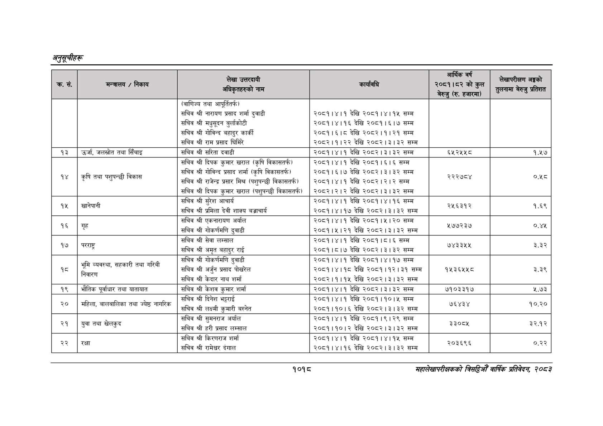

# Page 1080 QA

## Rendered page


## Extracted text

```text
अनुतूचीहरू
१०१८
महालेखापरीक्षकको बितहिओँ वार्षिक प्रतिवेदन २०८२

| रु | (७ जाए | र [र (बाणिज्य तथा आपूर्तितर्फ) सचिव श्री नारायण प्रसाद शर्मा दुवाडी सचिव श्री मधुसूदन बुर्लाकोटी सचिव श्री गोविन्द बहादुर कार्की सचिव श्री राम प्रसाद घिमिरे | आफ ३ २०८१।४।१ देखि २०८१।४।१५ सम्म २०८१।४।१६ देखि २०८१।६।७ सम्म २०८१।६।८ देखि २०८२।१।२१ सम्म २०८२।१।२२ देखि २०८२।३।३२ सम्म | प२७ा छ त कुल बेरुजु (रु, हजारमा, |  |
| --- | --- | --- | --- | --- | --- |
| १३ | उर्जा, जलस्रोत तथा सिँचाइ | सचिव श्री सरिता दवाडी | २०८१।४।१ देखि २०८२।३।३२ सम्म | ६५२४५४५८ | १.५७ |
| १४ | पशुपन्छी कृषि तया पशुपन्छी बिकास | सचिव श्री दिपक कुमार खराल (कृषि विकासतर्फ) सचिव श्री गोविन्द प्रसाद शर्मा (कृषि विकासतर्फ) सचिव श्री राजेन्द्र प्रसार मिश्र (पशुपन्छी विकासतर्फ। सचिव श्री दिपक कुमार खराल (पशुपन्छी विकासतर्फी | २०८१।४।१ देखि २०८१।६।६ सम्म २०८१।६।७ देखि २०८२।३।३२ सम्म २०८१।४।१ देखि २०८२।२।२ सम्म २०८२।२।२ देखि २०८२।३।३२ सम्म | २े२२७८४ | ४ |
| पेश | खानेपानी छा | सचिव श्री सुरेश आचार्य = डेवी सचिव श्री प्रमिला देवी शाक्य बज्राचार्य | २०८१।४।१ देखि २०८१।४।१६ सम्म देखि २०८१।४।१७ देखि २०८२।३।३२ सम्म | २ २४६३१२ | . न |
| १६ | गृह | सचिव श्री एकनारायण अर्याल सचिव श्री गोकर्णमणि दुवाडी | २०८१।४।१ देखि २०८१।५।२० सम्म २०८१।४५।२१ देखि २०८२।३।३२ सम्म | ५७७२३७ | ०.४५. |
| ७ १ | परराष्ट्र | सचिव श्री सेवा लम्साल सचिव श्री अमृत बहादुर राई | २०८१।४।१ देखि २०८१।८।६ सम्म २०८१।८।७ देखि २०८२।३।३२ सम्म | ७ ४३४४ | . ड्र |
| १८ | भूमि व्यवस्था, सहकारी तथा गरिबी निवारण | सचिव श्री गोकर्णमणि दुवाडी हा सचिव श्री अर्जुन प्रसाद पोखरेल सचिव श्री केदार नाथ शर्मा | २०८१।४।१ देखि २०८१।४।१७ सम्म देखि २०८१।४।१८ देखि २०८१।१२।३१ सम्म देखि २०८२।१।१५ देखि २०८२।३।३२ सम्म | १५३६५४५८ | ३.३९ |
| १९ | भौतिक पूर्वाधार तथा यातायात | सचिव श्री केशव कुमार शर्मा | २०८१।४।१ देखि २०८२।३।३२ सम्म | ७१०३३१७ | ५.७३ |
| २० | - महिला, बालबालिका तथा ज्येष्ठ नागरिक | सचिव श्री दिनेश भट्टराई सचिव श्री लक्ष्मी कुमारी बस्नेत | २०८१।४।१ देखि २०८१।१०।५ सम्म २०८१।१०।६ देखि २०८२।३।३२ सम्म |  |  |
| २१ | युबा तथा खेलकुद ३ | सचिव श्री सुमनराज अर्याल सचिव श्री हरी प्रसाद लम्साल | २०८१।४।१ देखि २०८१।९।२९ सम्म २०८१।१०।२ देखि २०८२।३।३२ सम्म | ३३०८५ | इ२.१२: |
| २२ | क्षा स | सचिव श्री किरणराज शर्मा. सचिव श्री रामेश्वर दंगाल | २०८१।४।१ देखि २०८१।४।१५ सम्म देखि २०८१।४।१६ देखि २०८२।३।३२ सम्म | ० २०३६९६ | ०. २२ |
```

## Flags
- table_page
- medium_quality_table
