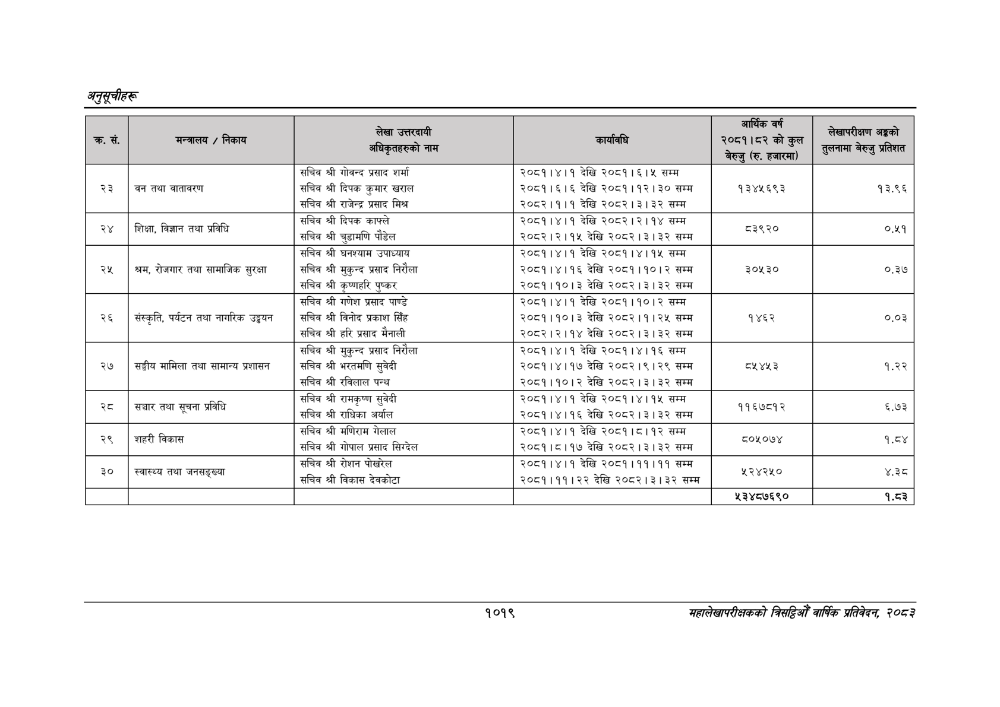

# Page 1081 QA

## Rendered page


## Extracted text

```text
अनुतूचीहरू
१०१९
महालेखापरीक्षकको बितहिओँ वार्षिक प्रतिवेदन २०८२

| नङ रु | तकाथ |  |  | कुन बेरुजु (रु, | ३ १ १ २ ० ० ३६४ ९० ६३८ १९ -१ ४ १ १ २ १ ० ३६४ ९० ६३८ १९ -१ ५ १ १ २ १ १ ३६४ ९० ३६ १७ ७९.२२८०८१ सचिव ५ १ १ २ १ २ ४०८ ९१ १६ १६ ९३.३०४३२९ श्री ५ १ १ २ १ ३ ४३१ ९० ४१ १७ ८९.७४६०९४ गोवन्द ५ १ १ २ १ ४ ४७९ ९६ ३४ ११ ९४.१२७३८८ प्रसाद ५ १ १ २ १ ५ ५२० ९१ २८ १६ ९६.७२५६७० शर्मा ५ १ १ २ १ ६ ७३५ ९४ ९० १५ ८१.५५०१७९ २०८१।४।१ ५ १ १ २ १ ७ ८३६ ९० २७ १७ ९३.२५६९६६ देखि ५ १ १ २ १ ८ ८८३ ९५ ४१ १४ ८८.६६०५९१ २०८१। ५ १ १ २ १ ९ ९३२ ९५ ३१ १३ ६९.०१५१५२ ६१५ ५ १ १ २ १ १० ९७२ ९६ ३० ११ ९६.२९२९१५ सम्म ३ १ १ ३ ० ० २९ ११७ १३५५ ७३ -१ ४ १ १ ३ १ ० २९ ११७ १३५५ २२ -१ ५ १ १ ३ १ १ २९ १२१ १९ १४ ९५.९९२४७७ २३ ५ १ १ ३ १ २ ८५ १२२ २१ १२ ९५.९९२४७७ वन ५ १ १ ३ १ ३ ११३ १२२ २५ १२ ९६.२८६८५८ तथा ५ १ १ ३ १ ४ १४५ १२२ ५७ १२ ९५.६६०१३३ वातावरण ५ १ १ ३ १ ५ ३६४ ११७ ३६ १७ ८८.११३५७९ सचिव ५ १ १ ३ १ ६ ४०८ ११८ १६ १६ ९६.३५८१७० श्री ५ १ १ ३ १ ७ ४३१ ११७ ३७ १७ ९६.४३१४४२ दिपक ५ १ १ ३ १ ८ ४७४ १२२ ३८ १७ ८९.११९३९२ कुमार ५ १ १ ३ १ ९ ५१८ १२२ ३८ १२ ९६.९२७५०५ खराल ५ १ १ ३ १ १० ७३५ १२१ ९१ १४ ६३.६५४९३४ २०८१।६।६ ५ १ १ ३ १ ११ ८३६ ११७ २७ १७ ९३.२४२०४३ देखि ५ १ १ ३ १ १२ ८८३ १२१ १०४ १४ ८५.९१९९०७ २०८१।१२।३० ५ १ १ ३ १ १३ ९९५ १२२ ३० १२ ९६.३६५५७८ सम्म ५ १ १ ३ १ १४ ११०२ १२१ ७८ १४ ८६.३७७६३२ १३४५६९३ ५ १ १ ३ १ १५ १३३७ १२१ ४७ १४ ९३.०३२३१० १३.९६ ४ १ १ ३ २ ० ३६४ १४४ ६५० १८ -१ ५ १ १ ३ २ १ ३६४ १४४ ३६ १६ ८९.७७४६५८ सचिव ५ १ १ ३ २ २ ४०८ १४४ १६ १६ ९२.८८५९७९ श्री ५ १ १ ३ २ ३ ४३१ १४४ ४० १७ ९१.४७५०९० राजेन्द्र ५ १ १ ३ २ ४ ४७८ १४९ ३४ १२ ९६.१२३०५५ प्रसाद ५ १ १ ३ २ ५ ५१९ १४४ २७ १६ ६७.१९१४७५ मिश्र ५ १ १ ३ २ ६ ७३५ १४८ ९० १४ ८६.८६६९३६ २०८२।१।१ ५ १ १ ३ २ ७ ८३६ १४४ २७ १७ ९२.८७०५२९ देखि ५ १ १ ३ २ ८ ८८३ १४८ ९१ १३ ८८.४७४६१७ २०८२।३।३२ ५ १ १ ३ २ ९ ९८४ १४९ ३० ११ ९५.८९८२३९ सम्म ४ १ १ ३ ३ ० ३६४ १७२ ६५० १८ -१ ५ १ १ ३ ३ १ ३६४ १७२ ३६ १६ ८८.४६०४७२ सचिव ५ १ १ ३ ३ २ ४०८ १७२ १६ १६ ९६.१९७२८१ श्री ५ १ १ ३ ३ ३ ४३१ १७२ ३६ १७ ९६.२५८६६७ दिपक ५ १ १ ३ ३ ४ ४७४ १७२ ४१ १६ ९६.४९८०३९ काफ्ले ५ १ १ ३ ३ ५ ७३५ १७६ ९० १४ ८२.९५४७८१ २०८१।४।१ ५ १ १ ३ ३ ६ ८३५ १७२ २८ १७ ९५.९७२३४३ देखि ५ १ १ ३ ३ ७ ८८३ १७६ ३१ १३ ६.८१२१२४ २०८२ ५ १ १ ३ ३ ८ ९२३ १७७ १ १२ ६.८१२१२४। ५ १ १ ३ ३ ९ ९३१ १७६ ४५ १४ १७.३१०४७६ २११४ ५ १ १ ३ ३ १० ९८४ १७७ ३० ११ ९६.१८३७६२ सम्म ३ १ १ ४ ० ० २९ १८५ १३५४ ६० -१ ४ १ १ ४ १ ० २९ १८५ १३५४ ३६ -१ ५ १ १ ४ १ १ २९ १८९ २१ १३ ७३.८७२४९० रेष्ट ५ १ १ ४ १ २ ८५ १८५ ३७ १८ ९४.७९५१३५ शिक्षा, ५ १ १ ४ १ ३ १३० १८५ ३८ १७ ८५.११०४४३ विज्ञान ५ १ १ ४ १ ४ १७६ १९० २५ १२ ८५.११०४४३ तथा ५ १ १ ४ १ ५ २०८ १८५ ३७ १७ ७४.१३४२३२ प्रविधि ५ १ १ ४ १ ६ ३६४ १९८ ३६ १७ ८७.०१०७८८ सचिव ५ १ १ ४ १ ७ ४०८ १९९ १६ १६ ९६.५०२९२२ श्री ५ १ १ ४ १ ८ ४३१ १९८ ५२ २३ ९३.७२१७३३ चुडामणि ५ १ १ ४ १ ९ ४८९ १९७ ३७ १८ ९६.६७३५६१ पौडेल ५ १ १ ४ १ १० ७३५ २०२ १०४ १५ ७८.७९०३४४ २०८२।२।१५ ५ १ १ ४ १ ११ ८४७ १९८ २८ १७ ९३.२५२८१५ देखि ५ १ १ ४ १ १२ ८९५ २०३ ९१ १३ ८५.८४९८१५ २०८२।३।३२ ५ १ १ ४ १ १३ ९९५ २०४ ३० ११ ९६.३५३३१० सम्म ५ १ १ ४ १ १४ १११४ १८९ ५५ १४ ०.०००००० ३५२० ५ १ १ ४ १ १५ १३४८ १८९ ३५ १४ ३३.६५६४९४ ४ ४ १ १ ४ २ ० ३६४ २२६ ६५० १९ -१ ५ १ १ ४ २ १ ३६४ २२६ ३६ १७ ४८.२५९५४८ सचिव ५ १ १ ४ २ २ ४०८ २२७ १६ १६ ९५.६९६७०९ श्री ५ १ १ ४ २ ३ ४३१ २३२ ५५ ११ ९६.३६३०५२ घनश्याम ५ १ १ ४ २ ४ ४९२ २३२ ५७ ११ ९५.६६६७७९ उपाध्याय ५ १ १ ४ २ ५ ७३५ २३० ९० १५ ७९.९८५३६७ २०८१।४।१ ५ १ १ ४ २ ६ ८३६ २२६ २७ १७ ९३.२२९९८८ देखि ५ १ १ ४ २ ७ ८८३ २३० ९२ १५ ८४.३८३१३३ २०८१।४।१५ ५ १ १ ४ २ ८ ९८४ २३२ ३० ११ ९५.९३७३३२ सम्म ३ १ १ ५ ० ० २९ २५२ १३५७ ७५ -१ ४ १ १ ५ १ ० २९ २५२ १३५७ २३ -१ ५ १ १ ५ १ १ २९ २५८ २० १३ ९६.३३४५७९ २५ ५ १ १ ५ १ २ ८७ २५९ २५ १३ ८९.३०५९०१ श्रम, ५ १ १ ५ १ ३ १२० २५४ ४६ १७ ९६.११०६४१ रोजगार ५ १ १ ५ १ ४ १७३ २५९ २६ ११ ९७.००३८८३ तथा ५ १ १ ५ १ ५ २०५ २५४ ६० १६ ९६.९८३००२ सामाजिक ५ १ १ ५ १ ६ २७१ २५९ ३७ १६ ९६.८२९३०८ सुरक्षा ५ १ १ ५ १ ७ ३६४ २५४ ३६ १६ ८८.२१८१४७ सचिव ५ १ १ ५ १ ८ ४०८ २५४ १६ १६ ९२.१३८२९८ श्री ५ १ १ ५ १ ९ ४३१ २५९ ४१ १६ ९६.२२०४९७ मुकुन्द ५ १ १ ५ १ १० ४७९ २५९ ३४ १२ ९५.८२७७८२ प्रसाद ५ १ १ ५ १ ११ ५२० २५२ ४२ १९ ९६.६६८६४० निरौला ५ १ १ ५ १ १२ ७३५ २५८ १०३ १४ ९०.८६६४०९ २०८१।४।१६ ५ १ १ ५ १ १३ ८४७ २५४ २८ १७ ९३.१९२९१७ देखि ५ १ १ ५ १ १४ ८९५ २५८ ९० १४ ८३.४७६०६७ २०८१।१०।२ ५ १ १ ५ १ १५ ९९५ २५९ ३० ११ ९६.४१४२१५ सम्म ५ १ १ ५ १ १६ १११४ २५८ ५५ १३ ९२.४०९५७६ ३०४३० ५ १ १ ५ १ १७ १३४८ २५८ ३८ १३ ९१.९३९१९४ ०.३७ ४ १ १ ५ २ 
```

## Flags
- table_page
- low_quality_table
