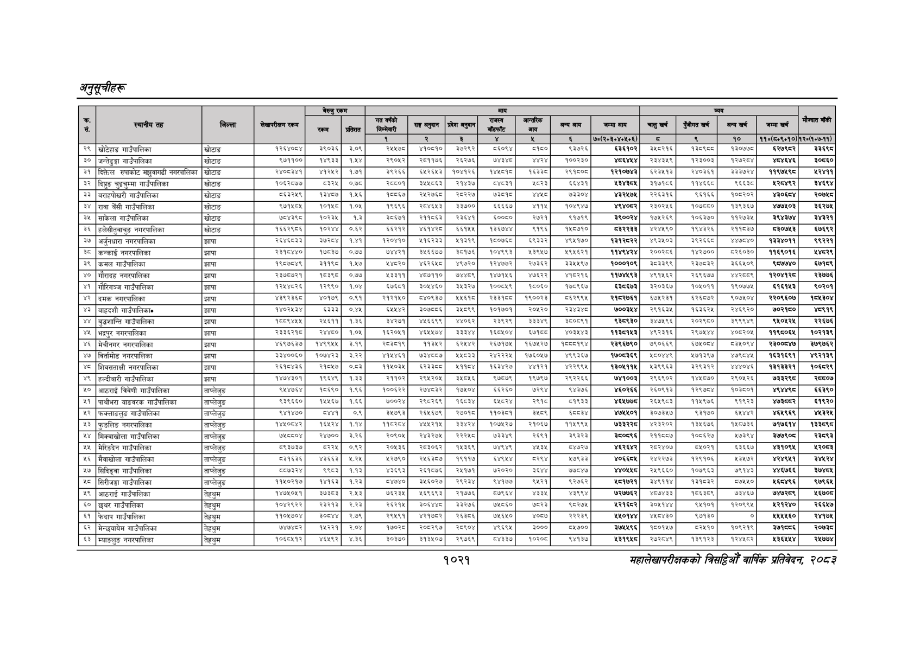

# Page 1083 QA

## Rendered page


## Extracted text

```text
अनुतूचीहरू
सहालेखापरीक्षकको वार्षिक प्रतिवेदन २०८२

|  |  |  |  | बैरुए | रकम |  |  |  |  |  |  |  |  |  |  |  |  |
| --- | --- | --- | --- | --- | --- | --- | --- | --- | --- | --- | --- | --- | --- | --- | --- | --- | --- |
| । |  |  |  |  |  |  | नय |  | ११ | १ | लन | खन | चन | अनन | लन |  |  |
|  |  |  |  |  |  | १ | र | ३ |  | ४ |  | ७०(२०३०४०४०६) | छ | ९ | १० | ११०(८०१०१०) | १२०७०७-११) |
| २९ | खोटेहाङ गाउँपालिका | 'खोटाङ | १२६४०८४ | इ९०३६ | ३.०९ | २५४७८ | ४१०८१० | ३७२९२ | ५६०९४ | ५१८० | ९३७२६ | ६३६१०२ | ३:०२१६ | पइड९्ध। | १३०७७८ | ६२७९८र | इइ६९८ |
| ३० | जन्तेढुङ्गा गाउँपालिका | 'खोटाउ | ९७११०० | १४९३३ | १,४५४ | २९०६२ | २८११७६ | २६२७६\| | ७४३४८ | २४ | १००२३० | भव | २३४३५९ | १२३००३ | १२७२८४ |  | ३०५६० |
| ३१ | दिक्तेल रुपाकोट मुवागदी नगरपालिका | खोटाङ | रहण्य४१ |  | १७१ | २६६ | ब२६४३ | प०४१२६। | पहाड | बढ |  | ब२१०७४३ | ब२३७१३ | र४०३६१ | उइब७र४ | ९७४६ | २७११ |
| ३२ | दिपङ चुझ्चुम्मा गाउँपालिका | खोटाङ | बठइस७७ | इन | ० | २००० | बल | स४७। | मान | बब | ६१ | पारा | २१७० |  | ९६६३ |  |  |
| ३३ | बराहपोखरी गाउँपालिका | 'खोटाङ | ५६३२४५९ |  | १४६ | १५५६७ | २४२७६८। | २८२२७\| | ७३८१८ |  | ७३३०४ | ४३२५७४५ | २२६३१६ | ९१६६ | १०६२०२ | ४३०६८४ | २०७५८ |
| ३४ | रावा बैँसी गाउँपालिका | 'खोटाङ | ९७१५०४५ | १०१४५८ | १.०४५ | १९६९६ | २८४६४३। | ३३५०० | ६६६६७ | ४११५ | १०४९४७. | ४९४०६२ | २३०२४५६ | १०७६८५० | १३९३६७ | ४७७५०३ | ३६२७४५ |
| ३५ | साकेला गाउँपालिका | 'खोटाङ | ७०४३९८ | १०२३५ | १.३ |  | २११८६३ | २३६४१ | ००६० | २७२१ | २१७१९ | ३९००२४ | १७५२६९ | १०६३७० | ११२७३५ |  | ३४३२१ |
| ३६ | हलेसीतुवाचुङ नगरपालिका | खोटाङ | पदरदय | कलर | ०७:६२ | इइ२पर | अपर्ण | ६१४४) | प३६७४४ | १९६ | ०७१० |  | ४२४४९० | ९३२६ | र२९१०३७ | बइन्छइ | ०६९२ |
| ३७ | अर्जुनधारा नगरपालिका | झापा | २६४६०३३ | बेड२०४ | १४१ | ब२०७१० | ६२३३ | २१३९ |  | इ९३३२ | ४९४१७० |  | ४९३४०३ |  | ४४७०४० | बढब४०११ | द९२२१ |
|  | कन्काई नगरपालिका | झापा | २३१०४४० | ७०३७ | ०७७ | ड४२१ | २४६६७७ | ३०१७६ | १०४६९३ | ४३९४५७ | ४९४६इ२१ | पपदशरश | र००२०६ | ब४२७०० | ड२६०३० | ११६९०१६ | ४६२९ |
| ३९ | कमल गाउँपालिका | झापा | प९छउयई४ |  |  |  | ४६२६४८। | ४९७२०\| | १२४७७२ | र२७३६२ | ३३४५९७ | १०००१०९ | ३८३३९९ | २३७८३२ | ३६६४०९ | ९८७७४० | ६७१८९ |
| ४० | गौरादह नगरपालिका | झापा | २३७८७२१ | १३९८ | ०७४ | ३३११ | ४८७११०। | ७४४९ | १४७१५६ | ४७६२२ | ४१८२१६ | ११७४६९३ | ४९१५६२ | २६९६६७७ |  | ब२०४१२८ | र२३७७६ |
| ४१ | गौरिगञ्ज गाउँपालिका | झापा | १२४५४८२६ | १२६६० | १.०४ | ६७६८१ | इ३०४४६० | इ४३२७। | १००८१९ | १०६० | १७८९६७ | ६३८६७३ | ३२०३६७ | १०५०११ | १९०७७५ | ६१६१५३ | ९०२०१ |
| ४२ | दमक नगरपालिका | झापा | ४३९२३६४ | ४०१५९ | ०.९१ | २१२१५० | ८४०९३७ |  | ३ | १९००२३ | ५६२९९५ | २१८२७६१ | ६०५२३१ | ६२६८७२ | ९०७५०४ | २२०९६०७ | १५४३०४ |
| ४३ | बाहदशी गाउँपालिकान | झापा | १४०२४३४ | ६३३३ | ०,४४५ | ६५४४२ | ३०७८८६ | ३५८९९ | १०१७०१ | र२०४२० | २३४३४८ | ७००३४४ | २९१६३५ | १६३६२५ | र२४६६२० | ७०२१८० | ४८९१९ |
| ४४ | बुद्धशान्ति गाउँपालिका | झापा | १०८९४४५५ | २५६११ | १.३६ | इ४२७१ | ४५६६९९ | ४४०६२ | २३९२९ | इइइ४९ | ३८०८९१ | ९३६९३० | ३४७५९६ | २०२९८० | इ९९९४९ | ९५०५२४५ | २२६७६ |
| ४५ | भ्रपुर नगरपालिका | झापा |  |  | १८०४ | ब६२०४१ | पाङ | ३ | १६७४०४ | इला | अल |  | ४९२३१६ | र२९७४४४ | ०७२० | ब११७०६८ | ०१३९ |
| ४६ | ेचीनगर नगरपालिका | झापा | ४६९७६३७ | क४९४४ | १% |  | १३४२ | ६२४४२। | २६७१७४५ | १६७४२७ |  | र३९६७९० | ७९०६६९ | इ७४०७४ | ३०९४ | र३००५४७ | इ३७९७६२ |
| ४७ | विर्तामोड नगरपालिका | झापा | ३३४००६० | १०७४२३ | ३.२२ | ४१५४६१ |  | १४८३३\| | २४२२२५ | १७६०४७ | ४९९३६७ | १७०८३६९ | ८०४४९ | २८१३६७ | ४७९०४५ | १६३१६९१ | ४९२१३९ |
| ४८ | शिवसताक्षी नगरपालिका | झापा | २६१८४३६ | २१८४७ | ०.८३ | ११४५०३५ | बरइइछ्ङछ | ११०४ | १६३४२७ | ४४१२१ | ४२२९९४५ | १३०५११५ | ५३९९६३ | ३२९३१२ | ४४४०४६ | १३१३३२१ | १०६८२९ |
| ४९ | हल्दीबारी गाउँपालिका | झापा | १४७४३०१ | १९६४९ | १३३ | २११०२ | २९४२०५ | ३४८४५६ | ९८७५ | १९७९६७ | २९२२६६ | ७४१००३ | २९६९०२ | १४५८७० | र२९०५२६ | ७३३र९्ड | २८०७ |
| ५० | आठराई बिवेणी गाउँपालिका | ताप्लेजुङ | ९४५४७६४ | ८६९० | १९६ | १००६२२ | २७४८३२ | १७५०४ | इ६२६० | ७२९४ | ९४३७६ | ४६०२६६ | २६०६१३ | ब२९७८७४ | १०३६८०१ | इद | ६६३९० |
| ४१ | पाथीभरा याङवरक गाउँपालिका | ताप्लेजुङ | द३९६६० | ५४६७ | १६६ | ७००२४ | रब८२६९ | बहयइ४। | बाडर/श | २९१७ | ब१९३३ |  | २६५९०३ | ११४९७
```

## Flags
- table_page
- medium_quality_table
