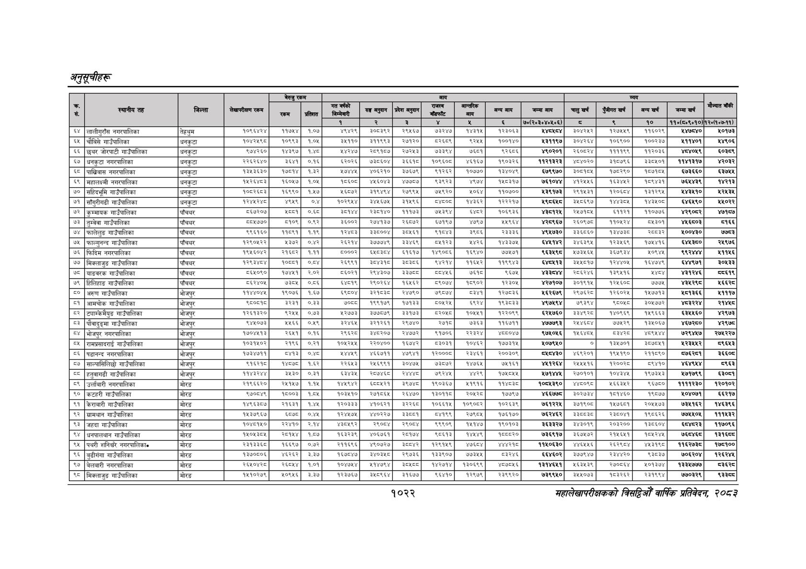

# Page 1084 QA

## Rendered page


## Extracted text

```text
अनुतूचीहरू
१०२२
सहालेखापरीक्षकको वार्षिक प्रतिवेदन २०८२

|  |  |  |  | बैरुए | रकम |  |  |  |  |  |  |  |  |  |  |  |  |
| --- | --- | --- | --- | --- | --- | --- | --- | --- | --- | --- | --- | --- | --- | --- | --- | --- | --- |
|  |  |  |  | ला |  |  | नल | लका | १ | पा | भन | लन | चन |  | नन | खन | ।' |
|  |  |  |  |  |  | १ | रे | ३ |  | ४ |  | ७०(२०३०४०४६०६) | छ | ९ | १० | १०(६०६०१०) | १२०७०७-११). |
| ५४ | लालीगुराँस नगरपालिका | तेहयुम | १०९६४२४ | ११७४४ | १:०७ | अ्हर९ | ३०८३९२)\| | २९४६७ |  |  |  | अक्क | ३०४२५२ | । १२७५४९ | ११६०२९ | ७५४० | ०१७३ |
| ६५ | चौबिसे गाउँपालिका | धनकुटा |  |  | १०६ | इ१० | इ१९९३ | २१२०] | डड |  | ब००१४० | ४१९७ |  | १०३९०० | ब००२३७ | अक | २९०६ |
| ६६ | छुयर जोरपाटी गाउँपालिका | धनकुटा | द७४२६० | ४३९७ | पट | पर | र८९१०७। | २७२४३\| | ३३९४ | ७६०१ |  | ४९०२०१ | र६०७२४ | प१११९९ | २०३६ | भ्ा०९ | ह०इ९, |
| ६७ | धनकुटा नगरपालिका | धनकुटा | २२६२६४० | ३६४१ | ०.१६ | ६२०२६ | छइड६०४ | ३६६१ | १०९६०७ | ६१६७ | १९०३२६ | ब१२१३२३ | ४०४०२० | ३१७७६६ | इ३०५०१ | ११४१३१७ |  |
| ६८ | पाखिवास नगरपालिका | धनकुटा | १३४३६३० | ७०१४ | ४३ | ७४४६ | ४०६२१०। | ३७६७९\| | १२६२ | ०७७० | १३४०४६ | ६७९९७० | इ००१०४ | ७०२६० | ०७१७ | ६७३६६० | ३७५४ |
| ६९ | महालक्ष्मी नगरपालिका | धनकुटा | कस्न | ब६०६७ | १०४ | कन | भाइलाइ |  | इद | पा | कल | जलमा | अचाइ | पल | कन्या | ७९ | कार |
| ० | सहिदभूमि गाउँपालिका | धनकुटा | ब०६२६८३ | ६९६० | १४७ | ६०७२ | ३१९४९४ | २७९९४। | ७९२० | ४०६४ | ११०७०० |  | २९१४३१ | ब२०६७४ | ३१२९ |  | १२३८ |
| ७१ | साँगुरीगढी गाउँपालिका | धनकुटा | बरश्रश्ध |  | ०४ | कलर | बइ७५ | २४९६ | पादन |  | १२२२१७ |  | ३५०६९७ | पाइला | १३६० | धाइ९० | २५०२२ |
| ७२ | गाउँपालिका | पाँचथर |  | अच्य | ७६ | इला |  | ११७३ |  | बन | १०६९३६ |  |  | ६१२१ | ११०७३६ |  | ७१५७ |
| ७३ | तुम्वेवा गाउँपालिका | पाँचथर | छ५७७० | ०१०९ | ०९२ | इ६००२ | २७४१३७। | २६७७२। | ६१९७ | ७९७ | ४९६४ |  | २६०६७० | ०६२४ | ०३०१ | शनक | ब१६६ |
|  | फालेलुङ गाउँपालिका | पौँचवर | द९६१६० | बक |  |  | इ३०००४) |  |  | ३९५६ | र३३३६ | ४९५७३० | इ३६०६० | बढाउन |  | ४००७३० | ७७५३ |
| ७५ | फाल्गुनन्द गाउँपालिका | पाँचथर | १२९०४६२२ | ४३७२ | ०४२ | २६२४ | २३७७७४९। | ३३४६९\| | बा१२३ | १४२६ | १४३३७४ |  |  | प२३४६९ | प७४७१६ | बइ० | २९७६ |
| ७६ | फिदिम नगरपालिका | पाँचथर | १९५६०४२ | २१६२ | १.११ | ©०००% |  | ६१६१७ | १४६९०८६ | १६९४० | ७७५७१ | ९६३५९८ | २७३५६४५ | ३६७९३४ | ४०९४४ |  | २९९४८ |
| ७७ | मिक्लाजुङ गाउँपालिका | पाँचथर | बेरहय | बम्च्] | ० |  |  |  |  | १४६२ |  |  | ३४०४०१७ | ब२४४७०५ |  |  | ३०३३ |
| ७८ | याङवरक गाउँपालिका | पाँचथर | ५६५०९० | १७४५१ | २.०२ | ८६०२१ | २९४३०७। | ३३७८ | ५८४५६ | ७६१८ | ९६७५ | ४इ्३्कशट | २८०६२४६ | १३९४१६ |  | ४३१२४६ | ५६१९ |
| ७९ | हिलिहाङ गाउँपालिका | पाँचथर | ८६२४०४५ | ७३८५ | ०.८६ | ६४१९ | २९०२६४) | ६५६२, | ९०७४ | १९०२ | १२३०५ | ४२७१०७ | ३०१९१४५ | १२५६०८ | ७७७५ | ४३४२९६ | ६६२८ |
| ५० | अरुण गाउँपालिका | भोजपुर | ११४४०४६ | १९०७६ | १.६७ | ६९८०४ |  | २४७९०। | ७९७४ |  | १२७८३६ | ४६२६७९ | २९७६२८ | १२६०२४ | ब४७७१३ | १३६६ | १११७ |
| ५१ | आमचोक गाउँपालिका | भोजपुर |  | ३२३१ |  |  | ९९१७) | प७१३३\| | ०२६ | हद | ब९३ट३इ | ४९७४९४ | ७९३९४ | ब००५८ | इ०७७७२ | भ्यरर/ | र१४७६ |
| ८२ | टाम्केमैयुङ गाउँपालिका | भोजपुर | ब२६१३२० | ९२४५ | ०७३ | २७७३ | ३७७०७९ | ३३१७३। | ८२०४ | ०७७१ | १२२०१९ | ६२४७६० |  | प४०९६९ | प४९६६३ | ६३६० | २९७३ |
| =२ | पोवादुङ्मा गाउँपालिका | ओजपुर | द४४०७३ | ३४६६ | ०४९ |  |  | २९७४०। | र७१५ | ७३६३ | ११६७११ | ४७७७९३ | र४४६०४ | ७७२९ | १३५०६७७ | ४६७२८० | ४२९७ |
| ५४ | भोजपुर नगरपालिका | भोजपुर | १७०७७१३ | २६५१ | ०.१६ | २९६२८ | ३४८२०७। | २४७७२। | ९१०६ | र्रइ२र४ |  | ९७४०६६ | १५६४०५ | दइहरू | ध९४४ | ७२९७ | २७१२२७ |
| ५४ | रामप्रसादराई गाउँपालिका | भोजपुर | १०३१५०२ | २१९६ | ०२१ | ब०६२४४ | र२२०४००। | ६७४२] | ३०३१ | ०४६२ | क७७३१४ | १०७९४० | ० | १३४७०१ | ०७०१ | २३८६ | ब९६४३ |
| ५६ | पढडानन्द नगरपालिका | ओजपुर | १७३४७११ | ४१३ | ०४८ | २४५९ | ४७११ | ४७९४१\| | २००० | र३४६१ | र२००३०९ |  | ४६९२०१ | १९५१९० | २११७६० | बइर्१ | ३६६० |
| ५७ | साल्पासिलिछो गाउँपालिका | भोजपुर | ९१६२१८ |  | १.६२ | २२६४६३ | २५६९९१ | ३०४७५ | ७३८७२ | १४७६४५ | ७५१६१ | ४५१२६४ | २५४५४५१६ | १२००२८ | ८९४१० | ४६४९४५४ | ८९६३ |
| छ | हतुवागदी गाउँपालिका | ओजपुर | क४इरश | ३४३० | ३ | बक | रछ | २४४४ | ७९२४ |
```

## Flags
- table_page
- medium_quality_table
