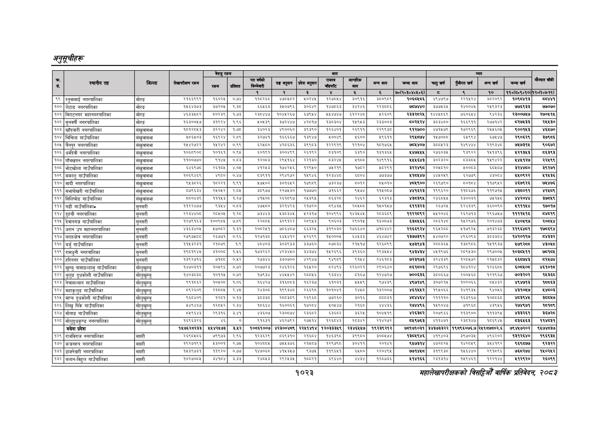

# Page 1085 QA

## Rendered page


## Extracted text

```text
अनुतूचीहरू
१०२३
सहालेखापरीक्षकको वार्षिक प्रतिवेदन २०८२

|  |  |  |  | बैरुए | रकम |  |  |  | जन |  |  |  |  |  |  |  |  |
| --- | --- | --- | --- | --- | --- | --- | --- | --- | --- | --- | --- | --- | --- | --- | --- | --- | --- |
| । |  |  |  |  |  |  | नय |  | ११ | १ | लन | खन | चन | अनन | लन |  |  |
|  |  |  |  |  |  | १ | र | ३ |  | ४ |  | ७०(२०३०४०४६०६) | छ | ९ | १० | ११०(८०९०१०) | १२०७०७-११) |
| ९९ | रतुवामाई नगरपालिका | मोरङ | २१६६९९९ | ९० | ० |  |  | ०२४६ | बर७०४ | ०९१६ | इण०९ड९ | ०६४६ | ४९४७९७ | र२१६२४ | इ०२०९२ | १०९४४७१३ | बट |
| १०० | लेटाङ नगरपालिका | मोरङ | १५६४३७३ | ३७२०५ | र२.३८ | ६६४६३ | ३४०७९६ | ३०६४९\| | प४७८६३ | ४२४६ | र२२३८०६ | ७५७४४० | ३७७५६४८ | १४००४५ | र२४९३२३ | ७७६९३३ | ७७०७० |
| १०१ | बिराटनगर महानगरपालिका | मोरङ | ४६३३४८२ | ५०२३९ | १७३ | रइ८४४७ | १०४५२६७। | ६७९५४। | २५४७४७ | ६१२२४८ | ४३५०८ | २३३२८२५ | १४४४५०६९ | ७६०६४४ | हर्ट | २३००७४७ | २७०४ |
| १०२ | सुनवर्षी नगरपालिका | मोरङ | १६३००४७ | ३१९२४ | १९६ | २०६३९ | ङड२४४७छ | ४२०१७ | बढ्३०४ | १४९४३ | र२३३००३ |  | उड | १६६९११ | र२७७१४२ | बर२७४३३ | र४४३० |
| १०३ | खाँदबारी नगरपालिका | संखुवासभा | पेडपर३ |  | ७० | ४०२३ | ४९००६०। | ३९३९० | प२६४०१ | २९११ | र्रददइट | ९१२७०० | ४७१४७६९ | ७२६६ | २४६० |  | ४६७० |
| १०४ | चिचिला गाउँपालिका | संखुवासभा | ४०६४०३ | ६९२४ | २०९ | इर७४१ | १६६६६७ | ब३९४७। | २००४ | ३६०० | ९६११ | २४७४ | बछ०्छ | बब | बढाउ | र९०६२९ | ३७९६ |
| १०५ | चैनपुर नगरपालिका | संखुवासभा | ब७२२ | ४२४२ |  | ६२८० |  |  | १२२९१९ | २१०४ | ७१७६ | ७४४०७ | ३००४२३ | प४९४७७४ | २९३७ | ७७३१ | ०६७२ |
| १०६ | धरमदेवी नगरपालिका | संखुवासभा |  | १०३४ | ०९४ | बल |  | रबर | छड |  |  | १४७७ |  | द३९२र | ११३६ |  |  |
| १०७ | पाँचखपन नगरपालिका | ' संखुवासभा | ३००८८० | ९१४५ | ०८३ | २०८३ | २९५१६४ | २२१३० | ३२४५ | शपच्ङ | १४९९१६ | ४५५६४३ | ३०२३२० | छइइछा | १४९४२२ | ४६१२७ | २२४९ |
| १०८ | भोटखोला गाउँपालिका | संखुवासभा | ६४९७ | र२६१०५ | ४०४ | भर | ७४२६ | १२९५०\| | ७२१९ | ७२ | ८२९१ |  | २०४०१० | ००७३ | बनाल्ङ | इर/४६० | ३९२७१ |
| १०९ | मकालु गाउँपालिका | संखुवासभा | १०६९४६९ | ४९६० | ०४७ | ९९ | २९४६७२ | ब४९४६ | बस | इद०४ | ७३७७ | अ१७४७ | प७४०६६ | इप७७५ | एन्छा | ४४०९२२ | ११५३६ |
| ११० | आदी नगरपालिका | संखुवासभा |  | बर | ब०६१ | ४४४०२ | ब०१६४२ | बढ९७९ | छइरछ | ०२ | ४०१० | ९०० | २६९७९० | ०० | ११७९४६२ | ४६७९२६ | ७४४७६ |
| १११ | सभापोखरी गाउँपालिका | संखुवासभा |  | रणार | सय | ०९७७ |  | १७७० | ७१६२ | दाउ | पागाङछ | भलाइ | ब९९६२० | प०६७६ | ९७१४ |  |  |
| ११२ | सिलिचोङ गाउँपालिका | संखुवासभा |  | १४३ |  | अपना | २१०९७ |  | पर | २४६२ | इप३१३ |  |  | १३००३१ |  | शरम |  |
| ११३ | गढी गाउँपालिकान | सुनसरी | ११२२४७७ | द३८४ | ००३ | ४४८० |  | २१७२०। | दाइ |  | क४५०१४७ | चककइर३ | २६७२४५ | ब२३३९ | ३६००९० |  | ७०१७ |
| ११४ | दुहवी नगरपालिका | सुनसरी | सरषहण्य |  | कू | पाइ | अह | अ२३१७। | १०४६९६ | पा |  | बरस्थदर | २०४६ | २६२७१३ | २९७७ | ११११५१६ |  |
| ११५ | डेवानगञ्ज गाउँपालिका | सुनसरी | प२७९१६३ | १००३७४ |  |  |  | ०९४३ | ९०६०३ | २९०५ | १६०७७३ | ६६६ | स्व | १४२९७६ | २०७३ | ६०९७ | र०४ |
| ११६ | धरान उप महानगरपालिका | सुनसरी | पइबइ४०५ | २७०२ | ३१ | र०७२६१ | ७०६ | ३२४ | ब१९०३० | २७६६४० | कार | र२१६६९२४ | दशा | २१७६२४ | ७३२६ | र१९६४७१ | १७५६९४ |
| ११७ | बराहक्षेत्र नगरपालिका | सुनसरी | २७९७४७ड | २६७१ | ०९६ | बर |  | २६९९ | १४०० | ३ | अधार | ब७७३९१ | ४४०७२० | ४९६०६३ |  | २०९७ |  |
| ११८ | बर्जु गाउँपालिका | सुनसरी | ११४३२३१ | २१०७९ | १८६९ | ४०३ | ३ | ३७६०) | बड्इ४/ | र२१५१७ | १२६८९९ | ५७३९४३ | स्व०३६५ | ०९०६ | १९३७ | ७९२८ | ३०५८ |
| ११९ | रामघुनी नगरपालिका | सुनसरी | ब९०१९४५ | इ१००८ | १४६ | ७३२६२ | ४२३४४०। | बढ३७४। | १४२६९६ | इ९३६० | र२९३४४४ | दशक | ४४१९७६ | २०९५३० | २९७००४६ | क०३५७११ | ७५१४ |
| १२० | हरिनगर गाउँपालिका | जन्ती | १३९२७१६ | ७१६८ | ०.४२ | २७३४४ | ३००० | ४२९४७। | ९४९८९९ |  | र२४६१८३ | ७२३९७३ | ३२४३३९ | १२०४७२ | र२१४०३२ | ६७४३ | दबर४७४ |
| १२१ | खुम्बु पासाङल्हामु गाउँपालिका | सोलुखुम्बु |  |  | ०७२ | र२०७७२३ | २६२६ | बढ४२०। | दरब | २२६०२१ | २९०४४० |  | २९७६९६ |  | बरधइच्ाछ |  | श७१०१५ |
| १२२ | दुधकोशी गाउँपालिका | सोलुखुम्बु | पठयकध | १०१५ | ०७२ | पदा | हर) |  | ३३४४ | ब१६७ | १२४४२७ | ७००६३६ | ३८०६६७ | र२००५६८ | १२१९६७ | ७०३२०२ | १४३८ |
| १२३ | नेचासल्यान गाउँपालिका | सोलुखुम्बु | द
```

## Flags
- table_page
- low_quality_table
