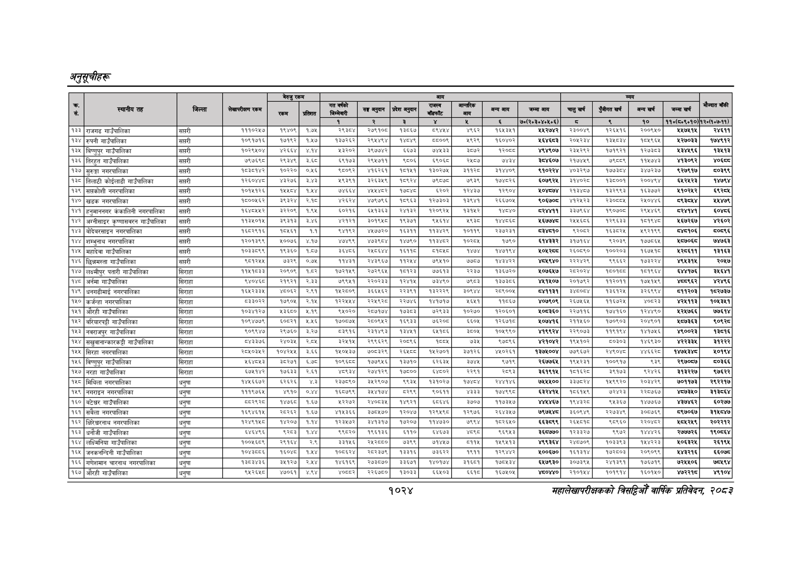

# Page 1086 QA

## Rendered page


## Extracted text

```text
अनुतूचीहरू
सहालेखापरीक्षकको वार्षिक प्रतिवेदन २०८२

|  |  |  |  | बैरुए | रकम |  |  |  | जन |  |  |  |  |  |  |  |  |
| --- | --- | --- | --- | --- | --- | --- | --- | --- | --- | --- | --- | --- | --- | --- | --- | --- | --- |
| । |  |  |  |  |  |  | नय |  | ११ | १ | लन | खन | चन | अनन | लन |  |  |
|  |  |  |  |  |  | १ | रे | ३ |  | ४ |  | ७०(२०३०४०४६०६) | छ |  | १० | ११०(६०६०१०) | १२०७:७-११). |
| १३३ | राजगढ गाउँपालिका | सप्तरी | १११०२५७ | १९४०६ | १:७५ | ९३८४ | २७९१०८। | १३८६७ | १ | ४९६२ | १६४३५१ | १४५२७४२ | २३००४६ | १२६५१६ | २००९५० | २५७५१४५ | २४६११ |
| १३४ | रुपनी गाउँपालिका | सप्तरी | १०६१७१६ | ७१९२ | १५७ | ३७२६२ | र९४४९४ | ब४४९। | ५००६ | ४९२९ | १६०४०२ | अ६४६ड३ | २०४२३४ |  | १०४६६४ | ४२७०३३ | १७४९१२ |
| १३५ | बिष्णुपुर गाउँपालिका | सप्तरी | कठस्दर | परबइ | अप | अइ२०२ | ३९७७४२ | ६६७३] | नाउ | ३०७२ |  |  | २३४२६२ | १७१९२१ | पराउन | १४९६ | १२७३ |
| १३६ | तिरहत गाउँपालिका | सरी | ७९७इ९छ |  | कछ | बडप७३ | २९७१ | ००६ | बइ्इछ | राखछ | जाइ |  | २१७०४६९ | छद्थ | १७५ | २०९२ | ४०६चय |
| १३७ | सुरुङ्गा नगरपालिका | सप्तरी | बेप | १०२२० | ०४६ | ००६२ | ४१६२६१। | ०१४१ | ३०२७ | जक | इ३१४४०९ | दुब०रर४ | अ०३२९७ | १७७३०४ | इ४०७२३७ | ९२७९१७ | ०३९९ |
| १३८ | तिलाटी कोईलाडी गाउँपालिका | सप्तरी | बरदणश्ठ | ४३२७६ | ३४३ | ५९३९१ | इ२६३४९ | पढ९र४ | छदछछछ | ७९३९ |  | ६०७९२४ | उपर | बइय००१ | र००७७४ |  | ४७९४ |
| १३९ | सप्तकोशी नगरपालिका | सप्तरी | १०१५१२६ | कश | १०४४ | ७४६६४ |  |  | ६२०२ | १२४३७ | १२९०४ | १०४६७४ | २१३४८७ | १३२९९३ | १६३७७२ | २१०२४२ | ६९२०४५ |
| १४० | खड्क नगरपालिका | सप्तरी | १५००५६२ | ९३२४ | २९८ | २६२४ | ४७९७९६ | ८९६३ | १२७३०३ | १३९४१ | २६६७०५ | ९०६७०८ | ४१२४५२३ | २३०६८८४ | र१०४४६ | ८९३८४४ |  |
| १४१ | हनुमाननगर कंकालिनी नगरपालिका | सप्तरी | १६४०७५४२ | ३२२०९ | १,९४५ | ६०२१६ | ६४५१३६३ | २४१३२ | १२०६२५ | १३१४२ | १८४० |  | ३३७९६४ | १९०७०४ | २९४४६९ |  | ६०४८६ |
| १४२ | अग्नीसाइर कृष्णासवरन गाउँपालिका | सप्तरी |  |  | ४६ | असब२१ | ३०१९४८ | १९३७१। |  |  |  | ६७७४ | २४४६०६ | १०६३ | ०९७७ | ४६७२६७ | २६०२ |
| १४३ | बोदेवरसाइन नगरपालिका | सप्तरी | १६०२६१६ | १०४५६१ | १.१ | ९४१९२ | ४४५७७२० | १६३११ | ११३४२९ | १०११९ | २३७२३१ | छ३४८१० | ९६२०८२ | १६३८२५ | १९२१९९ | ८४८१०६ | ५०८९६ |
| १४४ | शम्भुनाथ नगरपालिका | सप्तरी | २०३९ | ४००७६ | ४१७ | ४७४९९ |  | १४७९०। | ३४८२ | क०२५ | १७६० | चरक | २१७१६४ | २०३६ | पढ |  | ७४७६३ |
| १४५ | महादेवा गाउँपालिका | सप्तरी | ०३३ | १९३६० | ९५६ |  |  |  | वकडशट | १४७४ | १४७१९४ | ४०२८ | २६००९० | १००२०३ | ७४१० | २६११ | १३१६३ |
| १४६ | छिन्नमस्ता गाउँपालिका | सप्तरी |  | ७३२९ | ०७४५ | १४३१ | २४३९६७ | १२८४ | ७९१० | ७७०७ | १४३४२२ | भ९४० |  | ९९६६२ | १७३२२४ |  | र०६७ |
| १४७ | लक्ष्मीपुर पतारी गाउँपालिका | सिराहा |  | २०६०६ | १७२ | २१४९ | र२७२९६५ | ०१२३ | ७७६१३ | २२३७ | १३६७२० | ०७६४७ | र२०२०२४ |  | प१०७१६६७४ |  | उ |
| १४८ | अर्नमा गाउँपालिका | सिराहा | ९४०४६८ | २१९२१ | २.३३ | ७९९५१ | २२०२३३ | १२४१५ | ७३४९० | ७९८३ | १३७३८६ | ४४५१५०७ | २०१७६२ | ११२०११ | १७५१४९ | भच्यद६र | ४२४९६ |
| १४९ | धनगढीमाई नगरपालिका | सिराहा | १६४५२३३५ | ४८०६२ | २,६९१ | १५२८०६ | ३६६५६२ | २२३९१ | ब३२२२९ | इ०९४४ | २८९००५ | ११३१ | ३४००७४ | ब३६१२५ | ३२६९९६४ | ८११२०३ | १५२७३७ |
| १५० | कर्जन्हा नगरपालिका | सिराहा | ५३३०२२ | १७९०५ | २१४५ | १२२४४४ | २२४९२८। | २२७४६\| | १४१७१७ | ४६४१ | ११६६७ | ४०७९०९ | २६७५६४ | ११६७२४५ | अ०्यरइ | ४२४११३ | १०५३५१ |
| १५१ | औरही गाउँपालिका | सिराहा | १०३४१२७ | १३६८० |  | ९४५०२० | २८७१७४। | ७३८३ | ७२९३३ | १०२७० | १२०६०१ | १०८३६० | २२७११६ | १७४१६० | १२४४९० | २५२५७६६ | ७७६१४ |
| १५२ | बरियारपट्टी गाउँपालिका | सिराहा | १०९४७७९ | ०८२१ | २४६ | १७०८७५ | र२८०९४२) | १६९३३। | ७६२०८ | ६६०५ | १२६७१८ | ४०७४१६ | २११५६० | १७०६०३ | र२०४६०१ | ५७३६३ | १०९८ |
| १५३ | नवराजपुर गाउँपालिका | सिराहा | द०९९४७ |  | ३८२७ | बाइद१६ |  | १३४१) |  | इ०५ | क०४९९० |  | २२९०७३ | प१९१९४ | ४७५६ | ४९००२३ | ३५१६ |
| १५४ | सखुवानान्कारकट्टी गाउँपालिका | सिराहा | ८४३३७६ | २४०३५ |  | ब२४१५ | २९९६२९ | २०६९६ |  | ७३५ | २७८९६ | ४२१०४२ | १९५१०२ | ८०३०३ | १४६९३० | ४२२३३५ | ३१२२२ |
| १५५ | सिरहा नगरपालिका | सिराहा | २०४०३४२ | ब०४२४४ | २६५ | ०रइछ | ७०७३२९ | २६४० | प४२७०१ | इ७१२६ | ७०२६१ | ब३७४००४ | ७७९६७२ | र४९०७ |  | कक | ४०९४ |
| १५६ | विष्णुपुर गाउँपालिका | सिराहा | २६४८४३ | 
```

## Flags
- table_page
- medium_quality_table
