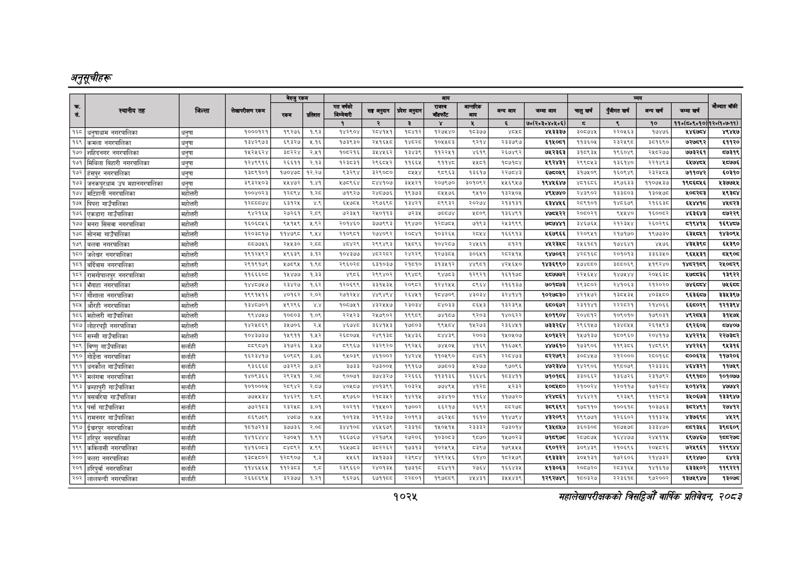

# Page 1087 QA

## Rendered page


## Extracted text

```text
अनुतूचीहरू
१०२५
सहालेखापरीक्षकको वार्षिक प्रतिवेदन २०८२

|  |  |  |  | बैरुए | रकम |  |  |  | जन |  |  |  |  |  |  |  |  |
| --- | --- | --- | --- | --- | --- | --- | --- | --- | --- | --- | --- | --- | --- | --- | --- | --- | --- |
| । |  |  |  |  |  |  | नय |  | ११ | १ | लन | खन | चन | अनन | लन |  |  |
|  |  |  |  |  |  | १ | रे | ३ |  | ४ |  | ७०(२०३०४०४६०६) | छ | ९ | १० | १०(६०६०१०) | १२०७०७-११). |
| १६८ | धनुपाधाम नगरपालिका | घनुपा | १०००प२१ | बढ्रछछ | ९३ |  | २०४१५१ | प०४१२ | ब२७५४० | ०३७७ | ४०५८ |  | ३००७४५ | २२०४६३ | १७७६ |  |  |
| १६९ | कमला नगरपालिका | धनुषा | पर |  |  | प७३९३० | सय | बहर | ठा | दस | २३३७२७।। | लाइन | १३६० |  | ३०६९० | ७२७५९२ | ११२० |
| १७० | शहिदनगर नगरपालिका | धनुषा | करहचर |  | २४१ | कलटरप६ | उ४७७६२ | प३४३९ | ब२२४१ |  | र२६७४६२ | ७४२३६३ | १०९३५ | १९६०४६ | र४०२७७ | ७७३२६१ | ब७३१९ |
| १७१ | मिथिला विहारी नगरपालिका |  | पर४९९१६ | २६११ | २१३ |  | २९६२ | ११६४) |  | २६०१ | पप | द्र | २९९०५३। | प१३६१४० |  | ४७४५ | ८७७६ |
| १७२ | हंसपुर नगरपालिका | धनुषा | १३८९१०१ | १७०४७८ | १२,२७ |  | इ२९०७०। | ००४) |  | ३६१७ | र२२७०४३ |  | ३७४० | ६०४६ | र३२४७४ | ७११०४२ | ०३१० |
| १७३ | जनकपुरधाम उप महानगरपालिका | धनुषा | इ९३२४०३ | ब४४७२ | १०४१ |  | नाा०छ | उ४४२१। | २०७९७० | ३०१०६२ | ४४६९४७ |  |  | ३९७६३३ | ११०७४३७ | ब९६६७५६ | १३७७४४ |
| १७४ | मटिहानी नगरपालिका | महोत्तरी | १००४०२३ | बेस्वथ् | १.२८ | ७१९२७ | २४८७७६ | १९३७३ | ५५४५७६ | २५१० | १३२४५०४५ | ४९५७४० | २४३६०२ | १३३८०३ | १३०५७८ | श०८र८३ | ४९३८४ |
| १७५ | पिपरा गाउँपालिका | महोत्तरी | पस्छ | ६३१२५ | ४९ | ६४७०५ | २९७६९८० | १३४२१ | ९९३२ | २०२७४ | २१३१३१ | ६३४४५६ | २०९१०१ | १४८६७६५ | २१६६३८ |  |  |
| १७६ | एकडारा गाउँपालिका | महोत्तरी |  | २७२६१ | २.८९ | ७२३५१ | २४५०११३ | ७२३५ | ७८८७४ | ४८०९ | १३६४९१ | ४७८५२२ | २०००२१ | ९५५४० | १६००८२ | ४६३६४३ | ५७२२९ |
| १७७ | मनरा सिसवा नगरपालिका | महोत्तरी | १६०६०४६ | ४१४६ | ५९२ | २०१४६० | ३७७९६३ | ९४७० | ब२८७०४ | ७९३ | र४३९६६ |  | ३४६७३४ | सर | २६०२६६ | दए | १६९४७७ |
| १७० | सोनमा गाउँपालिका | महोत्तरी | १२०३८१७ | ११४७९८ | ९६.४४ | २१०९८१ | २७४०६२ | २०८४१। | १०३२६४५ | स्वश्ट | १६६९१३ | १६७९६६ | २२०९५१ | २१७१७० | १९७७३० | ६३४०५१ | १४३०९४५ |
| १७९ | बलवा नगरपालिका | महोत्तरी | ब७७५६ | २४३० | २६८ | ४२९ | २९९४९३। | प४७९६) | १०४२८७ | २४४६१ |  |  | २४६१५१ | १७४६४१ | ४४७६ | शकक | ६३९० |
| १५० | जलेच्वर नगरपालिका | महोत्तरी | १९१२५६२ | ९६३९ | ४ | १०४३७७ | धटर२८र | २४२२६९ | १२७३०५ | ३०६४५१ | २०२४५१४ | ९४७०६२ | ४२०१६८ | २०१०१३ | ३३६३५० |  | वश्ड्ण्द |
| १०१ | बर्दिबास नगरपालिका | महोत्तरी | २९१९१७९ | २७८९ | १९८ | २९६०२८० | ६३१०३७ | २१८०१० | ३१३४१२ | ४४९८१ | ४२४६५० | १४३६९९० | १५४८८० | इड०६६ | ध१९२४० | २१५९ | र२४०८२९ |
| १८२ | रामगोपालपुर नगरपालिका | महोत्तरी | ११६६६०८० | ४४७७ | १.३३ | ४९८६ | २६९४०२ | १९४६ | ४७८३ | २९२१ | १६११७८ | ८७७७२ | २२४६४४ | बाठा | २०४६३७० |  | ३९२२ |
| १०३ | नगरपालिका | महोत्तरी | १०५७ | २३४२७ | १६२ |  | उ३प४३४ | २०८२) | परह२१४५ |  |  | ७०%६७३ | २९३००२ | २४१०६३ |  | ७४४ | ७१६ |
| १८४, | गौशाला नगरपालिका | महोत्तरी | १९९१५१६ | ४०६२ | २०२ | र७१२४४ | शकक | २६४१) | १०४७०६ | ३०३ | इरश४१ | ०६० | ४२१४७२ | ब३०४३४ | ४०३७८० | द६३६५७ | ३३४३९७ |
| १०५ | औरही नगरपालिका | महोत्तरी | १३४८७०१ | २९२९६ | ४४ | १००७५१ | ४३२४५४५७ | २३०३४ | ८४०३ | ८६४३ | १३२३९४ | ६८०६७२ | २३११४१ | २२२८२१ | २१४०६६ | ६६८०२९ | १२१३९४ |
| १८६ | महोत्तरी गाउँपालिका | महोत्तरी | ९९४७५७ | ०६०३ | १०६ | २२४२३ | २४७९०२। | ९९८९ | ७४१८७ | ९२०३ | १४०६२२ | १०१९०४ | २०४५१२ | १०६०१० | १७९०३१ | ४९२८४५३ | ३१५७४ |
| १६७ | लोहरपट्टी नगरपालिका | महोत्तरी | ४२४०७६९ | इ५७०६ | २४ | ४६७४८ | ३६४१४३। | १७७०३\| | दाङ | ब४२७३ | र३६४४१ | ७३३२६४ | २९६१५७ | ४०५५ | र२६१४९३ | ९२६० | ७४०७ |
| १८८ | सम्सी गाउँपालिका | महोत्तरी | १०४३७३७ | १४१९११ | १,४५२ | २६८०७५ | र२४९प३८ | १४५४३६ | ८४४३९ | २००३ | १५०४५०७ | १०१५२२ | १५७१३७ | १८६०९६० | र२०४११४ |  | २२७३८२ |
| १८९ | विष्णु गाउँपालिका | सर्लाही | ५८९८७१ | ३१७२६ | ३,४५७ | ८९६६७ | २३२६२० | १९२५ | ७४५०४५ | ४१६९ | ११६७५९ | ४४७६१० | १७३९०६ | ११९३८६ | १४८९६९ | ४४२२६१ | ९४३१६ |
| १९० | गोडेता नगरपालिका | सर्लाही | १६२३४१७ | ६०९९ |  | ५०३९ |  | ४२४४ | ०४९० | बा | र२२८४७३ | द२२७९२ | इ००४५७ | र२१२००० | र२८०१६८ | ००६२ | ११७२०६ |
| १९१ | धनकोल गाउँपालिका | 
```

## Flags
- table_page
- medium_quality_table
