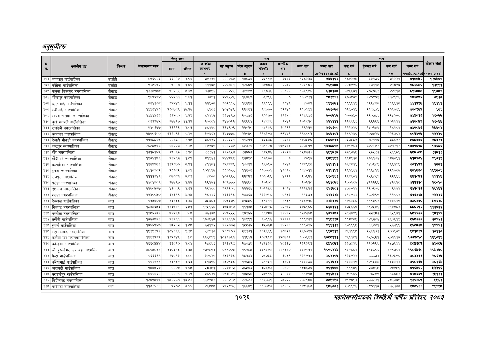

# Page 1088 QA

## Rendered page


## Extracted text

```text
अनुतूचीहरू
१०२६
सहालेखापरीक्षकको वार्षिक प्रतिवेदन २०८२

|  |  |  |  | बैरुए | रकम |  |  |  |  |  |  |  |  |  |  |  |  |
| --- | --- | --- | --- | --- | --- | --- | --- | --- | --- | --- | --- | --- | --- | --- | --- | --- | --- |
|  |  |  |  | ला |  |  | नल | लका | १ | पा | भन | लन | चन |  | नन | खन | ।' |
|  |  |  |  |  |  | १ | रे | ३ |  | ४ |  | ७०(२०३०४०४६०६) | छ | ९ | १० | १०(६४०६०१०) | १२०७:७-११). |
| २०३ | चक्रघट्टा गाउँपालिका | सर्लाही | ८९६०४३ | ३ | ४०४ | ७०२४० | र२२००४। |  | ७७१४ | इ३ |  | ४७७१९२ | ४३४५ | ६३१७६ | १७१३३१ |  | १२८४८० |
| २०४ | काँडेना गाउँपालिका | सर्लाही | ९२७६६२ | ९६६० | १०४ | ११०४ | २४३०६१ | १७६०९। | ७४००३ | शाड | १२८१०२ | कथ्य | २२०४४६ | द३११४ | १४१०४० | श६२६०४ | ३४९१ |
| [२०५ | फतुवा विजयपुर नगरपालिका | राँतहट |  | ९४६९ | ७२८ | छड | ब३प४२९। | ३४०७ | ९९०३ | ६०३३ | ३६५६ |  | ३४६६०१ | र२०२०६२ | पह१७ | द्र | १९०४ |
| २०६ | मलापुर नगरपालिका | रौतहट | दशरथ | ४६३३ |  | ७४१ | २४९५४९ | १६०५ | ७९४९६ | ० | १३७४३१ | २४४२ | २०७००४ | १४०८०२ | ३७१४ |  | ७४३० |
| २०७ | यमुनामाई गाउँपालिका | रौतहट | ५१०० | ३०७१ | ४११ | इइ४०८ | ३०२६१५ | ४६२६ | ६१६६ | ३६४९ | श७८२ | ४२२७७१ | ९९२२ | बरा | ११९४३० | भतर७ | ११४३ |
| २०८ | गढीमाई नगरपालिका | रौतहट | १४५५६४४३ | र२६८७८९ | १७.२७. | २८६ |  | २२०६१ | ९०७७३० | ३२९४३ | २१७१५४५ | ७७६०७ड | ३२४५०३४ | र२१०४७४५ | र२३६७६५ | ७४०३७५ |  |
| (२०९ | माधव नारायण नगरपालिका | रोतहट | १४४५४५६३ | ६१४५८० | ४२३ | २३४७ | ३६७४९७। | २०४७६ | ९३१७० | ११६४५८ | २१४९४६ | ७०८७४७ | ३००७४५० | २२०७४९ | रे२४३०८ | ७४५८१६ | १६०७७ |
| २१० | दुर्गा भगवती गाउँपालिका | रौतहट |  | ९७७१७ | ११,३२ |  | २४७०१२, | १६९९४। | ढा | १४२ | १०३०३० | हरर | २२६६५६ | द९२६४ | १०३१३१ |  | २६०४ |
| २११ | राजदेवी नगरपालिका | रौतहट | स४०६७७ | ३४१६ | ३०१ | भल | ३४९० | २०३० |  | ब०२६३ | ९२१९ | ४६९६०० |  | बढ०४७ | १७०१ | ७७९०७६ | ३४७०२ |
| [२१२ | वृन्दावन नगरपालिका | रातहट | १४६०६८० | १३१६९६ | ८२९ | ३०७६३ | ३४७७७८ | २३०४०। | ११०३०७ | ९४४६ | १९८६०३ | ७७३ | ३६६२७९ | २०७४२७ | २२६७६२ | ७०३४९७ | का |
| २१३ | देवाही गोनाही नगरपालिका | रौतहट | ११४००४९ | २४६१ | २१४५ | ५१४६ | ३२२५४५१ | ९७११ | ५ |  | १४७५५०. | १८०५१३ | २१७४५८४ | १७२११० | ८६४२ | ५६८३३६ | भ्यइ्रइ |
| २१४ | चन्द्रपुर नगरपालिका | रौतहट | २६७०४१३ | ६०२२३ | २.२४ | ४४०९ | इक६५३४ | ६३२४ | १७१९२० | ४७४९ | ३२७७१९ | बिर | ब४९४६३। | इ३४२९४२ | ३४७२१२ | ३३९६ | ३६८६ |
| २१४ | गौर नगरपालिका | रौतहट | प३१०१०४ | इड्वइङ | २९७ | २२२२६१ |  | २३०३] | ४४०६ | र३०३७ |  | धक | ३३९७६१ | १४०४२३। | प१९९०९ | ६२०७ |  |
| २१६ | बौधीमाई नगरपालिका |  | १२०४१५६ | २१५६३ | १.७९ | ८१२६३ |  | २३८२७। | ४३०० | ४ | ४०९६ | ५९४२ | २२०२३७ | २०६१७६ | १०३७९१ | ह१८२०४ | ४९०२ |
| २१७ | कटहरिया नगरपालिका | रौतहट | १३६५५७१ | ११२१७० | ८.२१ | ४११७१ | ३५८९ | १७७३२ | ६५०२० | ड्श्श्ड | १६८९५७ | ६५४१४१ | ३४४०३९ | १४७२४५ | १९९३४४५ | ७०१४२९ |  |
| २१८ | गुजरा नगरपालिका | रोतहट | पन्थ |  | कलर | कमका | ३६०३ | १६०६ | ब३७०७१ | बग्छ | पाठ | एकल | २९३६ | ६९७२ |  | धब४७६० | २८०९ |
| (२१९ | राजपुर नगरपालिका | रौतहट | ११११६४६ | ००८३ | ७०३ | ४०० | ४०१९९४\| | र२८२३\| | १०३७२९ | ४१२६ | र७९२४ | १६०४९६ | २६०६०१ | र४९७७७ | र२९९६ | २७०७ | कह |
| (२२० | परोहा नगरपालिका | रौतहट | प४४९८९ | ३७७९७ | २४५ | ९२७१ | ६८९७७७ | ३१५९८। | १०२७४ | ० | २०२३० | ७५१८७९ | २७०७१०७ | ४१३२९४ |  | ७३३११० | ८०४० |
| २२१ | ईशनाथ नगरपालिका | रौतहट | १२९०५६४७ | ४६०८९ | ३.६३ | २६४८ | २९१६०४। | २३३६७\| | १०३२४६ | ६०२४ | ३ | ६४६७८१ |  | १६०६०९६ | ९१७३ |  | २९४४३ |
| २२२ | गरुडा नगरपालिका |  | ब२३००४० | ४६२९ | ३ | २६१४६ | ४३६३१६। | २४६७] | बइइठड |  | १५७१ |  | ४२४०४४ | १७०३९० | १९९२ | बहर |  |
| २२३ | देवताल गाउँपालिका | बारा | ९१५७८७ | १३४६६ | १.४७ | ७४५७८१ | २०५३७९ | ३१४५५० | ५९४११ | २९६९ | १३६०१८ | ४४६८३२७ | २०६४४५८ | ११९३९२ | १४४६१० | ४७०४६० | २०६४८ |
| [२२४ | निजगढ नगरपालिका | बारा | १७४७६४३ |  | ६५१ | २६६७ | ३७३७१० | १९१४४\| | पढ | रव | ३०८९०० | ८६७३६१ | ४७४६६० | ब९०४७६ | सकाण्छा |  | १९३०३६ |
| २२५ | पचरौता नगरपालिका | बारा | १२५६३०२ | १६४५९० | ४४५ | ७६३०७ | ३४०४४५५। | २०२६६ | द२४८० | १४२३ | १३४३४४५ | ६०४०७० | ३२३०४६ | पइइस्छङ | १९४५९०१ | ६४२२३३ | २८४४ |
| २२६ | प्रसौनी गाउँपालिका | बारा | १०६०५६१ | २१२६१ | र | १०७५६८० | २६९६६० | १४२९९ | ६७९१६ | २३९२२ | ११९४३२ | ४९५२२८ | ११०४७
```

## Flags
- table_page
- medium_quality_table
