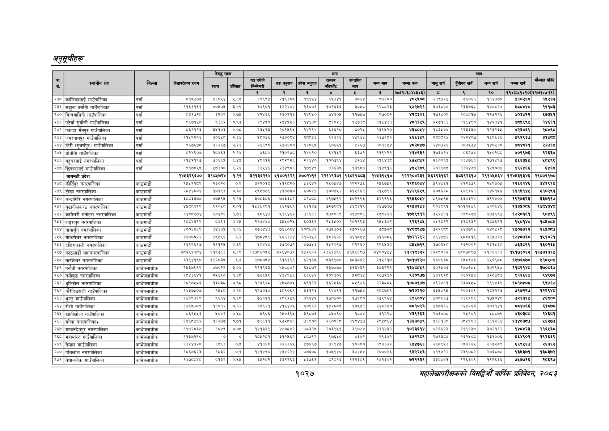

# Page 1089 QA

## Rendered page


## Extracted text

```text
अनुतूचीहरू
सहालेखापरीक्षकको वार्षिक प्रतिवेदन २०८२

|  |  |  |  | बैरुए | रकम |  |  |  | जन |  |  |  |  |  |  |  |  |
| --- | --- | --- | --- | --- | --- | --- | --- | --- | --- | --- | --- | --- | --- | --- | --- | --- | --- |
| । |  |  |  |  |  |  | नय |  | ११ | १ | लन | खन | चन | अनन | लन |  |  |
|  |  |  |  |  |  | १ | र | ३ |  | ४ |  | ७०(२०३०४०४६०६) | छ | ९ | १० | ११०(८०१०१०) | १२०७०७-११) |
| २३८ | कालिकामाई गाउँपालिका | पर्सा | ८१५७७७ | ४६०४ | २,६४५ | ९९९४ | २९३८ | १९४४५४ | ५५७४१ | इस्ट | ७१०० |  | २१९४२४ | ७०६६ | ११४७७८ | १०%६८ | ४२३३ |
| २३९ | सखुवा प्रसोनी गाउँपालिका | पर्सा | ११६११६१ | ४०५०५ | ३४९ | इ४९०१ |  | १६००१\| | १०१६३६ |  | १२८८२३ | ५७२७२१ | ३०६०४७ | ब३३७६८ | १४७५२४ | ४४० | १९१३ |
| (२४० | बिन्दबासिनी गाउँपालिका | पर्सा | ५३१७२८ | ६२०६ | ०,७४५ | २४६६ | २३०२१३। | १४९५०' | ७४३० | ११७४५७ | २७०६२ | ४२८३०६ | १७१४०९ | १०४८१७ | १२७१९६ |  | ६७३४१ |
| २४१ | परेवा सुगौली गाउँपालिका | पर्स | ६७५० | दइइर | ०९७ | बढन | प४७३३ | पाका | पकठरङ | कक | बक | अव | स२७१६३ | ४४९० | पह |  | १४६१ |
| २४२ | पकाहा मैनपुर गाउँपालिका | पर्सा | ९ | ३१०३ | ४०८ |  |  | बहर९ | इइइ२० | ब०२४५ | १३९४२० | ०४ | १०६४०४ | ११३३३० | बर३२३४ | शर३०६९ |  |
| २४३ | जगरनाथपुर गाउँपालिका | पर्सा | ११४९२९६ | इ०६४८ | २६४ | २००६६ | र७३००४। | पच्डइइ। | ९३१६ | ४९४५ | नश्ल | ४६६३४९ | स्००९४ | २४०७ | १८०३ | ९२९३७ |  |
| २४४ | ठोरी (सुवर्णपुर) गाउँपालिका | पर्सा | ९६७६७८० | ३१२९७ | ३२३ | २४६९ | २७३६००। | ३०९४ | ९०७१ | २६७ | १०१४ |  | २४०७२६ | १०३४७४ | १४०४३० |  | २२७१४ |
| २४५ | घोबीनी गाउँपालिका | पर्सा | ८२४९०७ | ८४६१ | २२४ | ७६८० | २१०६७८ | १४०१०। | बार | बढ७१ | १९४१ |  | ७३१४ |  | बन्य | ४०९९७६ | रा |
| २४६ | बहुदरमाई नगरपालिका | पर्सा | ११४२१९७ | ७३६६५ | ६,४४५ | ४९११२ | २९२६२६ | २१४४० | १००७९४ | ४२४४ | १५६४३८ | १७४८४२ | २६००९४५ | १३४७६३ | १७१४९७ | ५६६३४४५ | २८५९९ |
| २४७. | छिपहरमाई गाउँपालिका | पर्सा | ९१७५४४ | ७३०० | ६.२४ | ३४४६ | र२३४९०१ | ७९४९ | ७३६३ | ३९८७ | ११४९१६ | क९ | २०३९०४ | १३३४७७ | १२४००४ |  | बा |
|  | बागमती प्रदेश |  | २४४३२९६७० | ३१८४७२४ | १.२९ | ३२१३६२९४ | ५१००११२१ | ७७०२४११ | २२१४१३०१ | १६व१९८य३ | २४४३९५१४ | १२२२०४२३१ | ५६६९३१६२ | ३०६९२६१७ | २९१४४५६४ | १२४४३१३४६ | २९५०९१७० |
| २४८ | कीर्तिपुर नगरपालिका | काठमाडौँ | सर | २३०२० | ० |  | ० | २६६४ | २इ०४४७ | बढ्ररङई | २६७३ | बिर्इणश/ | २९४६ | ४१२३७९। | २४९३०४ | प२६६४६ | ३०९४ |
| २४९ | टोखा नगरपालिका | काठमाडौँ |  | ०३९३ | ०३७ | प९४७७९ | ४७३० | ६००२१ | ४०० | इ१४६६१ | २१४७९६ |  |  | २६९३६१ | र४०४६ | कश | ब१०२९३ |
| २५० | चन्द्रागिरि नगरपालिका | काठमाडौं | ३८८३३७७ | ४७५९५ | १.२३ | ३०८३८६ | ७४३६५८२ | ५१७८ | ४९७४९२ | ३०२९९६ | ३२९९९६ | १९४५६०४४ | ५९७५९४५ | ६३०३२४ | ३९९४०४ | १९२७३२३ | ३३७११७ |
| २४१ | बुढानीलकण्ठ नगरपालिका | काठमाडौँ |  | २०४४ | २०१ | ब४६६१९१ | २७६९ | इइप३७। | ७२७९०८१ | ४४०६१९ | इ३४७७२७ |  | ९०३०९१ | १०११४४९ | ४१९६ | र३३१०५६ | बयबधय |
| २५२ | कागेश्वरी मनोहरा नगरपालिका | काठमाडौं | इ्ययर७४ | ६०४८६ | १.७३ | २०९४७ | ४३६४६२ | ७४६३ | शछलयइ९ | इपहलाइ | रह०२३३ | ७४९९१३ | उरटप१प |  | २७७६९४ | क७२५३६१ | ०४९९ |
| २४३ | शङ्गरापुर नगरपालिका | काठमाडौँ |  | ८४९६ | ०७ | र१७७४ |  | ६०३६१। | र२४३४०४ | १०१९९३ | ४४३० | दरइकछ | ०२२ | २१७३३२ | १०७३९१ | दश |  |
| २४४ | नागार्जुन नगरपालिका | काठमाडौँ | इ००६२६९ |  | बक | रङइाइ | ७इ६०२४ | १००६३१ | २७४३०७ | २७०२६७ | ७०७२ |  | ७२२९०९ | ४४३७९४ | र४०७२८ | १४०७३१२ | र२६४०८७ |
| २५५ | गोकर्णेश्वर नगरपालिका | काठमाडौं | ३४७००२२ | ७९७९६ | २.३ | १७८४५९ | १२६६३७४। | ३१३३४५३। | १८३६२६ | इ४१८४४ | २९५०८ | १७२१२९२ | ५९४४७२ | ४५०४५१९ | ३६५७३६ | १७४८७३० | १४१०२१ |
| २५६ | दक्षिणकाली नगरपालिका | काठमाडौँ | १६१९६१७ | १११२५ | ०.९ | दद | ३७८०७२। | ४७७५३\|। | १५२०९७ | ब५१२६० | १९६४३८ | ८४५५७१९ | ३५०३४५८ | १६२००२ | २३१४५३८ | ७६३८९९ | १६०२६४५ |
| २५७ | काठमाडौं महानगरपालिका | काठमाडौं | २८२९१३८४ | ६१९७६३ | २१९ | १३७८६०४५ | २२६४०७२ | १४२६१२\| | २३४१४९६ | ५९५९६८७ | २४००४४४ | १३११८३२२ | ६२२९०३२ | ६८०७०९७ | २१३६१३३ | १४१७३०६२ | ११७३१३१४ |
| २५८ | तारकेश्वर नगरपालिका | काठमाडौं | ३३९४१९० | १२२०३५ | ३.६ | २७८०५४ | ६१६१९६। | ६२१६४। | ५३९९८० | ३८३८६२ | २१४५११७ | १५१७३२० | ६६०६३८ | ४ | र४६९०८ | १४५७६५७० | ११७५०४ |
| २५९ | पनौती नगरपालिका | काभ्रेपलाञ्चोक | २४५३७९९९ | ७५०२६ | ३०४ | २१११६३
```

## Flags
- table_page
- medium_quality_table
