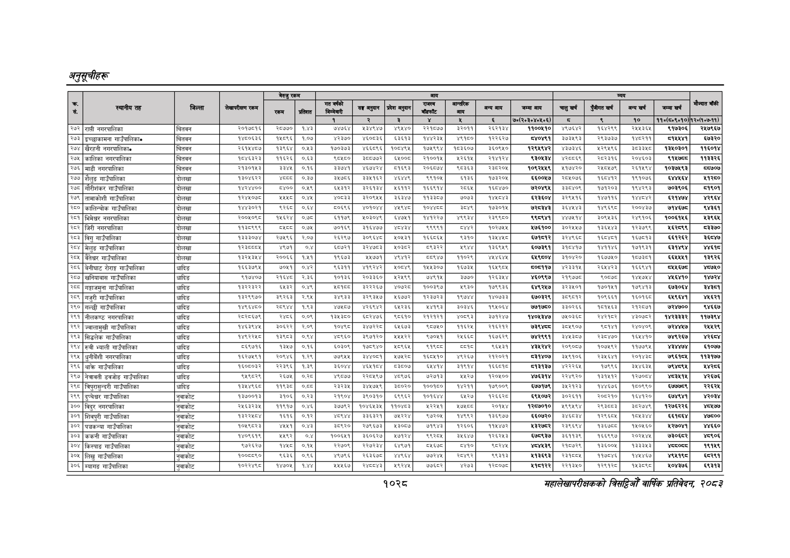

# Page 1090 QA

## Rendered page


## Extracted text

```text
अनुतूचीहरू
१०२८
सहालेखापरीक्षकको वार्षिक प्रतिवेदन २०८२

|  |  |  |  | बैरुए | रकम |  |  |  | जन |  |  |  |  |  |  |  |  |
| --- | --- | --- | --- | --- | --- | --- | --- | --- | --- | --- | --- | --- | --- | --- | --- | --- | --- |
| । |  |  |  |  |  |  | नय |  | ११ | १ | लन | खन | चन | अनन | लन |  |  |
|  |  |  |  |  |  | १ | रे | ३ |  | ४ |  | ७०(२०३०४०४६०६) | छ |  | १० | १०(८४०६०१०) | १२०७०७-११). |
| २७२ | नगरपालिका | चितवन | २०१७८१६ | र२८७७० | १४३ | ७४७७६४ | भ३४९४७। |  | २२१०७७ | इ२०प१ | रबरपइट | ब%००४१० | ४९७६४२। | बढ४२९९ | २४५३६४ | ९१७३०६ | र२४७९६७ |
| (२७३ | इ्च्छाकामना गाउँपालिका» | चितवन |  | ४८९६ | १०७ | २३७० | ४६०३६) | ६३६१३] | ४४२३ | ४९१० | १२२६२७ |  | ३७३४९३ | २९३७३७ | ब४०२११ | बक | ७३२० |
| (२७४ | खैरहनी नगरपालिका० | चितवन | २६१५४८७ | ३९६४ | ०४५३ | १७०३७३ | ४६६८९६। | १०८४९४५) | १७५९९४ | १८३६०४७ | ३६०९५० | १२९४९४२ | ४३७३४६ | ५२९५९६ | ३०३३४० | १३४०३०१ | ११६०१४ |
| २७५ | कालिका नगरपालिका | चितवन | १०४६३२३ | १६२६ | ०.६३ | ९०४८० | इ८५७७२ |  | २१००१५ | २६१५ | र२१४१२४ |  | हस्छछइड | र२०२३१६ | २०४६०३ |  | ११३३२६ |
| [२७६ | माडी नगरपालिका | चितवन | २१३०१४३ |  | ०१६ |  | अर | ०६९३ | २०६०७४ | दटइइइ | रइय२०५ | ०२४९ | प१७४२० | र२४०४७९ | र२६१४९४ | १०३७४९३ | बब७०७ |
| २७७ | शैलुङ गाउँपालिका | दोलखा | १३०४६२२ |  | ०.३७ | ३४७०६ | इ३४१६२ | ४६४४९। | ९९१० | ब१३६ | ७३२० | ६६००४७ | २०४०७६ | बइापर | १९५०७६ | इशा | १२६० |
| २७८ | गौरीशंकर गाउँपालिका | दोलखा | १४२४४००. | ८४०० | ०,४५९ | ६५३१२ | ३२६१३४। | ४६११२। | १६६९१४ | २८६५ | १६८४७० | ७२०४९४५ | ३३८४०९ | १७१२०३ | १९४२९३ | ७०३९०६ | ५१९०१ |
| २७९ | तामाकोशी गाउँपालिका | दोलखा | १२४४०७८ | २५५८ |  | ४०३३ | ३२०६४५ | ३६३४७ | ११३३०७ | ७०७३ |  | ६र३६इ०४ | ३२९५१६ | १४७११६ | १श४४८४२ | ६२१४७४ | ४२९६४ |
| २८० | कालिन्चोक गाउँपालिका | दोलखा | १४४३०२१ | देखइड | ०६४ | पठइद६इ |  | ४९ | कनल | ३०४९ | १७३०१४ | छरपब | ३६४४४३ |  | २००४३७ | ७१६७ | ४३६१ |
| [२०१ | भिमेश्वर नगरपालिका | दोलखा | २००४०६८ | ४६२४ | ०७८ | ६११७६ | ४०३०४६ | ६४७७१\| | कप२२७ | ९९३४ | २३९९८० | दुद] | प४ड१४। | ३०६५४३६ | २४६१०६ | १००६१४६ | ३९६४ |
| २८२ | जिरी नगरपालिका | दोलखा | ११३८९९९ | बश्चट | ०७५ | ७०१६९ | ३१६४७७। |  | ९९९९१ | दर | १०२७५५ | १७६१०० | ३०२५५७ | १३६५४३ | १२३७९९ | इ६२८९९ | ३३७० |
| २८३ | विगु गाउँपालिका | दोलखा | १३३३०७४ | २७४९६ | २०७ | २६२९७ | ३०९६४८। | ४०४३१\| |  | ९३१० |  | ६७१७१२ | इ२४९६८० | ६०४६१ | १६७०१३ | इ६१२६२ | ३६४७ |
| २०४ | मेलुङ गाउँपालिका | दोलखा | परक्मपा | ४९७१ |  |  |  | अ०३०२\| | बदर | उ९४४ |  | ६०७३९३ |  | पाइ | १३ | हाइ | शक |
| २०५ | बेतेख्वर गाउँपालिका | दोलखा |  | २००६६ | १४१ | ९६७३ | ४४५७३१ | ४९४१२ | ५९४७ | ११०२९ | ४४४६४४५ | ६४९८०४ | ३१०४२० | १६७७५० | १०७३५१ | ६६४५४५१ | १३९२६ |
| (२८६ | बेनीघाट रोराङ्ग गाउँपालिका | धादिङ | १६६३७९४५ | ७०५१ | ०.४२ | ९६३११ | ४१९२४२ | ४०८४६ | १४५४५३०७ | १६७३५ | १६४९८४५ | ५०८११७ | ४२३३१४५ | २६५४२३ | १६६९४१ | ८४५४५६७८ | ४८७५० |
| २८७ | खनियावास गाउँपालिका | धादिङ | ९१७४०७ | २६४८ | २.३६ | ०१३६ | २०३३६० | १२४९९ | ४९१५ | ३७५० | १२६३५४ | ४६०९९७ | २१९७३७८ |  | १४५७५४ | २४६६४१० | १४७२४ |
| २८८ | गङ्राजमुना गाउँपालिका | धादिङ | बढ्सरइ२२ | ६४३२ | ०४९ | अ८१७८ | इ२२२६७। | ४०७२८। | १००३९७ | ४९३० | ९९३६ |  |  | १७०१५१ | प७९४१३ | ६७३०६४ | उइ४३५१ |
| (२८९ | गजुरी गाउँपालिका | घादिङ | १३२९९७० | इ९२६३ | २९४ | इ४९३३ | इ२९३५७। | ४६७७२\| | १२३७२३ | १९७४ | १४०७३३ | ६७०३२९ | इ०९०१२ | ०९३१ | इप | ६९६१ | ४६२१ |
| २९० | गल्छी गाउँपालिका | धादिङ | १४९६४८० | र८९४४ | १.९३ | ४७८७ | ४२६९४२। | ६५२३६ | ४४१९३ | ३०३४६ | १९४०६४ | ७७१७८४० | ३३०२६६ | १०१५६३ | २१२८७१ | ७२४७०० | ९४६६७ |
| (२९१ | नीलकण्ठ नगरपालिका | घादिङ | २८२८६७९ | २४८६ | ०.०९ | १३४५३८० | इ८र४७६ | ९८६१०। | २१२१२१ | ४०८९३ | ३७१२४७ | १४०४३४७ | ७५०३६८ | २४२१८२ | ४३०७०८२ | १४२३३३२ | ११७३९४ |
| २९९ | ज्वालामुखी गाउँपालिका | घादिङ | परक |  | २०६ | ०४६८ | रर | ६५६७३ | ०७४० | १६२४ | २१६२१२ | छइदशपय | इ०४९०७ | दन | २४०४०६ | ७२०७ |  |
| [२९३ | सिद्धलेक गाउँपालिका | घादिङ | ४९२२५७ | ३९५३ | ०.९४ | ४८९६० | ३९७१२० | ४४४२२\| | ७०७१ |  | ७६२९ | ७४२९९१ | उ४४३०७ | २३०७७० | १६४७१० | ७४९२६७ |  |
| (२९४ | रुवी भ्याली गाउँपालिका | घादिङ | ५६९७१६ | १३४७ | ०.१६ | ६५०३०९ | १७८९४० | ०९६४ | ९१९८८ | ब्ब१द | ब६४५३१ |  | २०६००७ | १०७५९२ | ११७७९५ |  | ६१०७७ |
| २९४५ | नगर
```

## Flags
- table_page
- medium_quality_table
