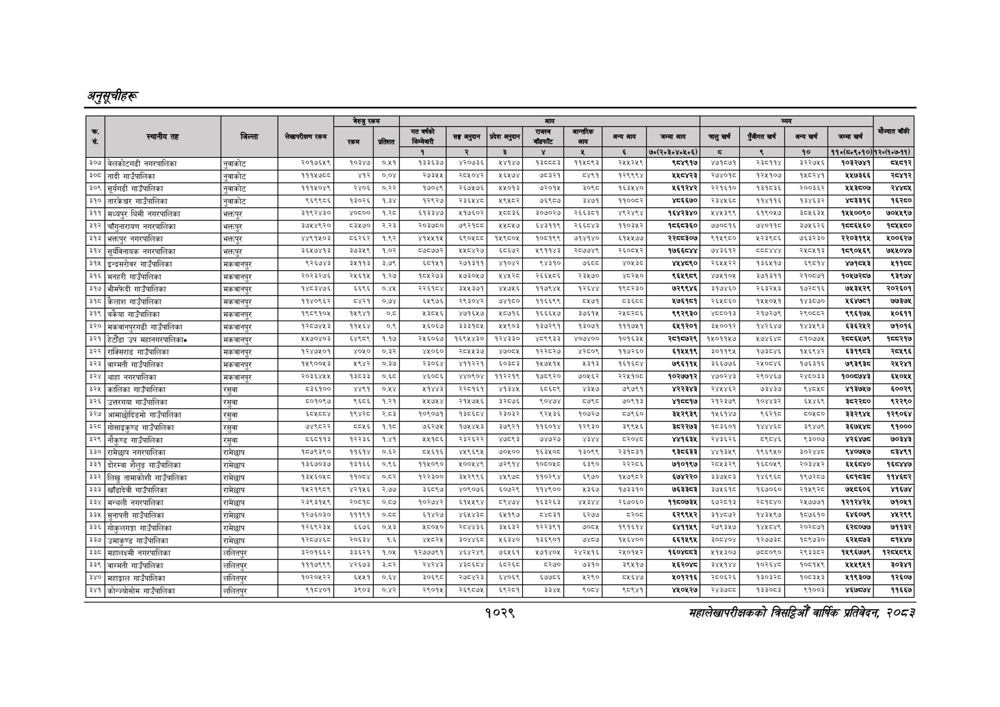

# Page 1091 QA

## Rendered page


## Extracted text

```text
अनुतूचीहरू
१०२९
सहालेखापरीक्षकको वार्षिक प्रतिवेदन २०८२

|  |  |  |  | बैरुए | रकम |  |  |  | जन |  |  |  |  |  |  |  |  |
| --- | --- | --- | --- | --- | --- | --- | --- | --- | --- | --- | --- | --- | --- | --- | --- | --- | --- |
|  |  |  |  | ला |  |  | नल | लका | १ | पा | भन | लन | चन |  | नन | खन | ।' |
|  |  |  |  |  |  | १ | र | ३ |  | ४ |  | ७०(२०३०४०४०६) | छ | ९ | १० | १०(८४०६०१०) | १२०७०७-११). |
| ३०७ | बेलकोटगढी नगरपालिका | नुवाकोट | २०१७६४९ | कठइछ | ०७१ | १३ | ४२०७३६। | ४१४७ |  | प१४०९३ |  |  | ४७०७ |  | इ२२७५६ | ०७४१ |  |
| ३०८ | तादी गाउँपालिका | नुवाकोट | १११४७८८ | ४१२ | ००४ | २७३४ | २०४०४२ | ४६४७४\| | ०३२१ | ९१ | १२९९९४ | १४२३ | २७४०१७ | ब२७१०४ |  | ७३६६ | र०४१२ |
| ३०९ | सूर्यगढी गाउँपालिका | नुवाकोट | ककरण | रह | ०२२ |  | २६७७ | ०३३ |  | डन्ड | बढाए | इकरहर | २२१६३० | ३०३६ | र२००३६२ | प४३५०७ | रह४७४ |
| ३१० | तारकेश्वर गाउँपालिका | नुवाकोट | कथन | ब३०२६ |  | बर९रछ | सह | अ९२०२ | ७६९७ | ३०७१ | ब१००७२ | भ्बइ७० | २३४४६८ | १४१६ | प३४६३२ | भ्य३३१६ | ६२८० |
| ३११ | मध्यपुर थिमी नगरपालिका | भक्तपुर | इक९२४३० | ४०७०७० | बस्ध | बकइबहङ | ४१७६०२ |  | ३०७०२७ | र२इ६३०१ |  | पहरकाण |  | ब९०७७ | ३०३४ | प४००९० | ७०९७ |
| ३१२ | चौंगुनारायण नगरपालिका | भक्तपुर | ब७४४६२० | पइ४७० | २३ |  | छद्रबाङ | ४४०७ | बइप९ | रचना | ०३६२ |  | ७७००१६ | टक | इ३०४६२६ | ७६६० | ९५४० |
| ३१३ | भक्तपुर नगरपालिका | अक्तपुर | ४४९१५०३ | ६२६२ | १६२ | ४१४४१५ | इ९०४७७ | ब४९००४ | १०७९ | ७१४१४० | ६१५७ | र्रथब३०७ | ९१४९८०० | प२३९०६ | ७६३२३० | र२२०३१९१ | ४००६२७ |
| ३१४ | सूर्यविनायक नगरपालिका | भक्तपुर | इच्भङह३ | उ७३५९ | १०२ |  | ०४२७ | ६०७२ | प९१३ |  | र२६००७५२ |  | छाउब२ |  | २ह०७१३ | १७९०६६९ | ७४४०४७ |
| ३१५ | इन्द्रसरोवर गाउँपालिका | मकवानपुर | ९२६४४३ |  |  | ६१५१ | २७१३११ | ४१०४२] | ९४३१० | ङ््व्ड | ४०५३८ | ४४४८९० | २६४५५२२ | ३६४१ | १ | २७%७४६३ | १११६ |
| ३१६ | मनहरी गाउँपालिका | मकवानपुर | २०२३२७६ | २४६४ | १२७ | ब०४२७३ | ७३०७ | पर | २६६६ | र३४७० | ६२४० | ९६४९८९ | ४७५१०५ | ३७१३११ | २१००७१ | ०७७२५७ | ९३९७४ |
| ३१७ | भीमफेदी गाउँपालिका | मकवानपुर | १४८३४७६ | ६६९६ | ०४४ |  |  | ४५७४६ | ११७९४४५ | बराह | १९०२३० | ७२९९४६ | ३१७४६० | २६३२४३ | २०१६ | ७४३४२९ | र२०२६०१ |
| ३१८ | गाउँपालिका | मकवानपुर | बक४०६६२ | डर] | ०७४ | ४९७६ | २९३०४२) | ७१७०] | प१६६९९ | बा! |  | ७६६१ | २६४०६० |  | काला | ६४७५ | ७७३७४ |
| ३१९ | बकेया गाउँपालिका | मकवानपुर | बक्यबक०५ | बान | हट | इला | ४७१६५७। | ४०७१६\| | १६६६७४७ | ३७६१५ | रष८रय६ |  |  | २१७२७६ | रबर | ९६१७ | ०६११ |
| ३२० | मकवानपुरगढी गाउँपालिका | मकवानपुर | बेस | १४६४ |  |  | । ३३३१०४ | ४४९०३\| | १३७२९१ | ३०७१ | ११७७ |  | ३४००१२ | १४२६४७७ | १४३५९३ | ३६६२ | ७१०६ |
| ३२१ | हेटौंडा उप महानगरपालिकान | मकवानपुर | ४५७०४०३ | इकाइ | ११७ | २४६०६७ | प६९४४३० |  | ९९३३ | ४०७४०० | ०६३६ |  | १५०११४४ | ७४६४ | ५१०७७५ | र८५६७९ | ८२१७ |
| ३२२ | राक्सिराङ गाउँपालिका | मकवानपुर | १२४७४०१ | ४०४० | ०.३२ | ४४०६० | र२८५४३७ | ४७०८४\| | बर२८र७ | ४२८०६५ | ११७२६० | ६१४४१९ | ३०११९४ | बढाइ | ५६९४२ | दइप९६८३ | २०४९६ |
| ३२३ | बारमती गाउँपालिका | मकवानपुर | १४६००४६३ | १९४२ | ०३७ | २३०६४ | अपपर२१ | ६०३०३ | ४७१५ | ३१३ | १६०४ | ७९६१ | ३६७७६ | २०७७ | १७६३१६ | ७९इद९इङ |  |
| ३२४ | थाहा नगरपालिका | मकवानपुर | २०३६४५५ |  | ०६८ | ४०ड६ | ४४०९०४ | पससद | ब०९२० | ७०४६२ | र२२६१०७ | ब०२७७१२ | ४७०२४३ | र९०४६७७ | रण | ००७३ | ७५०४ |
| ३२५ | कालिका गाउँपालिका | रसुवा | प३६१०० | ४४९१ | ०४४ | पप | रसव६१ | भइ | बाइ | थए | ७९७९१ |  |  | ७इाउछ | दाल | भ१इ७७ | ००२९ |
| ३२६ | उत्तरगया गाउँपालिका | रसुवा | ब०१०९७ | इ६८६ | .२१ | ४७४४ | २१४७५६\| | इ२०७६\| | ०४७४ | बढ | ७०९३ | अकचध१७ | २१२३७९ |  |  |  | २२९० |
| ३२७ | आमाछोदिङमो गाउँपालिका | रसुवा | इट | बढ | २८३ | १०९०७१ |  | २३०३२) | २४३६ | ०७२७ | ७९६० |  | १४६१४७ | दइ२१छ | ०६८० | इइ२९४४ | १२९०६४ |
| ३२८ | गोसाइकृण्ड गाउँपालिका | रसुवा | छड | ५०४६ | ११८ | ७२७५ | ७४७३ | २७९२१\| | ६०५४ | २९३० | ३९९४ |  | १०३६०१ | बध | ३९४७ |  | ९१००० |
| ३२९ | नौकृण्ड गाउँपालिका | रसुवा | ११३ | २२३६ | १४१ | ५४१८६ | २३२६२२\| | ४७८९३ | ७४७२७ | शइ४४ | दर०्श्ध |  | २४३६२६ | ९०४६ | ९००७ |  | ७०३४३ |
| ३३० | रामेछाप नगरपालिका | रामेछाप | १७७९३९६० | १६१४ | ०.६२ | ०६१६ | ४४९६९४५ | ७०५०० | ६३४० | ३०६९ |  | दइदाइइ३ | ४४१३४६ | ब९६९४५० | इला | ४०७७ | चइ९१ |
| ३३
```

## Flags
- table_page
- low_quality_table
