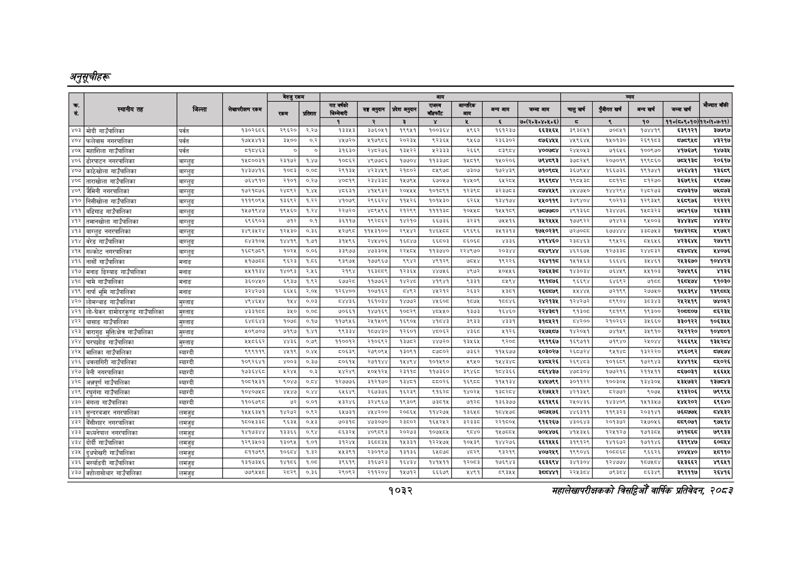

# Page 1094 QA

## Rendered page


## Extracted text

```text
अनुतूचीहरू
१०३२
सहालेखापरीक्षकको वार्षिक प्रतिवेदन २०८२

|  |  |  |  | बैरुए | रकम |  |  |  |  |  |  |  |  |  |  |  |  |
| --- | --- | --- | --- | --- | --- | --- | --- | --- | --- | --- | --- | --- | --- | --- | --- | --- | --- |
|  |  |  |  | ला |  |  | नल | लका | १ | पा | भन | लन | चन |  | नन | खन | ।' |
|  |  |  |  |  |  | १ | रे | ३ |  | ४ |  | ७०(२०३०४०४६०६) | छ | ९ | १० | १०(८४०६०१०) | १२०७:७-११). |
| ४०३ | मोदी गाउँपालिका | पर्वत | १३०२६८६ | २९६२० | २.२७ | ३३४३ | ३७६०५१। | प९९५१ | ००३६४ | २९६२ | २६१२३७ |  | ० | ७००६१ | ७७१९ | इइ९१२१ | इ७७९७ |
| ४०४ | फलेवास नगरपालिका | पर्वत | १७४४४१३ | ३५०० | ०.२ | ४५७२० | २१७९८६ | २०२३५ |  | ९५६७ | २३६३०२ | ८७६४५४५ | ४५९६४५ | १४५०१३० | २६९१८३ | द७५९४८ | ४३२१७ |
| ४०५ | महाशिला गाउँपालिका | पर्वत | ५१८४६३ | ० | ० | ३१६३० | २४८२७६ | १३५२२ | ५२३३३ | २६६९ | ८३९८४ | ४००७८४ | २४५०५३ | ७१६५६ | १००९७० | ४१७६७९ |  |
| ४०६, | ढोरपाटन नगरपालिका | बाग्लुङ | कश्च००३१ | रइक७र | १४७ | कठ्यइर | ४९७३०६ | १७७०४) | बब |  |  | बढ०२०६।७द्च९३ | २७०२५९ | र२०७०१९ | ब९९७६० | छाप | २०६७ |
| (४०७ | काठेखोला गाउँपालिका | बाग्लुङ | प४३७४१६ | १०६३ | ००८ | २९१३४ | अर३४५९ | २००२ | ०४९७ | ७३०७ | १७२४३९ | ७१०६७५ | ६७९४ | १६६७३६ | ९१७७ | २४३१ | इयर |
| ४०८, | ताराखोला गाउँपालिका | बाग्लुङ | ७४९० | २१०१ | ०२७ |  | रकषबइण | ५७९४ | ६०७ | ० | ६२०४ |  | ९०४३ | पया | ०२७० | इ६७९२६ | ६९७७ |
| ४०९ | जैमिनी नगरपालिका | बाग्लुङ | १७२१०७६ | २४९२ | १४४५ | ०६३१ | ४१४९३२ | २०५४४) | १०१०९१ | बरइट | ३२३७८३ |  | ०७० |  |  |  | ७४०७३ |
| ५१०, | निसीखोला गाउँपालिका | बाग्लुङ |  | बइइदर | फरर |  | रबबबरण | बकर |  | बरा | पण |  | अगा | दम्लइ | बरा | २९७६ | ररर |
| ४११ | बढडिगाड गाउँपालिका | बाग्लुङ | १५७१९४४७ | १९५६० | १,२४ | २२७२० | ४०९४९६ | २२९९ |  | ०४४७ | १४४१५९ | ७५७७५० | ४९१३६८ | १३४४७६ | ब५०३२३ | ७५४१६७ | र२६३३३ |
| ४१२, | तमानखोला गाउँपालिका | बाग्लुङ | इ९६९०३ |  | ०१ | ३११७ | बढ्स्धइर | १४२१०। | इछ३६इ | उइ२३१ | ७०७६ |  | १७७९२२ | छर |  |  | शार |
| ५१३ | बाग्लुङ नगरपालिका |  |  |  | ०३६ |  |  | सर | पहल |  |  | प७४०२३९ | ७२७० | बढ |  |  | ९७४२ |
| ४१४ | बरेङ गाउँपालिका | बाग्लुङ | बह |  | १७१ | ३१९६ |  | पछ] | बच्न | पछ | ३३६ |  | २०४६ | ६९६२६ | नाइ | पा | २०७१ |
| ४१५ | गल्कोट नगरपालिका | बाग्लुङ | इड९७५९ | १०२५ | ००६ | ३३९७७ | ४७३३०५ | २२०५ | ३७४० | २२४९७० | र०३४४ | चर | ४६२६७५ | २७३३ | र२४४७३२ | दशा | ४०७६ |
| ४१६ | गाउँपालिका | मनाङ | ४१७७८८ | ९६२३ | ४१:८६ | ९३९७५ | १७७९६७ | ९९४२ | ४९१२९ | ७्य२४ | १९२२६ | २६४११८ | १५१५६३ | ६६६४६ |  | २४५३६७० | १०४४२३ |
| ४१७ | मनाङ डिस्याङ गाउँपालिका | मनाङ | ४४५११३४ | ४०६३ | २४६ | २१६४ | १६३८८९ | २३६५ | ४४७५६ | ४९७२ | ४०५४६ | २७६४३८ | १४३०३४ | ७४५९ | ५५१०३ | २७४४९६ | ४१३६ |
| ४१८ | चामे गाउँपालिका | मनाङ | ३६०४४० | ६९३७ |  | इढउरण | ११७७६२ | ४२४८ | ७९७१ | ९३३१ |  | १९६७ | ९६९४ | ४६९२ | छान्छ | ६४७४ | ९१०३० |
| ४१९ | नार्पा भूमि गाउँपालिका | मनाङ | इरहर७३ |  | २०४ | ब२६४०० | क०७१६२ | ०४६२, | २१२ | रइ३२ | ४३०१ |  | २४७७ | ७१९६ | २०७० | ७९४ | १३९५५४ |
| ४२०. | लोमन्याङ गाउँपालिका | मुस्ताङ | ४९४६५४ |  | ००३ | पा३६ | १६१०३४ | ४७७२] | ४६० | ०७४५ |  | रहर |  | प९६०४ | डा | र२७९ | ७४०२ |
| ४२१ | लो-धेकर दामोदरकुण्ड गाउँपालिका | मुस्ताङ |  |  |  | ७०६६१ |  |  |  | ३७३ | १६४६० |  | ९३०७ | ०१६६ | ९३०० |  | ब६२३४ |
| ४२२ | थासाङ गाउँपालिका | मुस्ताङ |  | ब०७८ | ०१७ | ब१७९५६ | २७१४०९ | १६९०४ | भान | इद | ४३३१ |  | ०२०० | २१०२६२ |  | ३३०१२२ | १०६३४४ |
| ४२३ | बारागुङ मुक्तिक्षेतर गाउँपालिका | मुस्ताङ | ५०४७०७ | ७१९७ | ०७१३ | दुदुइइ४ | क०७४३०। | १२६० | ४६०६२ | ४३६८ | ४१२६ |  | १४२०५१ | ७७५९ | उ४९१० | र४२१२० | १०४६०१ |
| ४२४, | घरपझोङ गाउँपालिका | मुस्ताङ | ४४८६६२ | ४४३६ | ०७९ | १९००१३ | २१०६९२\| | ३७८२) | ४४७२० | ३४६४ | ड्२०८ | २९१९६७ | १६९७११ | ७१९४० |  | र२६६६९४ | १२७४ |
| ४२५ | मालिका गाउँपालिका | म्याग्दी | द९९११५ | ४७९ | ०४५ | ०६३९ | २७९०६५ | ३०६१ | ००२ | ७३६२ | १५६७ | ४०३०२७ | २६०७२४ |  | ब३२२२० | ४९६०९२ | ७५७४ |
| ४२६ | धवलागिरी गाउँपालिका | म्याग्दी | १०९२६४१ | ४००३ | ३ | ८०६१५ | र२७११४४ | ११५४९४। | १०१४५९६० | ४९५० | ११४३४८ | १४८५२६ | २६९४८३ | १०१६८९ | १७२९४३ | २४४११५ |  |
| ४२७ | बेनी नगरपालिका | म्याग्दी | प७३ब४इछ | पर | ०३ | अ४२४६९ | ४०४१२४ | ३११८ | ११७३६० | इ९४६ङ | ०४३६ | द६९४३७ | ४७०३०४ | १७७
```

## Flags
- table_page
- medium_quality_table
