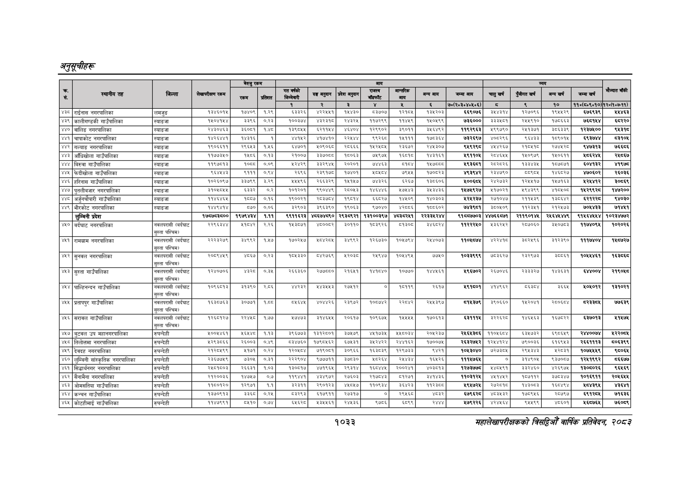

# Page 1095 QA

## Rendered page


## Extracted text

```text
अनुतूचीहरू
१०३३
सहालेखापरीक्षकको वार्षिक प्रतिवेदन २०८२

|  |  |  |  | बैरुए | रकम |  |  |  | जन |  |  |  |  |  |  |  |  |
| --- | --- | --- | --- | --- | --- | --- | --- | --- | --- | --- | --- | --- | --- | --- | --- | --- | --- |
| । |  |  |  |  |  |  | नय |  | ११ | १ | लन | खन | चन | अनन | लन |  |  |
|  |  |  |  |  |  | १ | र | ३ |  |  |  | ७०(२०३०४०६०६) | छ | ९ | १० | ११०(८०१०१०) | १२०७०७-११) |
| ४३” | राईनास नगरपालिका | लमजुङ | पड्न |  | १ | दइबर६ |  | ब४३० |  | प२१०५ | ३२०३ | इ९०७६ |  |  |  | ६९३९ | २४६३ |
| ४३९ | कालीगण्डकी गाउँपालिका | स्याङजा |  | इ३९६ | ०२३ | १००३७४ |  | २४३२५) | ११७२६९ | १४५९ | ४०७६ | ७३६००० | ३३३४०१ | २४४६१० | ७०६६ | ७६१४ | ६२२० |
| ४४० | बालिङ नगरपालिका | स्याङजा | २४३०४६३ | ३६०६१ |  | १३९०५५ | इ२११५४ | ४६४०४। | १२९९०२ | ३९०११ | ३४६४६२ | ११९२९६६३ | ४५९९७६० | २५१३७१ | ३८६३३९ | १२३७४०० | ९४३१८ |
| ४४१ | चापाकोट नगरपालिका | स्याङजा | १४२६४४१ | १४३१६ | १ |  | ४१७४१०। | २२४४४ | ९ | १४५१११ |  | ७३२६९७ | ४०८२६६ | ९६४३३ | १८९०१४५ | ६९३७४४ | ३१०४ |
| (४४२ | गल्याङ नगरपालिका | स्याङजा | १९०६६११ | २९६४३ | १४५६ | इ४७०१ | ४०६०६८। | २०६६६। | क४२७७५ | र३६७२ | र२४४३०७ |  |  | २५०४१७ | र७/७२८ | द७३१३ | ७६५६ |
| ४४३ | आँधिखोला गाउँपालिका | स्याङजा | ११७७३४५० | १५८६ | ०.१३ | २१००७ | इ३७०८८। | १८०६३ | ७९७५ | ६८१८ | १४३१६१ | १९११०५ | २०४६५४ | १५०९७६५ | १४०६११ |  | २४८६७ |
| ४४४ | बिरुवा गाउँपालिका | स्याङजा | ११९७८१३ | १० | ०.०९ | भ२४२९ |  | २०२०१ | ७४४६३ | =४८ | १श७८८ड | १९३६८१ | २८२८२६ | १३३४३५ | १८७८७१ | ६०४१३२ | ४९७८ |
| ४४५ | फेदीखोला गाउँपालिका | स्याङजा | ६६४४४३ | ९१११ | ०.९४ | २६९६ |  | १७४०१ | ८४८४ | ७९५५ | क७०्८रइ | ४९३९४२ | २३४७९० | च्याट | १४६८२७ | ४७०६०२ | २६०३६ |
| ४४६ | हरिनास गाउँपालिका | स्याङजा | १०२६०९७ | ३३७९९ | ३.२९ | २५५९६ | २६६३२९ | १५१५७ | ७४३२६ | ६२६७ | १३८६०६ | १००६८४५ | २४२७३२ | १२५५१७ | १४५७१६३ | ९ | ३०५६८ |
|  | नगरपालिका | स्याङजा | इक०४७५४ | ३३ | ०३ | १०१२०१ | वडा | २००४३ | काहा | २७७३ | उ४३४३६ | क७७४९२७ | २१७०२१ | ४९४३६६ | ४१०४०७ | ब४२९९२५ | क४७२०० |
| ४४८ | गाउँपालिका | स्याङजा | पकरर | ९ | ०१६ | बद्णणरत | रथका | बह |  |  |  |  | २००७ | र२११४३९ |  | हरर | ४०३० |
| ४४९ | भीरकोट नगरपालिका | स्याङजा |  | ५५० | ०.०६ | ब२९०३ | ३९६३९०। | १९०६३ | ९७०४० | शर्ू८६ | १८८६०२ | ७४३९८१ | ३८०५०९ | ११२३४१ | २१२५७३ | ७०४४३३ | ७१४५१ |
|  | लुम्बिनी प्रदेश |  | ७५७०३७०० | १९७९४३४ | १०११ | ९९११६२३ | ४६७४च९० | २९३७९२१ | १ |  | ररबक१र४४ | ९१०५७७०३ | ४४७६६७७१ | सक९मा | रहल | सरह | १०७३००० |
| ४५० | बर्दघाट नगरपालिका | नवलपरासी (बर्दघाट सुस्ता पश्चिम) | सर९६इह | अपार | २२६ | प४३०७१ |  | ३०११० | बइदर६ |  | इयर |  | ४३६२४२। | २०७०६० | ३५०३ | १७४० | १०२०२६ |
| ४१ | रामग्राम नगरपालिका | नवलपरासी (बर्दघाट सुस्ता पश्चिम | २२२३२७६९ | ४९९२ | १४७ | १७०२६७ |  | ४९६२ | १२६७३० | ब०४७९४ | २७४०७३ |  |  |  | इ१२३९० | ब११७४०४ | ६८७२७ |
| ४५२ | सुनवल नगरपालिका हि | नवलपरासी (बर्दघाट सुस्ता पश्चिमा | २०७९४४६ |  | ०२३ | ४३३० | ब४२७६९ | १२०३ | र४९४७ | ०४४४ | २७८० |  | ७०३६२७। | २३२९७३ | ३०६१ | १०९४६१ | इप |
| ४५३ | सुस्ता गाउँपालिका हि | नवलपरासी (बर्दघाट सुस्ता पश्चिमा | १२४०७०६ | ३ | ०,३४५ | २६६३६० | र२७७८८० | २१६५१ | १४१८४० | १०७७० | १४४५६१ | १९६७०२ | २६७०४६ | २३३३२७ | १४३६३१ | ६४४००४ | र२१९०४८ |
| ४५४ | पाल्हिनन्दन गाउँपालिका | नवलपरासी (बर्दघाट सुस्ता पश्चिम) | १०९६८१३ | १३९० | २८६ | ४४२३२ | २४३४५५३ | २७४५१२ | ० | ५११९ | २६१७ | १९१६०१ | ४१४६६२ | द्इ्दर | ३६६४ | ५०५०१२ | १३१०२१ |
| ४५ | प्रतापपुर गाउँपालिका | नवलपरासी (बर्दघाट सुस्ता पश्चिम) | १६३०७६३ | ३०७७१ | १०८ | ६ | ४०२६ | २३९७२ | १००७४२ | र२२८४२ | र८५३९७ | ८१४३७९ | ३९०६६० |  | स्थ०्ला | दरब | ७७६३९ |
|  | सरावल गाउँपालिका | नवलपरासी (बर्दघाट सुस्ता पश्चिम) | पस्चापरङ | रस | १७७ | २७४७३ | ३५४६४४ | २०६७ | ०९६७ |  | क७०६१३ |  | इस्ट | प४६४६३ | प६७०२२ | ६३७०१३ | ११५७ |
|  | बुटवल उप महानगरपालिका | रुपन्देही | ४००७४६१ | ४० |  | इ९६७७३ | ९३ |  | डक | पय |  | राइ | १०४६०४ | ब३४७३२ |  | र/४००७४ | २२०४ |
| ४५८ | तिलोत्तमा नगरपालिका | रुपन्देही | २९३८६६ | २६००३ | ०.४९ | ८३४७६० | १७९८५६२। | ६७५३१\| | ३४२४२२ | २४४१६२ | १५००७५ | २६३२७५२ | १२४४१२४ | ७९००३६ | १६६५३ | २६६१११३ | ५०६३९९ |
| ७५६ | डेवदह नगरपालिका | रुपन्देही |  | २१७१ | ०२४ |  | ७१९०५१ | ३०६६ | १६३५३९ | १२९७३३ | १ | ब०४
```

## Flags
- table_page
- medium_quality_table
