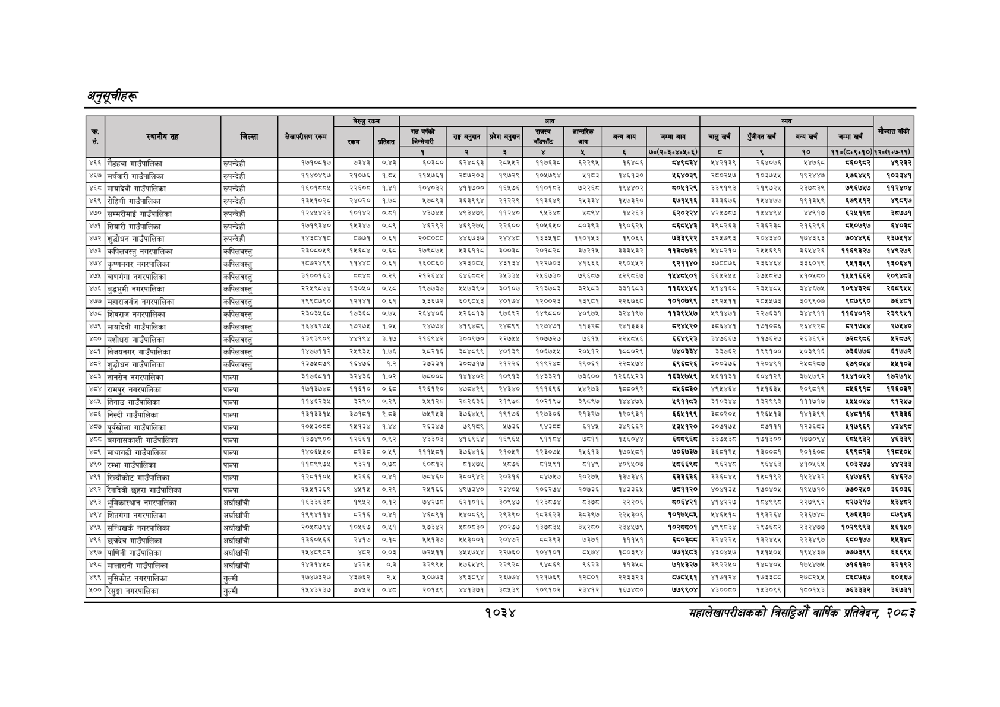

# Page 1096 QA

## Rendered page


## Extracted text

```text
अनुतूचीहरू
१०३४
सहालेखापरीक्षकको वार्षिक प्रतिवेदन २०८२

|  |  |  |  | बैरुए | रकम |  |  |  | जन |  |  |  |  |  |  |  |  |
| --- | --- | --- | --- | --- | --- | --- | --- | --- | --- | --- | --- | --- | --- | --- | --- | --- | --- |
|  |  |  |  | ला |  |  | नल | लका | १ | पा | भन | लन | चन |  | नन | खन | ।' |
|  |  |  |  |  |  | १ | रे | ३ |  | ४ |  | ७०(२०३०४०४६०६) | छ |  | १० | ११०(६४०६०१०) | १२०७०७-११). |
| ४६६ | जैडहवा गाउँपालिका | रुपन्देही | १७१०६१७ | ७३४३ | ०.४३ | ६०३० | ६२४८६३। | २०४४२ | १७३४ | २२९५ | १६४६ |  | ४४२१३९ | २६४०७६ | ४७६८ | ८६०१८र | ९२३२ |
| ४६७ | मर्चवारी गाउँपालिका | रुपन्देही | ११४०४९७ | २१०७६ | १८४५ | ११५७६१ | २८७२०३ | ९७२९ | १०५७९४ | ४१८३ | १४६१३० | १६४०३९ | २८०२५७ | १०३७४५ | १९२४४४ | ४७६४५९ | १०३३४१ |
| ४६८ | मायादेवी गाउँपालिका | रुपन्देही | १६०१८८४५ | २२०८ | १.४१ | १०४०३२ | ४११७०० | १६५७ | ११०१८३ | ७२२६८ | १९४४०२ | ५०६१२९ | ३३९१९३ | २१९७२५। | २३७८३९ | ७९६७४७ | ११२४०४ |
| ४६९ | रोहिणी गाउँपालिका | रुपन्देही | १३९०३५ | २४०२० | १.७ | ७०९३ | ३६३६९४ | २१२२९ | ११३६४९ | १४३३४ | १५७३१० | ६७१५१६ | ३३३६७६ | १५४४७७ | १९१३४९ | ६७९५१२ | ४९८९७ |
| ४७० | सम्मरीमाई गाउँपालिका | रुपन्देही | १२४४४२३ | १०१४२ | ०.८१ | ४३७४५ | ४९३४७९। | ११२४० | ९५३४८ | ४८९४ | १४२६३ | ६२०२२४ | ४२५७८७ | १५४४९४ | ४४९१७ | ६२४१९८ | ५७७१ |
| ४७१ | सियारी गाउँपालिका | रुपन्देही | १७१९३४० | ११३४७ | ०:८९ | ६२९२ | ४६९२७५ | २२६०० | १०५६४५० | ५०३९३ | १९०६२४५ |  | ३९०२६३ |  | २१६२९६ | ८५०७९७ | ६४०८ |
| ४७२ | शुद्धोधन गाउँपालिका | रुपन्देही | ब४१ड |  | ०.६१ | र०ड०्ड | ४४६७३७। | र२४४४८। | १३३४१८ | ११०१४३ | ९०६६ | ७३३९२२ |  | २०४३४० | १७४/३६३ | ७०७९६ | र३७७१४ |
| ४७३ | कपिलवस्तु नगरपालिका | कपिलवस्तु | २३०५०४६ | काला | ४ | प७९०७५ |  | ०३ | पम्प |  | इइह३२र | पवइपाडइन। | ४४०२१० | २४६९ | ४४२६ | ब१६९३२७ | १४९२७९ |
| ४७४ | कृष्णनगर नगरपालिका | कपिलवस्तु | १८७२४९९ | ११४४ | ०.६१ | १६०८६० | ४२३००५ | ४३१३४। | १२२७०३ | ४१६६६ | २९०५५२ | ९२११४० | ३५८८७६ | २३६४६४ | ३३६०१९ | ९५१३४९ | १३०६४१ |
| ४७५ | बाणगंगा नगरपालिका | कपिलवस्तु | इक००प६३इ | वडा | ०२९ | सरह |  | २४३३५४ | २४६७३० | ७६०७ | ४२९०६७ | काल |  |  | ४१०४५० | ११६६२ | र२०९४८३ |
| ४७६ | बुढभुमी नगरपालिका | कपिलवस्तु |  | ब३०४० | ०५ | ९७३७ |  | ३००७ | रवइ७न३ | इरान | इकाइ | १७४६ | पद | रइ४४न | इ००७४ | १०९२ |  |
| ४७७, | महाराजगंज नगरपालिका | कपिलवस्तु | ब९९०७९० | बरब१ | ०:६१३ |  | ब०९०४३ | ०१७४ | १२००२३ | बब |  | ब०%०७९९ | ३ | र०४४७३ | इ३०९९०४ | दए | ७६४७१ |
| ४७८ | शिवराज नगरपालिका | कपिलवस्तु | २०३६ | इद | ०७४ |  | अरधापइ | ७६९२ | बब | ४०९७५४ | इराब९७छ | प३९५४७ | अ९१४७१ | २२७६३१ | इाड१ | ६४०२ | र३९९४१ |
| ४७९ | मायादेवी गाउँपालिका | कपिलवस्तु | बचबर७४ | ७२७५ | १०४ |  |  | २४०९९ | १२७४७१ | बइठ | २४१३३३ |  | ३०६७ | १७१०७६ | २६४२ |  |  |
| ४५० | यशोधरा गाउँपालिका | 'कपिलवस्त्‌ | ३०० |  | २४७ | बदर | ३००९७०। | २२७४ | १०७७२७ | ७१४ | २२०६ | दहपर३ | ३४७६६३७ | ११७६२७ | २६३६६२ | ७र२५९५६ | २५७९ |
| अत | विजयनगर गाउँपालिका | कपिलबस्तु | प४७११२ | २९३४ | १७६ | प८२प६ |  | ४०१३९। | १०६७ | र०७२ | कह०र९ |  | इ३७६२ | ९९१० | अ०३९१६ | ७३६७७ड | १७७२ |
| ४८२ | शुढोधन गाउँपालिका |  | ब३७४०७९ |  | १२ | ७३३१ | ३००७१७। | २२२६ |  | १९०६१ | र२२८४७४ | ६६२६ | ३००३७६ | २०४१ | २०१७ | ७९०४ | २७०३ |
| ४८३ | तानसेन नगरपालिका | पाल्पा | ३१७६८११ | २४३६ | १.०२ | ७८०० | १४१४०२ | १०६१३ | १४३३२१ | ७३६०० | १२६६४२३ | १६३४७५९ | १५९९३ | ६०४१२६ | इ३७५७९२ | १४४१०६२ | १७२७१५ |
| ४८४, | रामपुर नगरपालिका | पाल्पा | १७१३७४८ | १६१० | ०६८ | ब२६१२० | ४७५४२९ | २४३४०। | ब११६९६ | ४२७३ | १०८०९२ |  | ४९४४६४ | ४१६३ | र२०६७१९ | बाइ | १२६०३२ |
| ४०५ | तिनाउ गाउँपालिका | पाल्पा | ११४६२३४५ | ३२९० | ०.२६ | श्पस्ठ | २०२६३६ | २१९७८ | १०२१९७ | ३९८९७ | १४४४७४५ | १९११८३ | ३१०३४४ | १३२९९३ | १११७१७ | २५४५०४४ | ९१२५७ |
| ४८६ | निस्दी गाउँपालिका | पाल्पा | १३१३३१५ | ७१८१ | र्.८इ | ७४२५३ | ३७६४४९ | १९१७६। | १२७३०६ | २१३२७ | १२०९३१ | ६६४१९९ | ३८०२०४५ | १२६५१३ | १४१३९६९ | ६४८११६ | ९२३३६ |
| ४८७ | पूर्वखोला गाउँपालिका | पाल्पा |  | कप | १४४ | रइ३४७ | ७९७९ | ४७३६ | दाङ |  | ३४९६६२ |  | ३०७१७८ | ७१११ | ब२३६०५३ | ४१७९६९ | रू |
|  | बगनासकाली गाउँपालिका | पाल्पा | १३७४९०० | १२६६१ | ०.९२ | ४३०३ | ४१६९६४ | १६९६४ | ९११०४ | ७८११ | १५६०४४ | दृदद९्इद | ३३७५३८ | १७१३०० | १७५०९४ | ६८४९३२ | ४६३३९ 
```

## Flags
- table_page
- medium_quality_table
