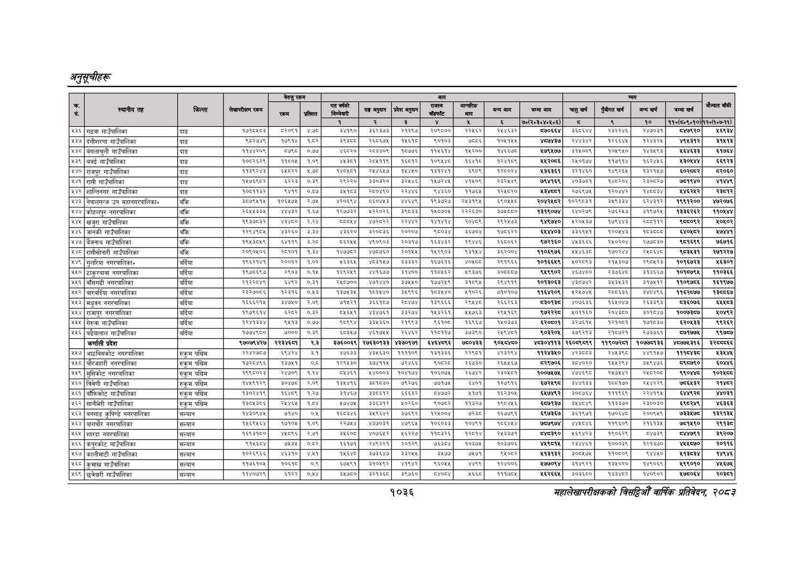

# Page 1098 QA

## Rendered page


## Extracted text

```text
अनुतूचीहरू
१०३६
सहालेखापरीक्षकको वार्षिक प्रतिवेदन २०८२

|  |  |  |  | बैरुए | रकम |  |  |  | जन |  |  |  |  |  |  |  |  |
| --- | --- | --- | --- | --- | --- | --- | --- | --- | --- | --- | --- | --- | --- | --- | --- | --- | --- |
| । |  |  |  |  |  |  | नय |  | ११ | १ | लन | खन | चन | अनन | लन |  |  |
|  |  |  |  |  |  | १ |  | ३ |  | ४ |  | ७०(२०३०४०४०६) | छ | ९ | १० | १०(६०६०१०) | १२०७०७-११). |
| ५३६ | गढवा गाउँपालिका | दाङ | १७१०४८३ | २०९१ | ४७८ | इ४१९० |  | २१२९७ | २०६८०० | २२४६२ | र२४४६३२ | द७०६६४ | ३६०६४४ | र२३२२४६ | २४७०३१ | बा७९२० | ६९३४ |
|  | दंगीशरणा गाउँपालिका | दाङ | द०२७४९ | १७९१४ | १८५२ | डच | २६०६७५ | १४६४ | ९०१०३ | छन्‌ | १०४१५४ |  | २४४३४२ | । १२६६४५ | १२४३२४५ | ४९४३१२ | ३१९३ |
| ५३८ | बंगलाचुली गाउँपालिका | दाङ | ११४४२०९ | ०७९८ | ०७७ | ४०२० | २०३३०९ | १०७६ | ११४६१४ | ब४२०० | ४६६८ | ४७९५७७ | १५०९ | १०४९५० | १४३६९३ | १६४६३३ | १७६४ |
| ५३९ | बबई गाउँपालिका | दाङ | १०८२६२९ | ११६०५ | १०९ | ४३८१ | २०४११९ | १६८१२\| | १०९४४८ | १६४१ | १२४१८९ | ४४२०६६ | २५०१७४ | ११७९१४ | १६२४४५६ | ४३०४४४ | ६६९२३ |
| ४४० | राजपुर गाउँपालिका | दाङ | बदर | बकर | २७८ | पटक] | २४४६४७ |  | १३ |  | १२८०२४ | ४३६३६१ | ३२१४६० | १४६२६४ | ३२४७ |  | २०६० |
| ४४१ | गाउँपालिका | दाङ | १४७६९८२ | ६२२३ | ०.३९ | २९२२० | ३०३० | इ२४४६। | क४७२४४५ | ४१५०९ | र२३२५४९ | ७९४१६९ | ४०३७०१ |  | र२३०५२७ | ७५१९४० | ४४९ |
| ४४२ | शान्तिनगर गाउँपालिका | दाङ | १०८६११३२ | ९४१९ | ०८७ | बेशपठ३ | २८०४६०। | २२४४६ | ९४३६० | ११७६४ | १२४८२० | १३४१ | २०६९७४५ | १२०४४२ | प्रष्ट | २४६२४२ | २८१२ |
| ४४३ | नेपालगन्ज उप महानगरपालिका" | बाँके | ३०७९५१५ | १०६४७५ | २,७४५ | ४२०६९४ |  | इट | १९३७२७ |  | ६९०५५८ | २०४२४८२ | १०२६०३१ |  | ब२४३१२ | १९९१२०० | ४७२०७६ |
| १४४ | कोहलपुर नगरपालिका | बाँके |  |  | १,६६७ | २७३२ | २२०२६ | ९८३३ | १४८७०५ | २२२६३० | ३ | १३१९०७४ | ब६४०२७६ | र२७६२४७ | ४१९७२६ | ब३३६२६२ | ११०८४४ |
| ४४५ | खजुरा गाउँपालिका | बाँके | १९३७८३२ | ३४८० | २,२४ | छल |  | २२४४२) | बहश | २०४६६ | २९२५४७३ | द४९७४० | ४२०५३७ | ९४४३ | र२००११२ | ६०९२ | ०५०२ |
| ४४६ | जानकी गाउँपालिका | बाँकि |  | ४३२६० | ३.३ | ३६२० | इ२०७३६ | २०२०७\| |  | ६७०४ | ७६२२ | द्शण् | ३३१४ | प२०४४३ |  |  | ४७४७ |
| ५४७ | बैजनाथ गाउँपालिका | बाँके | १९५३८४५९ | ६४११९ |  | ८६२४४५ | ४९०९०३ | २०३१७] | १६३४३२ | र२९४४६ | २६८०६२ | ९७२१६० | ४८३६६६ | २५०२०४ | २७७८३० | ९८१६९९ | ७६७१६ |
| ४४० | राष्ीसोनारी गाउँपालिका | बाँकि | २०६०४०६ |  | ब.३४ | करडडर |  | २०१४४ | २९०३ | ३ | इइ२००४ | ब१०६९७६ | इइू | ० | राख | द०३४३१ | र२७१२२७ |
| ४४९ | गुलरिया नगरपालिका» | बर्दिया | बसब१४१ | २००१२ | १७२ | ४६३६ |  | ३३३३२ | १६७६१६ |  | २९१९६६ | ०७६९ | ३ | २१४३०७४ | २९०६२३ | १०१७७२३ | ६३०१ |
| ४५० | ठाकुरबावा नगरपालिका | बर्दिया | १९७०६९७ | २९०३ | ०१४ | ९२४९ | ४४७१६७७। | ३१४००। | प१०६६२ | ९३७६ | ३०८८०७ |  | ४४०० | २३७६४८ | १३६६७ | ०१७९ | ११०३६६ |
| ४५१ | बाँसगढी नगरपालिका | बर्दिया | २१२२८४९ | ६४९२ | ०३९ | २५८७०० | ४७१४४०। | ३७५५०। | १७७२१९ | ३९ | २९४९१९ | १०१३०६३ | ४३८७४२ | ३५३५३२ | ३९९४९७ | ११०९७८६ | १६१९७७ |
| ४५२ | बारवर्दिया नगरपालिका | बर्दिया | २इ२७०८६ | बरइपइ | ०४३ | ब३७४३४ | काइक४० |  | ० | १०२६ | ७१०१०७ | बकर | श२४७४७५। | स००६३६ | इ४०४९६ | ब१६२८७७ | बक्य६७ |
| ४४३ | मधुवन नगरपालिका | बर्दिया | १६६६२१५ | इ४७५० | २०९ | ७१५२१ | ३६६७ | र०४७४\| | १३९६६६ | र९४४७ | २६६२६३ | दइ०पइद | ४०७६३३६ | ५०४७ |  | ७३इ०७६ | हन |
| ४५४ | राजापुर नगरपालिका | बर्दिया | १९७९६१४ | इश्धर | ०३२ | ८६४१ | ४३४७६१। | ३३२७४\| | १४३२६१ | ४७६३ | २९४१६९ |  | ५०११६० | र२०४३८० | ३०१५४७७ | १००७३५७ | १०४९२ |
| ४५५ | गेरुवा गाउँपालिका | बर्दिया | १२४१३३४ | ९५१३ | ०.७ | ९८९९४ | ३३४३६०। | २१९९३ | ९६१०० | १६९६७ | १५०३७३ | ६२०६०१ | ३२७६१४ | १२१०८१ | १७१८३७ | ६२०४३३ | ९९२६२ |
| ५५६ | बढेयाताल गाउँपालिका | बर्दिया | १७७४९८० | ७००० | ३ | ६३४७ | ४६१७४५ | २६४६२। | ११८११७ | ७३९० | र२४९४८१ | ९०३२०४ | ३७९२९३ | २१०७२१ | र२७३७६१ | ७१७७ | ९७८७ |
|  | कर्णाली प्रदेश |  | ९७०७९४२७ | ररइ्चप | २.३ | ३७६००६९ | २७६३०१३३ | ४३७०१७१ | ६४६४८९६ | ७५०४३३ | ९०४८४६० | भ्३०४११३ | २६०८९८९९ | ११९०७२८१ | १०७७५१३६ | ४८७७४३१६ | इरपयइ |
|  | आठविसकोट नगरपालिका | रुकुम पश्चिम | स्र२७०७ |  | ३.१ | ४६३३ | ४३५६३० | ११११०६ | १३९३३६ |  |  |  | परइपङ | २३९८ | ४९४७ | पाकाक्ध | १३४४ |
| ५५८ | चौरजहारी नगरपालिका | र
```

## Flags
- table_page
- medium_quality_table
