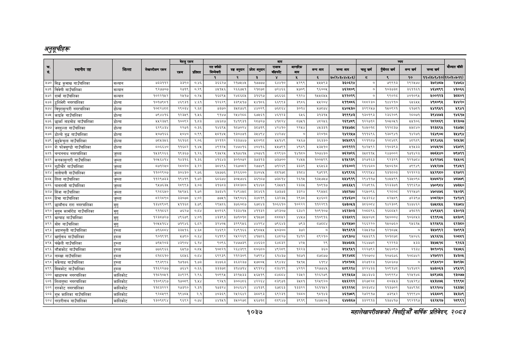

# Page 1099 QA

## Rendered page


## Extracted text

```text
अनुतूचीहरू
१०३७
सहालेखापरीक्षकको वार्षिक प्रतिवेदन २०८२

|  |  |  |  | बैरुए | रकम |  |  |  | जन |  |  |  |  |  |  |  |  |
| --- | --- | --- | --- | --- | --- | --- | --- | --- | --- | --- | --- | --- | --- | --- | --- | --- | --- |
| । |  |  |  |  |  |  | नय |  | ११ | १ | लन | खन | चन | अनन | लन |  |  |
|  |  |  |  |  |  | १ | रे | ३ |  | ४ |  | ७०(२०३०४०४६०६) | छ | ९ | १० | ११०(६०६०१०) | १२०७:७-११). |
| ४७० | सिट कुमाख गाउँपालिका | सल्यान | छर | इइ९० | गइ | ६६२७ | रड | ७७७७ | प० | २२९९ | २०७३ | ३६०६२४ | ० | ९९१३ | २९७४ |  | २४७४ |
| ५७१ | बिवेणी गाउँपालिका | सल्यान, | ९२७७०४ | २७१९ | ३ | ४१४६ | २६६७४१ | २०७ | ७२४६६ | ४७०९ | ६००४ | ४६२५०९ | ० |  | ३६१६ | ४४९९ | ३०६६ |
| ४७२ | दार्मा गाउँपालिका | सल्यान |  | २४१७ | ०२४ | बह | २४०६०५ |  |  | बर | १४०७ | ५२२०२९ | ० | ढुइ्छरङ | ४०१०६४ | ४००१२३ | ज५०१ |
| ४७३ | ठुलिभेरी नगरपालिका | डोल्पा | ब०१७९०१। | ४९३१ | ४१ | बर्बर | इइदाप७ | अपना | दद | उ९ाइ | अर० |  | २००२३० | १४२० |  | । ४९०९ | ब४४२० |
| ४७४ | विपुरासुन्दरी नगरपालिका | डोल्पा | पम्दरश्य | २९०३४ | २.८ | ४३७० | ब४७०७४९ | ०२९ | छड | डल | अह्ह |  |  |  |  | ४९५ | उ |
| ४७५ | काइके गाउँपालिका | डोल्पा | ७९४४१६ | २३४९ | १४५६ | ९१४७ |  | ६७५६१ | ४६१२३ | ६६ | ३१३१४५ | ३९९९४३ | १३०१९३ | २३६२०९ | २८०७१ | ३९४४७३ | १४६१७ |
| ४५७६ | छार्का ताङसोङ गाउँपालिका | डोल्पा | ४४५२३५९ | १००६२ | १.८३ | ४४५६८७ | १४१९३१ | २८७२७ | ४१द२४ | ५७५१ | ४२४६ | २६९४८९ | १२२७१२ | १०४०४५१ | ९०८ | स८२८६९ | ३२३०७ |
| ४७७, | जगदुल्ला गाउँपालिका | डोल्पा |  | र्र७१ | ०३६ | काइदा | कठडणर४ |  |  | र | नन |  | ब४४०१८ |  | ०७० | ३३६९ | ६७३८ |
| ४७८ | डोल्पो ७३ गाउँपालिका | डोल्पा | ४०७१६६ | ३०४० | ०९९ |  | १३०४७१ | ३४९४ | ४२७४ | ० | इ२०१६ | २४२२४७ | १११६९६ |  |  |  | ३४९४ |
| ४७९ | मुढ्केचुला गाउँपालिका | डोल्पा | ७०५३५६ | ६१६८ | २०६ | इ२११२ | र३३७४७। |  |  | र४६७ | उ३६३३० |  | २२१९०७ |  | ०९०९ | इ९९४६६ | १९ |
| ५८० | शे फोक्सुण्डो गाउँपालिका | डोल्पा | ८०६६४० | १६८२ | १.४५ | ४९२५ | २४७४१६। | ४०४१ | ५४७९१ |  | ४३५१० | ४०२१२२ | १४२५६९२ | २१०३९३ | ५१५३३ |  | ४६७२९ |
| ४०१ | चन्दननाथ नगरपालिका | जुम्ला | क५३९२६६ | ९३६७ | १२६ |  | ४१७४१४५ | ४०७४१ | २९६० | ४१६० | क०७४३० | ७६२७२६ | ३५०११५ | २४७००२ | ब७१४२३ | ७७६४० | ७९७१ |
| ४८९, | कनकासुन्दरी गाउँपालिका | जुम्ला | १०४६४७१४ | ४३१६ | १.३६ | भइ | इ०१०७२ | इछइनइ। | ३७०० | र७७ | ००९९ |  | ३२७१६३ | ४ | बस१७५४ | १२७६ | १५०६ |
| ४०३ | गाउँपालिका | जुम्ला | ०२७० |  | बर | ३०९६ | २६७०७२ | २७४७ | ७२६९ |  |  |  | २४६० | ०६१८ | ७९९५ | पर | १९४७ |
| ४८४ | तातोपानी गाउँपालिका | जुम्ला | १०२९०७ | इ०४३० | २७६ | ४७७६ | २६०० | ३४०४] | बढेका | इ१०४ | ७९१९ | ४९९२६ | २९९९४४ | पइ१००३ | १३ | २२९० | २७२२ |
| ४०५ | तिला गाउँपालिका | जुम्ला |  |  | ब७२ | इच्छा | ३०४७४६) | ३६९०७\|। | इप | रइ१४ |  | ४९१९ | २९७११७ | क | बढ्ान्य्‌्‌ | अ७४७१४ | ५७७९ |
| ४०६ | पातारासी गाउँपालिका | जुम्ला | ९५७६३५ | र८९९३ | ३.०३ | ३६८३ | इ२८३८० | १४६८ | ९३४५१ | २३३५ | १०६१४ | ६६५१ | २२७६१६ | १२३३७१ | ११९६९६७ | ४७०९८४ | ४७३५० |
| ४०७, | सिँजा गाउँपालिका | जुम्ला | दर्० | ४९४६ | ७२ | उ | रहल | उच४३१। | ६३७३ |  | ९०७८ |  | २६४०६६ | दे० | १२७२ | ४७०४७६ | र२४०३९ |
| ४५८ | हिमा गाउँपालिका | जुम्ला | दर२८९० | ३३०७ | ४.०२ | ७७६१ | र४९०४६ | इ४०१९ | इइरइ | र९३४ | १४६०२ |  | २४३२६४ |  | ७२९७ |  | कल |
| ४०९ | छायौँनाथ रारा नगरपालिका | मुगु | १३४८९०९ | ३११६८ | ३७९ | २९५०६ | ब७६००७ | ६०४३ | १०६६१० | ०२२२ | ११२२९१ | ६७३०४३ | उठ | प४२३०६ | प४७४६२ | ६७५७ | र२६७५४ |
| ४९० | मुगुम कार्मरोङ गाउँपालिका | मुगु | सक्छन | छइछ |  | ४०६९ | सबका | अर | छर०४ | दार | ०६०४ | पइरइण३ | २०७९ | बढ्ार | ७०१ |  | ब३०३ |
| ५९१ | खत्याङ गाउँपालिका | मुगु | परकाङरछ | ४९६७९ | ४०१ | इद | इ७१०१८। | भ१४७८ | बब |  | ११०११६ |  | ३४४० | १४०००४ | कमन | ११९० | ८३०९ |
| ४९२ | सोरु गाउँपालिका | मुगु | बठाकइ |  |  | डराया | इरदाइ | अरब | छदा | छ | नया |  | २६६२२० | १४०७६० | पाइ |  |  |
| ५९३, | अदानचुली गाउँपालिका |  |  | उ३७१६ |  | २६९२ | २४९६ | २९७४ |  | ३७२ | ० |  | २३५३१७ | २१७४ | ० | ३७७१९२ | र७१९३ |
| ५९४ | खाुनाथ गाउँपालिका | हुम्ला | द०१९१६ | २७९० | ०६४ | २४१९२ | २४२२६९ | ४४०६ | इटरछ | पार | ब९्२१० | ९३०४ | २५५६९१ | ००७० | ब४०७६ |  | रण्ययत |
| ४९५ | चंखेली गाउँपालिका | हुम्ला |  |  | ६४ | ९०६६ | २३७३ |  |  | ४२४
```

## Flags
- table_page
- medium_quality_table
