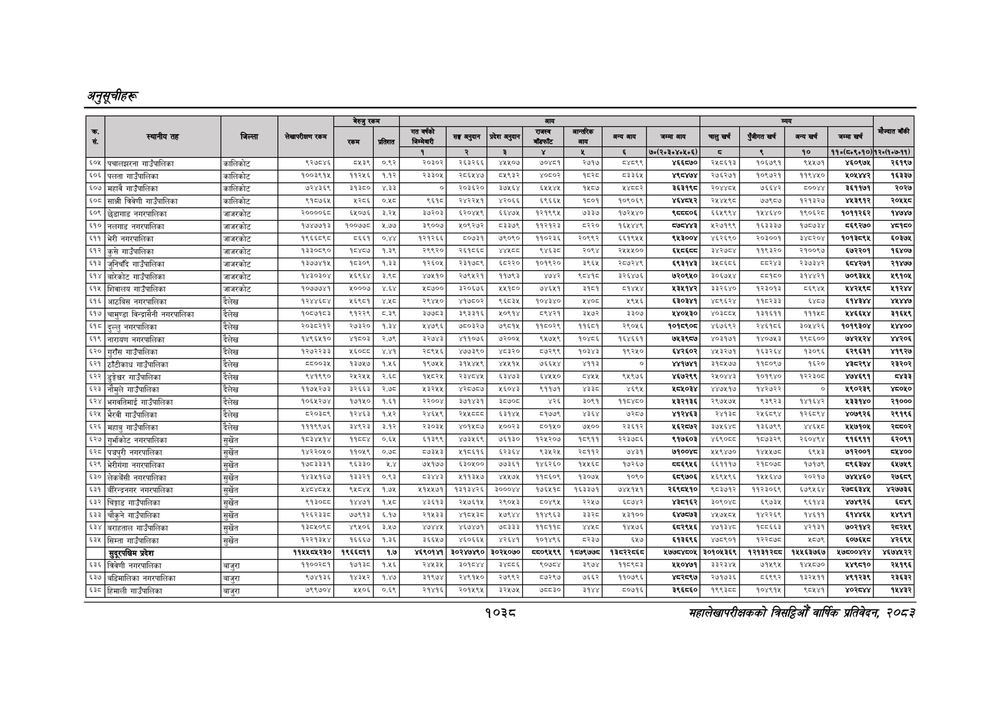

# Page 1100 QA

## Rendered page


## Extracted text

```text
अनुतूचीहरू
१०३८
सहालेखापरीक्षकको वार्षिक प्रतिवेदन २०८२

|  |  |  |  | बैरुए | रकम |  |  |  | जन |  |  |  |  |  |  |  |  |
| --- | --- | --- | --- | --- | --- | --- | --- | --- | --- | --- | --- | --- | --- | --- | --- | --- | --- |
| । |  |  |  |  |  |  | नय |  | ११ | १ | लन | खन | चन | अनन | लन |  |  |
|  |  |  |  |  |  | १ | र | ३ |  | ४ |  | ७०(२०३०४०४०६) | छ | ९ | १० | १०(६४०६०१०) | १२०७:७-११). |
| ६०५ | पचालझरना गाउँपालिका | कालिकोट | ९२७८४६ | ०२३९ | ०.९२ | २०३०२ | २६३२६६ | ४५५०७ | ७०४८१ | २७१७ |  | ४६६५८७० | २५८०६१३ | १०६७९१ | ९५५७१ | ४६०९७५ | २६१९७ |
| ६०६ | पलता गाउँपालिका | कालिकोट | १००३९१५ | १२५६ | १.१२ | २३३०५ | २०८६४५४७ | ०४५९३२ | ४०८०२ | ब्द्श् | ५३३६४ | ४९८४७४ | २०६२७१ | १०६७२१ | ११९४४० | २०४४४२ | १६३३७ |
| ६०७ | महावै गाउँपालिका | कालिकोट | ७२४३६९ | ३ |  | ० | २०३६२०\| | ३२७५६४ | ६५५४४५, | १५८७ | अष्च्दर | ३६३१९८ | २०४४०४ | ७६६४२ | ५००४४ | ३६११७१ | २०२७ |
| ५०८ | सान्नी विवेणी गाउँपालिका | कालिकोट | ९१०७६५ | श२८६ | ०,४५८ | ९६१५ | २४२२४५१ | ४२०६६ | ६९६६ | १७०१ | १०६०६९ | ४६४८५२ | २४४४९८ | ७७९०७ | १३२७ | ४६३९१२ | २०४७ |
| ६०९ | छेडागाड नगरपालिका | जाजरकोट | २००००६८ | ५०७६ | ३२४ | इ७२०३ | ६२०६ | ६४७८ | प२१९६४ | ७३३७ | १७२४४० | दुदपय०६ | इ६४६५४ | प४४६४० | ९०३२ | ०२६२ | ४७४७ |
| ६१० | नलगाड नगरपालिका | जाजरकोट | १७४७७१३ | १००७७८ |  | इ९००७ | ५०९२७२ | ८३७९ | पकरबरङ | ड२२० | १६४४४९ | दद | ५२७१९९ | १६३३३७ | १७०७३४ | ९२७० | ८१६० |
| ६११ | भेरी नगरपालिका | जाजरकोट | १९६६८९८ | ८६६१ | ०४४ | १२१२६६ | ५०७३१ | ७९०९० | ११०२३६ | २०९६९२ | ६५१९५५ | ९४५३००४ | ४६२६९० | २०३००१ | इ४८२०४ | १०१३५९४५ | ६०३७४५ |
| ५४२ | कुसे गाउँपालिका | जाजरकोट | पइ३००९० | कछ | १,३९५ | र२९९२० |  | भल |  | र०९४ | र२४४४०० |  | ३४२७०४ | प१९३२० | २१००६७ | ६७२२०१ | ६४०७ |
| ५१३ | जुनिचाँदै गाउँपालिका | जाजरकोट | ब३७७४७१४ | ०३०९ | १३३ | २६०५ | र२३१७०९ | ८२२० | १०१९२० | ३९६४ | र२०७२४९ |  | ३४०६०६ | डर | २३७३४२। | ६२७१ |  |
| ५१४ | बारेकोट गाउँपालिका | जाजरकोट | प४३०३०४ | ६९६४ | ३९८ | ४७४१० | २७९४२१ | ११७६३ |  |  | इ२६४७६ | ७२०९४० | ३०६७५४ | ०१५० | इ१४७२१ | ७०९३ | ९१०६ |
| ६१५, | शिवालय गाउँपालिका | जाजरकोट | १०७७७४१ | ०००७ | ४४ | ०७०० | इ२०६७६ | ४४१० | ७४७१ | बब |  |  | उ३२६४० |  | नइ | पह६ड | अर |
| ६१६ | आठबिस नगरपालिका | दैलेख | बरहच४ | २६९०८१ |  | २९४४० | ४१७८०२, | ९६६३५ | १०४३४० | २४०८ | ४९५६ | ६३०३४१ | २०६६२४ | १९५३३३ | ६४८७. |  | ४४४७ |
| ५१७ | चामुण्डा विन्द्रासैनी नगरपालिका | दैलेख | १००७१८३ | १२२९ | ८३९ | ड्ड | ३९३३१६ | ४०९४ | वदर | ३४७२ | ३३०७ | ४४०४३० | ४०३५०४ | १३१६११ | कश | प४६६४ | ३१६९ |
| ५१ | दुल्लु नगरपालिका |  | ०२१२ | २७३२० | ब४ | ४७९६ | ७००३२७ |  |  |  | २९०६ | ०१० |  |  | इ०७४२६ | बनाएन |  |
| ५१९ | नारायण नगरपालिका | इेलेख | १४९६४१० | १६०३ | २७९ | बस्छ | ४११०७६ | ७२०४, | ९४७६ |  | १६४६६१ | ७४३९८७ | ४०३१७१ | ४०७३ | ९०६० | रर | ४२०६ |
| ६२० | गुराँस गाउँपालिका | दैलेख | १२७२२३३ | २६०८८ | अप | २८९५६ | ४७७३९०। | ४८३२०। | ५७२९६९ | ०३४३ | १९२४० | ६४२६०२ | ४४५३२७१ | १६३२६४ | १३०६ |  | ४१९२७ |
| ६२१ | ठाँटीकाध गाउँपालिका |  | ५००३ | ३७४७ | १४६ | १९७६ | २४७९ | ४७४ | छ | नइ | ० |  | उ१०५७७ | १००६ | १६२० | ा्कर९४ | र३२०२ |
| ६२२ | डुङ्गेछर गाउँपालिका | दैलेख |  | २२५५ |  |  |  |  | इ४५५० | बह | ५९७६ | ४६७२९९ | २४०४४३ | ०९४० | बर्ण | ४७४६९१ | बाइ |
| ५२३ | नोमुले गाउँपालिका | दैलेख | ११७५२७३ | ३२६६३ | २७८ | ५३२४५ | २८७७ | २६०४३ | ९११७१ |  | ४६९५ | १८५०३४ | ४४७५१७ | १४२७२२ | ० | ९०३९ | ४०५० |
| ६२४ | भगवतिमाई गाउँपालिका | दैलेख | १०६४२७४ | १७१४५० | १.६१ | २२००४ | ३७१४३१ | ३०७० |  | ३०९१ | ११८४८० | १३२१३६ | २९७४५७५ | ९३६२३ | १४१६४२ | ४३३१४० | ३००० |
| ६२५ | भैरवी गाउँपालिका | दैलेख | ५२०३६९ | १२४६३ | ११२ | २४६४९ |  | ६३१४५ | ५१७७९ | ४३६४ | ७२८७ | ४१२४६३ | २४१३८ | २५६०८९४ | १२६८९४ | ४०७९२६ | २९१९६ |
| ६२६ | महावु गाउँपालिका | इेलेख | १११३९७६ | ४९२३ |  | २३०३४ | ४०१४०७। | ४००२३। | ०१० | ७७०० | र२३६१२ | अ६२७७२ | ३७४६४७० | ब३६७६६ | बाइट | ४७१० |  |
| ६२७ | गुर्भाकोट नगरपालिका | सुर्खेत |  | पकच्य |  | ६१३९९ |  | ७१३०] | प२४२०७ | ६९११ | र्र३७०६ | ९७६० |  | पेनडइर्द | २६०४९४ | ९१६९११ | ह२०९१ |
| ६२८ | नगरपालिका | सुखेत | ब२२०४० |  | ०ङ | चढाइ | २१०६१६ | २३६४] | द३४२६५ | २०११२ | ७८३१ | ७००४ | ५९४७० | ७७७० |  | ७१२००१ | ४४०० |
| ५२९ | भेरीगंगा नगरपालिका | खु
```

## Flags
- table_page
- medium_quality_table
