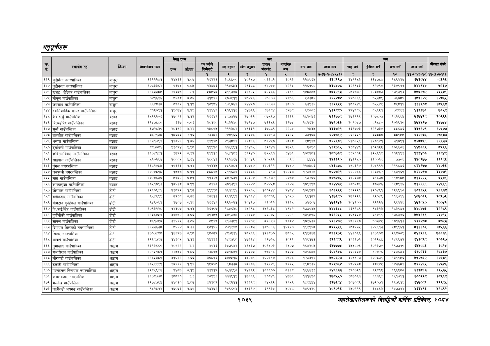

# Page 1101 QA

## Rendered page


## Extracted text

```text
अनुतूचीहरू
१०३९
सहालेखापरीक्षकको वार्षिक प्रतिवेदन २०८२

|  |  |  |  | बैरुए | रकम |  |  |  |  |  |  |  |  |  |  |  |  |
| --- | --- | --- | --- | --- | --- | --- | --- | --- | --- | --- | --- | --- | --- | --- | --- | --- | --- |
|  |  |  |  | ला |  |  | नल | लका | १ | पा | भन | लन | चन |  | नन | खन | ।' |
|  |  |  |  |  |  | १ | रे | ३ |  | ४ |  | ७०(२०३०४०४६०६) | छ |  | १० | ११०(६०६०१०) | १२०७०७-११). |
| ५३९ | बुढीगंगा नगरपालिका | बाजुरा |  | रड | कछ |  |  |  |  | ३०६३ |  |  | ३४९१४३ |  |  | ६०४ |  |
| ५४० | बुढीनन्दा नगरपालिका | बाजुरा | पछ | ९१७४ | ०७४ | ३७७६ | रप | रहन्छ |  | अस | १६९ |  | इ२१९७३ | ९२०६० | प३०६११ | अहा | ७२३० |
| ५४१ | खपड छैडिदह गाउँपालिका | बाजुरा |  | र२४३०७ | २१ | उचाइ |  | ९२४ | वर | २९९ |  |  | २७०७७२ | २००० | १७९३९३ | ४७५१७२ | ४६०९ |
| ५४२ | गोमूल गाउँपालिका | बाजुरा | १६२६ | २६०० | ०७६ | कहर | २०७९ | २७४२६ | बढ१७७ | २९७६ | ७३०६ |  |  |  |  | ३७९४२ | ४५६८ |
| ६४३ | जगन्नाथ गाउँपालिका | बाजुरा | इइ४३० | ७९०२ | ११९ |  | १७९०६२ | र४४२०। | दछ | १७६७ | ६३९३ |  | १७०४४९ | ७४०७ | नाला | ब३१९०४ | ९९६८ |
| ५४४ | स्वामिकार्तिक खापर गाउँपालिका | बाजुरा | च२०४१ | बढ्न | २२९ | गइ | रब | उड | चाला | इट |  | अपर्ण | २४४६७४ | न४इ२३ | छन | ९७१ | ७५८ |
| ६४५ | केदारस्यु गाउँपालिका | बझाङ | प४२६२०६ | १७०६१ | ११२ | २२६६४२ | ४०७७२७। | २७०६२) | ०७६७ | ६३६६ | १३०६ | ७१७७ | ३७६६२६ | र२०७५०४ | १७२९९५ | ७७७४२८ | र२०१९२ |
| ६४६ | बित्यडचिर गाउँपालिका | बझाड | ११४७५८० | ६३७ | ००८ |  | स्थइरश् | २७२४७। | ७६६६ | इर७४ | १८१६३८ | ४७२०६३ | २०९०४७ | इर/४० | र०३९३० | ५७१७ | इ७४ |
| ६४७ | सूर्मा गाउँपालिका | बझाङ | ६७२८३० | २८३९२ | ४२२ |  | २११३५२ | ४९६३१ | ६७५९ |  | २४३४ | इ३३७२१ | १६१७०३ | २१७३० | २६७६ | इ३९१०९ | ०६०७ |
| ६४८ | तलकोट गाउँपालिका | बझाङ | ८६२९७८० | ८६८३ | २.१६ | २३८१ | २४०९६६ | ३१३०६। | ८००९७ | इइ१५ | ७३१०८ | ४२७९२ | २६१३५१ |  |  | शक | १७९८७ |
| ६४९ | थलारा गाउँपालिका | बझाङ | ११३१७६२ | १२०४६ | १:०६ | २२९२७ | ४१३८४२। | ३३८१६ | ७९४२० |  | २०९२४५ | १६२९०१ | ४१७६४५९ | १२०१४१ | १०६१ | ४५६८८९१ | १६९३७ |
| ६४० | दुर्गायली गाउँपालिका | बझाङ |  | ४३०४ | ४९८ | ४९४० | उ३७४९१\| | ३४३४] | बर | २७४६ | २०९० |  | रइ०१ | ०३२२ | १०६६०६ | ३६९ | बर२९६ |
| ६५१ | छुविसपाविभेरा गाउँपालिका | बझाङ |  | ७५२ | ०.३२ | र४४१३ | डड | इ९२४०। | ७इइ |  | क०८२८१ | ४८०७ | ३३५३३२ |  | ३२१४३ | इ९३४०३ | १८४८ |
| ५५२ | साईपाल गाउँपालिका | बझाङ | ५१०२९७ | र२८८०५ |  |  | १६३४६७ | ३०८४९ | २०४६२ |  | ४४४४ | २४१३२० | १४१२५० | ११००१८ | ७७०९ | २४८९७७ | ११८६ |
| ६५३ | बुंगल नगरपालिका | बझाङ | १६७१०५४ | ९११३ | ११४ | ३ | ४४९४८१ | ०७५० | १४०३११ | ३७५० | र१४७८६ |  | ४९०३१० | ०४६६ | रक६०७६ | दर४१७७ | ४४०३६ |
| ५४४, | जयपृथ्वी नगरपालिका | बझाङ | प्रब | १४४७ | ०११ |  | ४११६७४ | ४६०६ | ४५७४ | का | बस्छ | ७००७२१ | हार | बर | १६७१६६ | ७२४०९७ | ३८४७१ |
| ६५५ | मष्टा गाउँपालिका | बझाङ | १०२०६३० | ११६२ | ०.५१ |  | २०२६३९ | इ२४र४। | ७२७२ | र०७० | ब७२०० | १०७४०६ | इ१२४७० | ९६७० | १०६० | १३२२ | ४०९ |
| ६५६ | खप्डद्ान्ना गाउँपालिका | बझाङ | १०४१०९३ |  | ०९९ | ७२२० | इ०१३९२, | भर | छा | इदाइ | क०६२९४ | अकबर | इ०७३०९ | पठाइ | ब२०९२६ | ३१६६६१ | र२४९९१ |
| ६५७ | जोरायल गाउँपालिका | डोटी | १२१०६४४ | र३८६२ | १.९७ | २९९९० | इेइइडरट | २४४५३५। | ००२४ |  | १०६४५७५ | ६०१२९२ | ३६२२२१ | १२०४९१ | १२६९४० | ६०९६५२ | २१६३८ |
| ६५८ | बडीकेदार गाउँपालिका | डोटी | द४६९९ | एरइड | ०७६ | ७६११ | २६३९९४ | २४६१४। | छन्द | ४०७७ | ९६१७४ | ४६७६८० | २७९२२६ | द२०४६ | १५७४ | ७०१९ | र२८२७२ |
| ६५९ | बोगटान फुड्सिल गाउँपालिका | डोटी | स४९०६३ | इ७०७ | ०३९ | बढाए | २९३०२१ | २०४६४। | ९१०३ | २३४ | ७१०७ | भ७६र४३ | २०४६०० |  |  |  | र००४२ |
| ६६० | के.आई.सिंह गाउँपालिका | डोटी | १०६३१२८० | २३०७ | ११३ | ३६१०७ | १८४६३८। | २४२९४\| |  | ४९४२ | १७७९४५ |  | २६९१०६ | द३१३ | १०३६७१ | १४०४७३ | जउेरर९ |
| ६६१ | पूर्वीचौकी गाउँपालिका | डोटी | ११३६४५४ | ४७७२ | ३०६ | इ९३४९ | इ०९७४७। | २१६५४। | ५२०५ | र०२१ | १३९५९८ | ६२५५ | उल | दाद | का | ७१९९ | रह |
| ६६२ | सायल गाउँपालिका | डोटी | ८६१७५० | ३२४२५ | ३७६ | ७५२९ | २१७३५९ | २३२७२ | ५३१२७ | भन्द | १०२६३० | ४३१४७२ | २५१३२० | ७७३४५ | १०१६१३ | ४३०२७८ | ८७२३ |
| ६६३ | दिपायल सिलगढी नगरपालिका | डोटी | १६३३६३८ |  | ०.३३ | २७१४६ | ४७१२४५। | ३६६८३ | १०७११६ | १४५३७ | १९२९४८ | ८२२५२९ | ३७८२३४ 
```

## Flags
- table_page
- medium_quality_table
