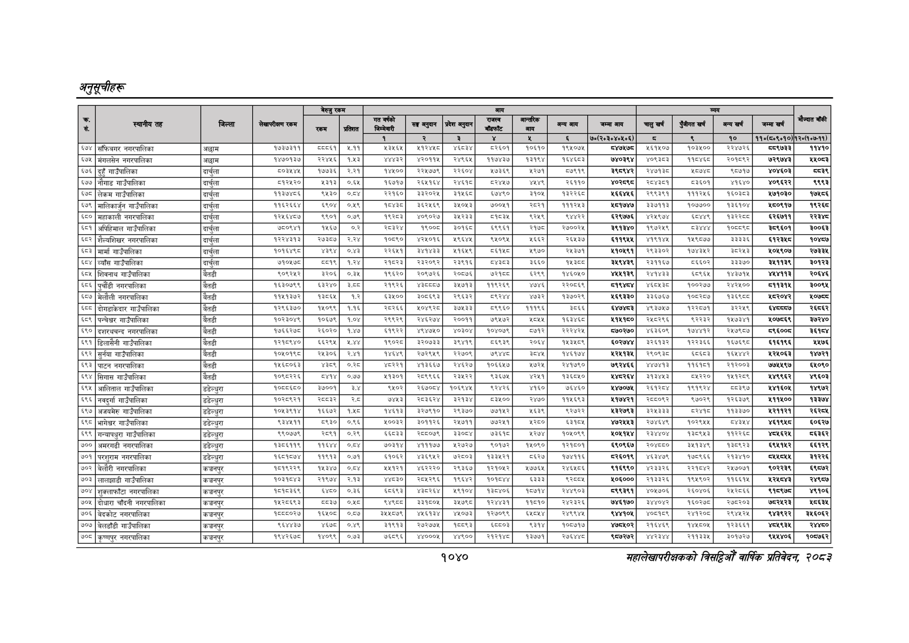

# Page 1102 QA

## Rendered page


## Extracted text

```text
अनुतूचीहरू
१०४०
सहालेखापरीक्षकको वार्षिक प्रतिवेदन २०८२

|  |  |  |  | बैरुए | रकम |  |  |  | जन |  |  |  |  |  |  |  |  |
| --- | --- | --- | --- | --- | --- | --- | --- | --- | --- | --- | --- | --- | --- | --- | --- | --- | --- |
| । |  |  |  |  |  |  | नय |  | ११ | १ | लन | खन | चन | अनन | लन |  |  |
|  |  |  |  |  |  | १ | रे | ३ |  | ४ |  | ७०(२०३०४०४६०६) | छ | ९ | १० | १०(६०६०१०) | १२०७०७-११). |
| ६७४ | संफिवगर नगरपालिका | अछाम | १७३७३११ |  | २.११ | ३४६५ | पकरष |  | ८२६० | ०६१० | ९५०४ | चह७५७५ | २६१५०७ | १०३५०० | र२२४७२६ | ९७३३ | ११४१० |
| ६७५ | मंगलसेन नगरपालिका | अछाम | १४७०१३७ | २२४४६ | १४३ | ४४३२ | ४२०११४ | २४९६४) | ११७४३७ | ३१९४ | १६४६८३ | ७४०३९४ | ४०९३०३ | ०४६८ | २०१७६२ | २९७३ | ४०८३ |
| ५७६ | ३ गाउँपालिका | दार्चुला | बम | प७७३६ | २२१ |  | २२७७७९। | २२०४ | ४७३६९ | २७१ | ७९१९ |  | रहन | पाटा | प७१७ |  |  |
| ६७७ | नोगाड गाउँपालिका | दार्चुला | ब१२४२० | ३३१३ | ०६४ | १६७१७ | २६४१६४ |  | ब२७ | ७९ | २६११० |  | र०७३०१ | बइ६इ०१ | ७० | ४०९६२२ | १९९३ |
| ६७८ | लेकम गाउँपालिका |  | बकर | द४३० | ०७४ | र२१६० | ब३२०२४। | ३१४६ | ७४९० | ३१०४ | पूइररइट | ६६४६ | २९९३९१ | १२४६ | १९०३३ | २७१०३० | ७५८६ |
| ५९ | मालिकार्जन गाउँपालिका | दार्चुला | अरब | दए | गइ |  | उर्बर |  | छल | रू | नर | ४६१७४७ | ३३७११३ | ब०७७०० | ३६०४ | ४६०९६१७ |  |
| ६५० | महाकाली नगरपालिका | दार्चुला | ब२४६४०७ | ब९०१ |  |  |  | ३४२३) | १०३६ | दब२४९ | र४४२२ | ६२९७७६ | ४२४९७४ | बाइ | बस्स्य | ६२६७११ | ररइध्ध |
| ५०१ | अपिहिमाल गाउँपालिका | दार्चुला | ७०९१ | ४६७ | ०२ | रम | ब९७०८। | इठपइ। | ६९९६ | सट | र२७००२४ |  | १९७२५६ | चा |  | ९६०१ | इ००६३ |
| ६८२ | शेल्पशिखर नगरपालिका | दार्चुला |  | २७३०७ | २२४ | १०९० | ४०१६ | ४९७७ | ०७ | १६६२ | २६४३७ |  |  | ४९०७ | ३३३३६ |  | १०४७ |
| ५८३ | मार्मा गाउँपालिका |  | कद | अब | गर |  |  | श१७७९। | पना | ४९७० | २३७१ | ४१०६९१ | ३३०२ | बढाउ |  | ४०९०७ | २७३८ |
| ६८४ | व्याँस गाउँपालिका | दार्चुला | ७१०४५७८ | छ्य९ | १२४ | स्वर | २३२०६२ | २३९१६ | डटाडइदइ | ३६६० |  | ३५९४३९ | २३११६४ | ५६६०२ | ३३७० | इ५११३९ |  |
| ६८५ | शिवनाथ गाउँपालिका | बैतडी | ९०६२५२ | ३२०६ | ०,३४५ | १९६२० | २०९७२६ | २०६७६ | २१६८ | ६२९९ | १४६०५० | ४४५५१३९ | २४१४३३ | ६८९६५ | १४३७१४५ | ४५४११३ | २०६४६ |
| ५८६ | नगरपालिका | बैतडी | ६३०७९९ | बुइर४० |  | २९२६ |  | ३४७१३) | प१९२६९ | ४७४६ | २२०७३९ |  | ४६०४३०ट | प००२७७ | २४२४०० | ब११३१४ | ३०० |
| ६८७ | मेलौली नगरपालिका | बैतडी | ११५१३७२ | १३८६५ | १.२ | ६३५०० | ३०६६९३। | २९६३२ | ५९२४ | ४७३२ | १३७०२९ | १६९३३० | ३३६७६७ | ०८२८७ | ३६९८ | ५८२०४२ | १०७५८ |
| ६८८ | दोगडाकेदार गाउँपालिका | बैतडी | १२६६३७० | १४५०९९ | १.१६ | २८२६६ | १०४९२८। | ३७५३३ | ८९९६० | १११९६ | ३०६६ | ६४७४८३ | ४९३७५७ | १२२८७१ | ड२२५९ | ६४७ | २६८६र |
| ६८९ | गाउँपालिका | बैतडी | १०२३०४९ | १०६७९ | १०४ | २९९२९ | २४६२७४। | २००११ | ७९५७२ | ०५५ | १६३४६८ | ४१४५१६० | २५८०२६६ | ९२२३२ | ५७३४१ | ५०७८६९ | ३७२४० |
| ६९० | दशरथचन्द नगरपालिका | बैतडी | १७६६२७८० | २६०२० | १,४४७ | ६१६२२ | ४९४७५०\| | ४०३०४\| | १०४०७९ | ५८१२ | २२२४२५ | ७०२७० | ४६३६०९ | ४४१२ | र२५७६०७ | बद्‌इ००ड | ३६१४ |
| ६९१ | डिलासेनी गाउँपालिका | बैतडी | १२१८६४० | ६६२९५ |  | ९७२८ | ३२०७३३ | ३९४१९ |  | २०६४ | १४३४५०९ | ६०२७४४ | ३२६१३२ | १२२३६६ | १६७३९८ | ६५१६१९६ | २४७६ |
| ६९२ | सुर्नया गाउँपालिका | बैतडी | १०४०१६८० | र२४३०६ | २४१ | १४६४९ | २७२९५९ | २२७०९ | ४९४४८ |  | १४६१७४ | ४२४५१३४५ | २९०६३८ |  | १६४४४२ | २४०३ | ४७२१ |
| ६९३ | पाटन नगरपालिका | बैतडी | १५६८०६३ | ४३९ | ०.२८ | ४२२१ | ४१३६६७। | २४६२७\|। | १०६६५७ | ५७२५ | २४१७९० | ७९२४६६ | ४४७४१३ | ११६१८१ | २१२००३ |  | ६४०९० |
| ६९४ | सिंगास गाउँपालिका | बैतडी | १०६८२२६ | दशप४ | ०७७ | १३०१ | २८९९६६ | २३४२२ | ९३६७४५ | ४२४१ | १३६८५० | श४८२६४ | ३१३४४५३ | ८५२२० | १४५१२८९ | ४४९९६२ | ४९६०३ |
| ६९५ | आलिताल गाउँपालिका | डडेल्धुरा | ब०्चय६च० | ३७००१ | ३४ | ९५०२ | २इ७०८४ | १०६९४५ | ब२४२६ | ४१६० | ७६४६० | ४४७०७५ | २१२४ | १९१६२४ |  | २४१६०६ | १४९७२ |
| ५९६ | नवदुर्गा गाउँपालिका | डडेल्धुरा | १०२८६२१ | र्बबइर |  | ७४५३ | र२०३६२४ | ३२१३४। | ८३४०० | २४७० | ११४५६९३ | ४१७४२१ | २०००६२ | ९७०२६ | ब२६३७६ | १२११४०० | १३७४ |
| ६५९७ | अजयमेरु गाउँपालिका | डडेल्धुरा | १०५३९१५४ | १६६७२ | १४८ | १४६१३ | इ२७९१० | २९३७० | ७१५२ | ५६३९ | ९२७२२ | ४३२७९३ | ३२५३३३ | छस्थपङछ | ११३३७० | ब२११२१ | र२
```

## Flags
- table_page
- medium_quality_table
