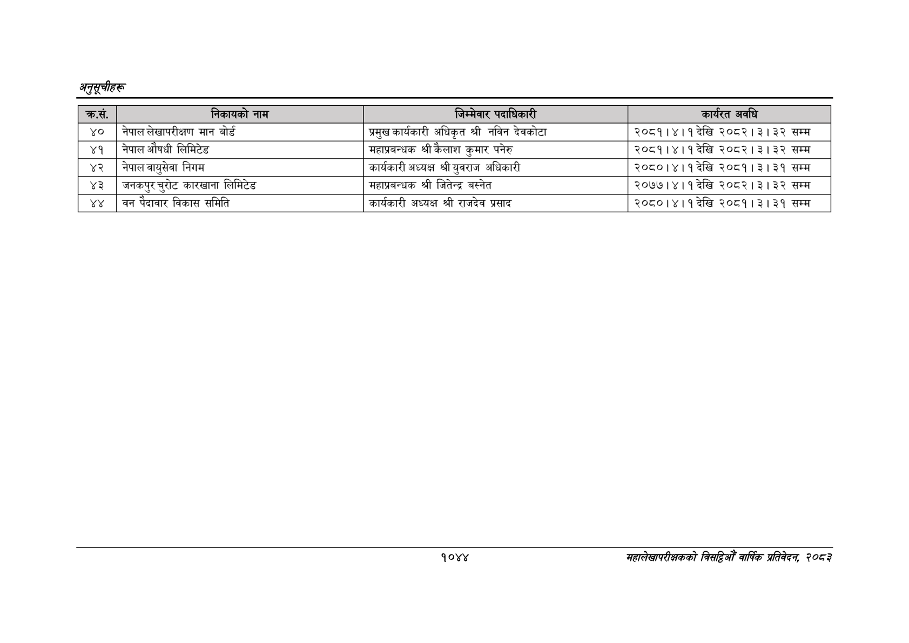

# Page 1106 QA

## Rendered page


## Extracted text

```text
अनुतूचीहरू
१०४४
सहालेखापरीक्षकको वार्षिक प्रतिवेदन २०८२

|  | ने ७०१ ना. |  | त | ९०) डत |
| --- | --- | --- | --- | --- |
| ४० | नेपाल लेखापरीक्षण मान बोर्ड | प्रमुख कार्यकारी | अधिकृत श्री नविन देवकोटा | २०८१।४।१देखि २०८२।३।३२ सम्म |
| ४१ | नेपाल औषधी लिमिटेड | महाप्रवन्धक श्री | कःलाश कुमार पनेरु | २०८१।४।१ देखि २०८२।३।३२ सम्म |
| ४२ | नेपालवायुसेवा निगम | कार्यकारी अध्यक्ष | श्री युवराज अधिकारी | २०८०।४।१ देखि २०८१।३।३१ सम्म |
| ४३ | जनकपुर चुरोट कारखाना लिमिटेड | महाप्रवन्धक श्री | जितेन्द्र बस्नेत | २०७७।४।१ देखि २०८२।३।३२ सम्म |
```

## Flags
- table_page
- medium_quality_table
