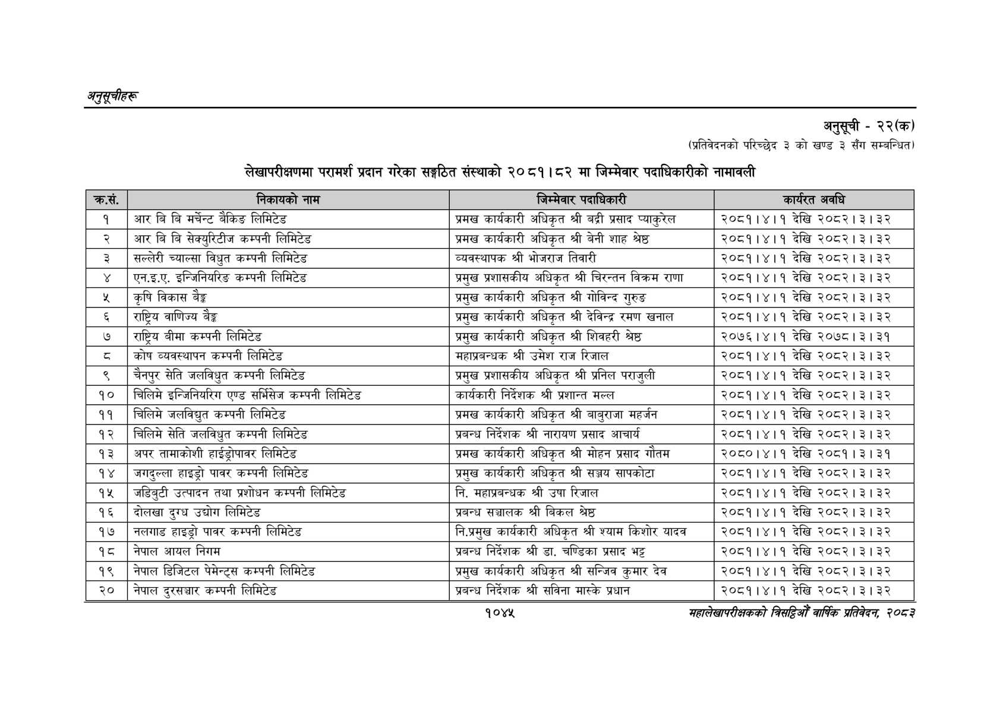

# Page 1107 QA

## Rendered page


## Extracted text

```text
अनुतूचीहरू
अनुसूची -२२(क)
(प्रतिवेदनको परिच्छेद ३ को खण्ड ३ सँग सम्बन्धित)
लेखापरीक्षणमा परामर्श प्रदान गरेका सङ्गठित संस्थाको २०८१।८२ मा जिम्मेवार पदाधिकारीको नामावली
सहालेखापरीक्षकको वार्षिक प्रतिवेदन २०८२
१०४२

| ङ्ःसे | ती | ७१४० जेब्२ र | त्र |
| --- | --- | --- | --- |
|  |  | ९ भक | उरुत ७१ |
| १ | आर बि बि मर्चेन्ट बैकिङ लिमिटेड | प्रमख कार्यकारी अधिकृत श्री बट्री प्रसाद प्याकुरेल | २०८१।४।१ देखि २०८२।३।३२ |
| २ | आर बि वि सेक्युरिटीज कम्पनी लिमिटेड | प्रमख कार्यकारी अधिकृत श्री वेनी शाह श्रेष्ठ | २०८१।४।१ देखि २०८२।३।३२ |
| ३ | सल्लेरी च्याल्सा विधुत कम्पनी लिमिटेड | व्यवस्थापक श्री भोजराज तिवारी | २०८१।४।१ देखि २०८२।३।३२ |
|  | एन.इ.ए. इन्जिनियरिङ कम्पनी लिमिटेड | प्रमुख प्रशासकीय अधिकृत श्री चिरन्तन विक्रम राणा | २०८१।४।१ देखि २०८२।३।३२ |
| ५ | कृषि विकास बैङ्क | प्रमुख कार्यकारी अधिकृत श्री गोविन्द गुरुङ | २०८१।४।१ देखि २०८२।३।३२ |
| ६ | राष्ट्रिय वाणिज्य बैङ्क | प्रमुख कार्यकारी अधिकृत श्री देविन्द्र रमण खनाल | २०८१।४।१ देखि २०८२।३।३२ |
| ७ | राष्ट्रिय बीमा कम्पनी लिमिटेड | प्रमुख कार्यकारी अधिकृत श्री शिवहरी श्रेष्ठ | २०७६।४।१ देखि २०७८। ३। ३१ |
| ८ | कोष व्यवस्थापन कम्पनी लिमिटेड | महाप्रवन्धक श्री उमेश राज रिजाल | २०८१।४।१ देखि २०८२।३।३२ |
| ९ | चैनपुर सेति जलविधृत कम्पनी लिमिटेड | प्रमुख प्रशासकीय अधिकृत श्री प्रनिल पराजुली | २०८१।४।१ देखि २०८२।३।३२ |
| १० | चिलिमे इन्जिनिबरिण एण्ड सर्भिसेज कम्पनी लिमिटेड | कार्यकारी निर्देशक श्री प्रशान्त मल्ल | २०८१।४।१ देखि २०८२।३।३२ |
| ११ | चिलिमे जलविद्युत कम्पनी लिमिटेड | प्रमख कार्यकारी अधिकृत श्री बाबुराजा महर्जन | २०८१।४।१ देखि २०८२।३।३२ |
| १२ | चिलिमे सेति जलविधुत कम्पनी लिमिटेड | प्रबन्ध निर्देशक श्री नारायण प्रसाद आचार्य | २०८१।४।१ देखि २०८२।३।३२ |
| १३ | अपर तामाकोशी हाईड्रोपावर लिमिटेड | प्रमख कार्यकारी अधिकृत श्री मोहन प्रसाद गौतम | २०८०।४।१ देखि २०५९१३१३९ |
| १४ | हाइड्रो पावर कम्पनी लिमिटेड | प्रमुख कार्यकारी अधिकृत श्री सञ्जय सापकोटा | २०८१।४।१ देखि २०८२।३। ३२ |
| १५ | जडिबुटी उत्पादन तथा प्रशोधन कम्पनी लिमिटेड | नि. महाप्रबन्धक श्री उषा रिजाल | २०८१।४।१ देखि २०८२।३।३२ |
| १६ | दोलखा दुग्ध उद्योग लिमिटेड | प्रबन्ध सञ्चालक श्री बिकल श्रेष्ठ | २०८१।४।१ देखि २०८२।३।३२ |
| १७ | नलगाड हाइड्रो पावर कम्पनी लिमिटेड | नि.प्रमुख कार्यकारी अधिकृत श्री श्याम किशोर यादव | २०८१।४।१ देखि २०८२।३।३२ |
| १८ | नेपाल आयल निगम | प्रबन्ध निर्देशक श्री डा. चण्डिका प्रसाद भट्ट | २०८१।४।१ देखि २०८२।३।३२ |
| १९ | नेपाल डिजिटल पेमेन्ट्स कम्पनी लिमिटेड | प्रमुख कार्यकारी अधिकृत श्री सन्जिव कुमार देव | २०८१।४।१ देखि २०८२।३।३२ |
| २० | नेपाल दुरसञ्चार कम्पनी लिमिटेड | प्रबन्ध निर्देशक श्री सविना मास्के प्रधान | २०८१।४।१ देखि २०८२।३।३२ |
```

## Flags
- table_page
- medium_quality_table
