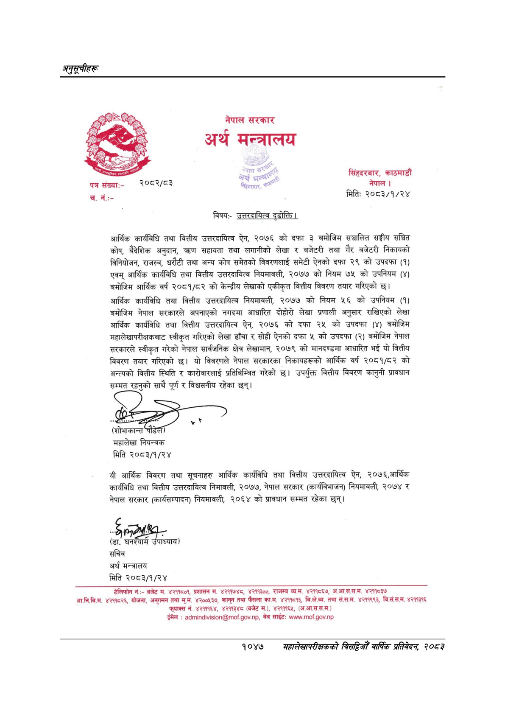

# Page 1109 QA

## Rendered page


## Extracted text

```text
नेपाल
मन्त्रालय
सरकार अर्थ
विषय:-
उत्तरदायित्व दृढोक्ति।
आर्थिक कार्यविधि तथा वित्तीय उत्तरदायित्व ऐन, २०७६ को दफा ३ बमोजिम सञ्चालित सङ्घीय सञ्चित कोष, बैदेशिक अनुदान, त्रण सहायता तथा लगानीको लेखा र बजेटरी तथा गैर बजेटरी निकायको विनियोजन, राजस्व, धरौटी तथा अन्य कोष समेतको विवरणलाई समेटी ऐनको दफा २९ को उपदफा (१) एवम्‌ आर्थिक कार्यविधि तथा वित्तीय उत्तरदायित्व नियमावली, २०७७ को नियम ७५ को उपनियम (४) बमोजिम आर्थिक वर्ष २०८१/८२ को केन्द्रीय लेखाको एकीकृत वित्तीय विवरण तयार गरिएको छ।
आर्थिक कार्यविधि तथा वित्तीय उत्तरदायित्व नियमावली, २०७७ को नियम ५६ को उपनियम (१) बमोजिम नेपाल सरकारले अपनाएको नगदमा आधारित दोहोरो लेखा प्रणाली अनुसार राखिएको लेखा आर्थिक कार्यविधि तथा वित्तीय उत्तरदायित्व ऐन, २०७६ को दफा २५ को उपदफा (४) बमोजिम महालेखापरीक्षकबाट स्वीकृत गरिएको लेखा ढाँचा र सोही ऐनको दफा ५ को उपदफा (२) बमोजिम नेपाल सरकारले स्वीकृत गरेको नेपाल सार्वजनिक क्षेत्र लेखामान, २०७९ को मानदण्डमा आधारित भई यो वित्तीय विवरण तयार गरिएको छ। यो विवरणले नेपाल सरकारका निकायहरूको आर्थिक वर्ष २०८१/८२ को अन्त्यको वित्तीय स्थिति र कारोवारलाई प्रतिबिम्बित गरेको छ। उपर्युक्त वित्तीय विवरण कानुनी प्रावधान सम्मत रहनुको साथै पूर्ण र विश्वसनीय रहेका छन्‌।
महालेखा नियन्त्रक मिति २०८३/१/२४
यी आर्थिक विवरण तथा सूचनाहरु आर्थिक कार्यविधि तथा वित्तीय उत्तरदायित्व ऐन, २०७६,आर्थिक कार्यविधि तथा वित्तीय उत्तरदायित्व निमावली, २०७७, नेपाल सरकार (कार्यविभाजन) नियमावली, २०७४ र नेपाल सरकार (कार्यसम्पादन) नियमावली, २०६४ को प्रावधान सम्मत रहेका छन्‌।
(डा. गि ध्याय)
सचिव अर्थ मन्त्रालय मिति २०८३/१/२४
टेलिफोन नं.:बजेट म. ४२११८०१, प्रशासन म. ४२११७४८, ४२११३००, राजस्व व्य.म. ४२११८६७, अ.आ.स.स.म. ४२११८३७ आ.नि.वि.म. ४२११८२६, योजना, अन्गमन तथा म्‌.म. ४२००१३७, कानून तथा फैसला का.म. ४२११८१३, तथा सं.स.म. ४२११९९३, वि.सं.स.म. ४२११३१६ फूयाक्स नं. ४२१११६४, ४२११३४८ (बजेट म.), ४२१११६५, (अ.आ.स.स.म.) ईमेल: .., साईट: ...
सिंहदरबार, काठमाडौं नेपाल |
मितिः
२०८३/१/२४
१०४७
महालेखापरीक्षकको बिसय वाक प्रतिवेदन २०८२
```

## Flags
- None
