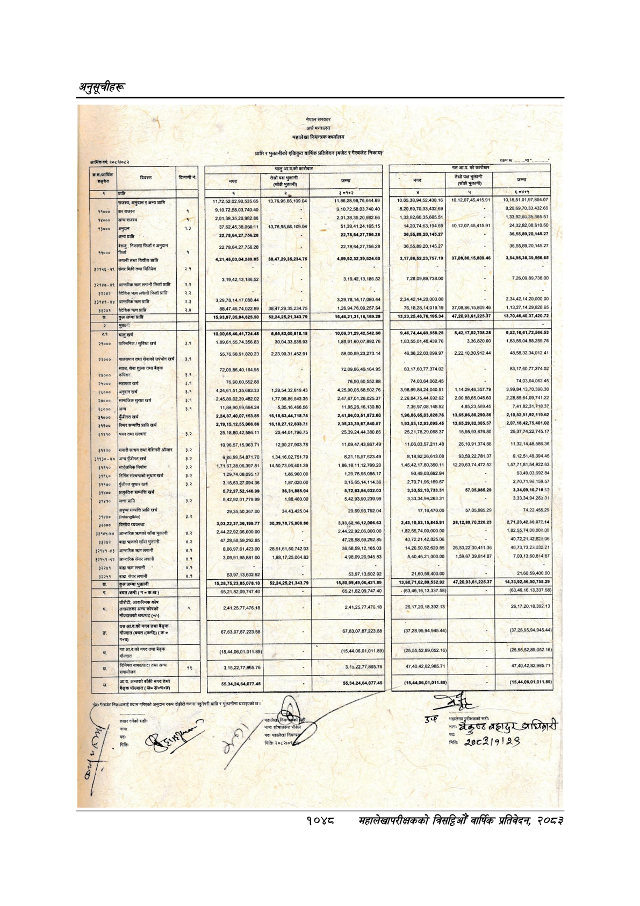

# Page 1110 QA

## Rendered page


## Extracted text

```text
प्राप्ति
र
भुक्तानीको
एकिकृत
वार्षिक
प्रतिवेदन
(बजेट
र
गैरबजेट
निकाय)"
नेपाल
सरकार
अर्थ
मन्त्रालय
महालेखा
नियन्त्रक
कार्यालय
का
क
ला
हा
छ
[क
५
८,२०,६९,७०,३३,४३२.६९
८,२०,६९,७०,३३,४३२-६९.
२,०१,३८,३५,२०,९६२:८५.
२०१,३८,३५,२०
९६२८६
१,३९,०२,६०,३५,६८५.५१
१,३२,०२,८०
३६९६५
५१
३७६२४५३८०५६११
१३.७६,९५.८६,१०९.०४
५१,३९,४१,२४,१६५-१५.
४,२०,७४,६३,१९४-६९
१०,१२०७.४५.४१५९१
२४,३२,८२,०६,६१०-६०
|अन्य
प्राप्ति
२२७८,८४२७,७५६.२८
३६,५५,८९,२०,१४५.२७
न
३६,५५,८९,२०,१४५.२७
छै
७
निकासा
फिर्ता
अनुदान
छ
२२,७८,६४,२७,७५६:२८
२२७८.६४२७.७५६.२८
३६,५५.८०.२०,१४५.२७
३६,५६,८९,२०,१४५.२७
२
[लगानी
तथा
वित्तीय
४,२१,४५,०३,०४,२६९-८५
३८,४७,२०,३८,२३४.७५
४,५९,९२,३२,३९,५२४.६०.
३,१७,८६,५२,२३,७५७-१९
३७,०८,८६,१५,८००४६
३,५४,९५,३८,३९,५६६.६५
३२१५६-५९
[सेयर
बिक्री
तथा
विनिवेश
२४
क
३
३
३
३,१९,४२,१३,१८६-५२.
२
३,१९,४२,१३,१८६-५२.
७.२६,००,८०.७३८.००
७२६,०,८९.७३८.००
३२९३
|िँदैशिक
फिर्ती
प्राप्ति
२.२
छ
३३९०९
२३
३,२९,७८,१४-१७,०६०,४४.
शर
३,२९,७८,१४,१७,०६०,४४.
२,३४,४२,१४,२०,०००:००
२,३४,४२,१४,२०,०००.००
३२४१
बिदेशिक
क्रण
प्राप्ति
२.४
८८,४७,४६,७४,०२२.६९
३८,४७,२९,३५,२३४७५
१,२८,९४,७६,०९,२५७.६४.
७६,१८,२८,१४,०१९७१९
उ,०८,८५,१५,६०९:४६
११३२७१४२८२८६५
प्रा
१५,९३,०७,०५,९४८२५.५०
५२२४२६२१३४०७९
१६४६,२१,३१,१६,१६९.२०
१३,२३२५४६७६,१९५.३४
४७,२०९३,६१,२२५३७
१३,७०,४६,४०,३७,४२०.७२
जिन
छ
१०.००,६५४६,४१,७२४.४८
६,६५,८३,००,८१८.१८
१०,०६,९१,२९,४२,५४२.६०
०४६,७४,४४,६९,०५०२५
१,०२,७००२८
९,५२,१६,६१,७२,५६६.५३
|पारि्रमिक
३४
१८९६१.६५७४३५६.८३
३०,०४३३,६३५९३
१८९,.९१,६०,०७,८९२.७६
१,६३,५५,०१,४८,४३९,७६
३३६८२०००
१,८३,५५,०४,८५,२५९,७६
ते
५५,७६,६८,९१,६२०:२३
२,२३,९०,३१-४५२.९१
५८,००,५९.२३.२७३.१४
४६३६२२०००००९७
२२२१०३०९१२४४
४९५८३२३४०१२४१
|गालसमान
तथा
सेवाको
उपभोग
खर्च
३.९
[सकन
लेखा
बुलक
तथा
दे
७२,०९,८६,४०,१६४.९५
७२,००,८६,४०,१६४.९५
८३,१७,६०,७७,३७४.०२
३
८३,१७.६०७७.३७४.०२
कमिशन
३.१
त
खर्च
३.१
७८,८०,६०,५५२:८८.
७६.९०,६०,५५२.६८
७४,०३,६४,०६२.४५
२
७४,०३,६४.०६२-४५
६०००
अनुदान
खर्च
३.१
४,२४,६१,५१,३५,६८३:३३
१,२८,५४,३२,६१९,४३.
४,२५,९०,०५,६८,५०२,७६
३,९८,६९,८४,२४,०४०.५१
११४२०४६३५७७९
३९०.८४१३.७०.३८८.३०
२७००.
सामाजिक
सुरक्षा
खर्ष
३:१
२४५८००२३९४८२०२
१७७.९८,८६,५४३३५
२४७,६७.०१२६.०२५३७
२२६८४७५४४६०२६२
२००८८६५०४८६०
२२८८५६४.००७४१२२
२८०००
|अन्य
३.१
११,८९,९०,९९,६६४.२४
५,३५,१६,४६६.५६.
११,९५,२६,१६,१३०.८०
७,३६.९७.०८,१४८.९२
४,८५,२३,५६०.४५
७,४१,८२.३१.७१८.३७
३१०००
दुँजीगत
खर्च
२,२०,८७,४०,०७,१५३८५
१६,१८,६३,४४,७१८.७५
२,४१,०६,०३,५१,६७२.६०
९६,८६,६५,०३,८२८.७६
१३,६५,८६,८८.२९०.८६
२,१०,५२,५१,९२.११९.६२
३१५१००
स्थिर
सम्पत्ति
प्राप्ति
खर्च
२,१९,१५,१२,५५,००६-८६
१६,१८,२७,१२,८३३.११
२,३५,३३,३९,६७,८४०.५७
१५३,१२९३,००५.४५
१३,६५२९,८२,३०५.५७
२,०७,१८,४२,७५,४०१.०२
३९०
|भवन
तथा
संरचना
३२
सा
२५२१७८२००६८३७
१५,९५,९३,०७६:८०.
२५,३७७४,२२,७४५-७.
१०,९६,५७,१५,९६३.१
१२,९०२७.९०३.७८
११,०.४७,४३,८६७.४९
११०६०३५७२११४८
२६१०९१३७४८८
११,३२.१४,४८.५६५.३६
३११२०
साधन
तथा
मेशिनरी
औजार
३
३१३०
[अन्य
पूँजीगत
खर्च
३२
९०५४८०
१३४१६०२७५१७०
८,२११५,५७,६२३:४९.
८१८९२२६६१३०८
९३५०२२७८१३७
९१२५१४९३०४४५
३१४०.
सार्षजनिक
निर्माण
२
१७१,६७,३८०६.३९७.८१
१४,५०,७३,०६,४०१.३९
१.८६,१८,११,१२.७९९.२०
१४६४२१७००३५०१
१२२०६३७४४७२५२
१६७७१८१५८२२६३
३१६०
निमित
संरचनाको
सुधार
खर्ष
३२
१.२.७४,०८,०९५.१७
१,८६,९६०.००
१,२०,७५,९५,०८५.१७
९३,४९,०३,६९२.८४
०३,४०,०३,६०२.८४
_३११७०
दुँजीपत
सुधार
खर्च
३२
३,१५,६३,२७,०९४,३६.
१८७.०२०००
३,१५,६५,१४,११४-३६.
२,७०,७१,९६,१५९.५७.
२७०७१,९५.१६९.५७
३१४००
प्राकृतिक
सम्पत्ति
खर्च
६,७२,२७,५२,१४६.९९
३६,३१,८८५.०४.
५,७२,६३,८४,०३२.०३
३,३३,५२,१०,७३३.३१
५७,०५,९८५.२०
३,३४,०९,१६,७१८
५२
१४१०
जना
प्राप्ति
३२
५४२९२०१७७९.९९
१,८८,४६०.००
५,४२,९३,९०,२३९.९९
३३३,३४,०४२६३.३१
३३३३४०४२६५३१
जाच
२९,३५,५०,३६७.००
३४,४३.४२५.०४
२०,६०.९३,७९२.०४
१७१६४७०००
५७.०५९८५.२०
७४२२४५५२९
१४४०
३२
_३२०००
वित्तीय
व्यवस्था
३०३,२२,३७,३६,१९९.७७
३०,३९,७८,७५,८०६.८६
३३३,६२,१६,१२,००६.६३
२४३,१०,५३,१५,८४५.९१
२०,१२,८९,७०२२६२३
२७१.२३.४२,८६,०७२.१४
[३३१४५-४७
्णको
साँवा
श्र
२,४४,२२,९२,०६,०००.००
३
२,४४,२२,९२,०६,०००.००
१,८२,५५,७४,००,०००:००
२
१,८२,५५.७४,००,०००.००
३२४२
साँचा
४.२
४७,२६,५८,५९,२९२:८५.
४७.२६,५८,५९,२९२.८५
४०७२,२१,४२,८२५:०६.
४०७२२१४२८२५०६
३
३२१४१-४३
आन्तरिक
क
लगानी
४.१
८०६.०७,६१४२३.००
२८,५१,६१६०७४२,०३.
३८,५८,५९,१२,१६५.०३
१४२०५०९२६२०८५
२६,५३,२२,३०,४११.३८
४६७३७३२३०३२२१
३३५४१४३
आन्तरिक
सेयर
लगानी
४.१
३,०९,९१,९५,८८१००
१,८८,१७,२५,०६४.८३
४,९८,०९,२०,९४५-८३.
५,४०,४६,२१,०००:००
१५९६७.३९,८१४.८७
७.००,१३.६०
```

## Flags
- None
