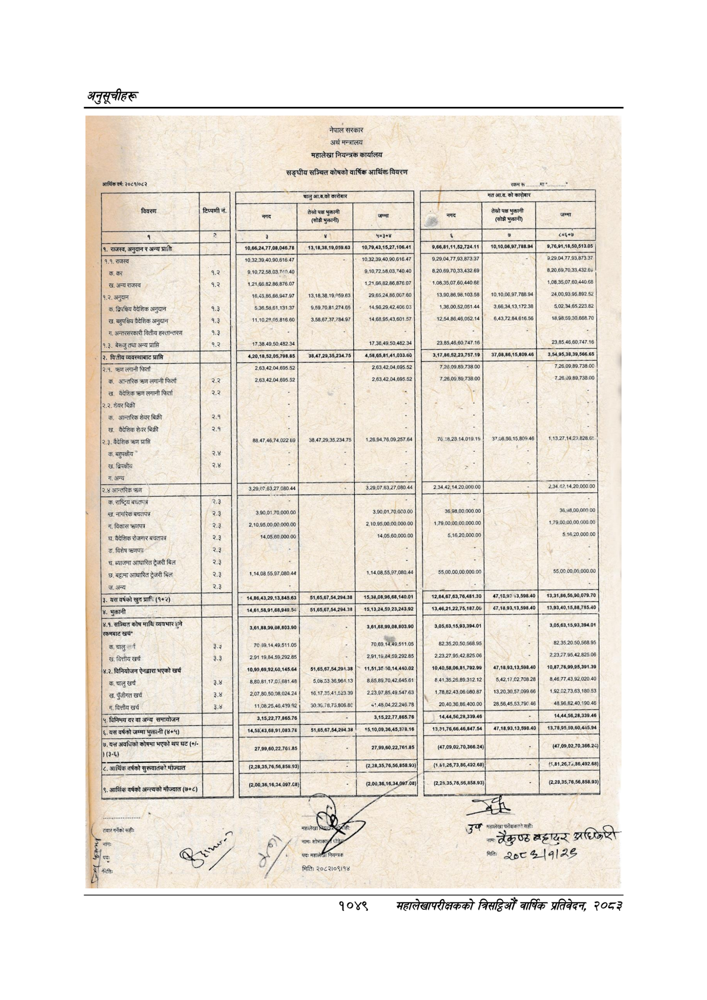

# Page 1111 QA

## Rendered page


## Extracted text

```text
नेपाल
सरकार
छ
अर्थ
मन्त्रालय
महालेखा
नियन्त्रक
कार्यालय
सङ्घीय
सञ्चित
कोषको
वार्षिक
आर्थिक
विवरण
मा".
डी
छै
चालु
आ.व.को
कारोबार
छिन
टिप्पणी
नं.
नगद
[बि
३
९.
राजस्व,
अनुदान
र
अन्य
१०,६६,२४,७७,०८,०४६.
१०,७९,४३,१५,२७,१०६.४१
५२७२४४१
१०१००६९७७८८९४
९,७६,९१,१८,५०,५१३.०५
१०,३२,३९,४०.९०,६१६.४७
१०,३२,३९,४०,९०.६१६.४७
९,२०,०४,७७,९३,८७३.३७
९.२९.०४,७७.९३,८७३.३७
क.कर
९.२
९.१०.७२.५!,०३.७_""
४०
९,१०,७२,५८,०३,७४०.४०
८.२०,६०,७०,३३,४३२.६९
८.२०,६९,७०,३३
४३२,६५
ख.
अन्य
राजस्व
९.२
१,२१,६६,८२,८६,८७६.०७
१,२१,६६,८२,८६,८७६.०७
१,०८,३५,०७,६०,४४०
६८
१,०८,३५,०७,६०,४४०.६८
[४:२.
अनुदान
१६,४५,८६.६६,९४७.९७
१३,१८,३८,१९,०५०.६३
२९,६५,२४,८६,००७
६०
१३,९०,८६,९८,१०३.५८
१०,१०,०६,९७,७८८.९४.
२४,००,९३.९५,८०२
५२
क.
द्विपक्षिय
वैदेशिक
अनुदान
१.३
५,३६,५८,६१,१३१.३७
९,५९.७०,८१२७४.६५
१४,९८,२९,४२.४०६.०३
१३६००५२०५१४४
३६६३४१३१७२३८
५,०२,३४,६५,२२३.८२.
बहुपक्षिय
वैदेशिक
अनुदान
१.३
११,१०,२८,०५,८१६.६०
३.५८,६७,३७,७८४.९७
१४,६८,०५,४३,६०१.५७
१२५४८६४६०५२१४
६४३७२८४६१६५६
१८,९८.५०,३०,६६८.७०
१,
अन्तरसरकारी
वितीय
हस्तान्तरण
१३
{९३
बेरूजु
तथा
अन्य
प्राप्ति
११.
१७,३८.४९,५०,४८२.३४.
१७,३८,४९.५०४८२.३४
२३,८५४६,६०.७४७.१६
२३,८५.४६,६०.७४७.१६
२.
वित्तीय
व्यवस्थाबाट
प्राप्ति
४,२०,१८,५२,०५,७९८,८५
अकानम३५२३४७५]
४,५८,६५,८१,४१,०३३.६०
३,१७,८६,५२.२३,७५७.१९
५८००४६
३,५४,९५,३८,३९,५६६.६५
२.१.
क्रण
लगानी
फिर्ता
२,६३,४२,०४,६९५-५२
२६३.४२,०४,६९५.५२
७,२६,००,८९,७३८.००
७,२६,००,८९.७३८.००
आन्तरिक
कण
लगानी
फिर्ता
२.२
२,६३,४२,०४,६९५-५२
२६३४२०४६९५५२
७.२६,०९,८९,७३८.००
७.२६,०९.८९,७३८.००
ख.
वैदेशिक
क्रण
लगानी
फिर्ता
२.२
क.
आन्तरिक
शेयर
बिक्री
२:१
'ख.
वैदेशिक
शेयर
बिक्री
२.१
[न
२.३.
वैदेशिक
क्रण
प्राप्ति
८८,४७,४६,७४,०२२६९]
३८४७२०३५२३४७५
१.२६.९४.७६,०९.२५७.६४
७६,:६,२८,१४,०१९१९
३७,०८,८६,१५,६०९:४६.
२.४
२
२.८
आन्तरिक
क्रण
३
३,२०,०७,६३.२७,०८०.४४
२,३४,४२,१४,२०,०००.००
२,३४.४२,१४.२०,०००.००
क,
राष्ट्रिय
बचतपत्र
२३
२
५७५
छ
३
नागरिक
बचतपत्र
२.३
३.९०,०१.७०,०००.००
३,९०.०१.७०"०(‘०.००
३६,९८,००,०००.००
३६,४८,००,०००
००
१.
विकास
त्रहणपत्र
हू!)
तै
२,१०,९५,००,००,०००.००
२,१०.९५,००,००,०००.००
१
१,७९,००,००,००.०००.००
घ.
वैदेशिक
रोजगार
बचतपत्र
३
१४,०५.६०,०००.००
१४,०५,६०,०००.००
६,१६,२०,०००.००
५.१६,२०,०००.००
३.
विशेष
क्रणपत्र
२.३
च.
ब्याजमा
आधारित
ट्रेजरी
बिल
२.३
छ,
बट्टामा
आधारित
ट्रेजरी
बिल
२.३
४,१४,०८
५५,९७,०८०:४४
१,१४,०८,५५,९७,०८०.४४
५५,००,००,००,०००.००
५५,००,००,००,०००.००
ज.
अन्य
२.३
३.
यस
वर्षको
खुद
प्राषि
(१४२)
१४,८०,४३,२९,१३,८४५.६३
३८
१२,८४,६७,६३,७६,४८१.३०
४७,१३,९९
१३,५९८.४०
१३,३१,८६,५६,९०,०७९.७०
८.
भुक्तानी
१४,६१,५८,९१,६८,९४९.५
५१,६५,६७,५४२९४.३८
१५,१३,२४,५९,२३,२४३.९२
१३,४६,२१,२२,७५,१८७.००
१२,९३,४०,१५,८८,७८५.४०
४.९,
सञ्चित
कोष
माथि
व्ययभार
छुने
[रकमबाट
खचे"
३,६१,८८,९९,०८,८०३.९०
०,
३,६१,८८,९९,०८,८०३.९०
३,०५,६३,१५,९३,३९४.०१
३,०५,६३,१५,९३,३९४.०१
क.चालु
सर्व
३३
७०
३९,१४,४९,५११.०५
७०७
४९,५११.०५
८२,३५.२०,५०,५६८.९५.
८२,३५,२०.५०,५६८.९५
वित्तीय
खर्च
३.३
२,९११९,६४,५९,२९२-६५
२९१,१६,३४,६०,२०२.८५
२,२३,२७,९५.४२.८२५.०६
२.२३,७७.९५,४२.८२५.०६
४.२.
विनियोजन
ऐनद्वारा
भएको
खर्च
१०,९९,६९,९२,६०,१४५.६४
५१,६५,६७,५४,२०१.३८
११,५१,३५
५०,१४,४४०.०२
१०,४०,५८,०६,८१,७९२.९९
४७,१८,९३,१३,५९८,४०
१०,६७,७६,९९,९५,३९१-३९
'क.
चालु
खर्च
३%
८,८०,८१,१७,०५,६८१.४८
५,०८.५३
३६,९६४.१३
८.८५.६९,७०,!२‘५४‘५.५१
८४१,३५२६,८९.३१२.१२
५,४२,१७,०२,७०८.२८
८,४६,७७.४३,९२,०२०.४०
पुँजीगत
खर्च
३.४
२,०७,८०,५०,०८,०२४.२४
१६,१७,३५.४१,६२३
३९
२.२३,०७,८५४९.५४७
६३
१,७८,८२,४३,०६.०८०.८७
१३,२०,३०,५७.०९९.६६
१,९२,०२,७३,६३,१८०.५३
७.
वित्तीय
खर्च
३८
११,०६,२५,४६.४३९.९२
३०.३९.७८,७५,८०६.८
४१,४८,०४,२२२४६.७८
२०,४०,३६,८६,४००.००
२८,५६,४५,५३,७९०
४६
४८,९६,८२,४०,१९०.४६
५.
विनिमय
दर
वा
अन्य
समायोजन
उ५२२७७,६६५७६]
८६५:७६.
५२२७७००५७८
१४४४५०२८३३०४०
६.
यस
वर्षको
जम्मा
भुक्तानी
(४५५)
१४,५३,४३,६८,९१,०८३.७६
५१,६५,६७,५४,२९४.३
१००८३६४५३७८१८
४७,१८,९३,१३,५९८.४०
१३,७८,९५,५०,६०,४४५.९४
७.
यस
अवधिको
कोषमा
भएको
थप
घट
१%
)(३-६)
२७,९९,६०,२२,७६१.८५
२७,९९,६०,२२,७६१.८५
(४७,००,०२,७०,३६६.२४)
(४७,००,०२,७०,३६६.२५)
८.
आर्थिक
वर्षको
सुरूवातको
मौज्दात
हर
,८५८.९३)
(२,२८,३५,७६,५६,८५८.९३)|
{१६१,२६,७३,८६,४९२.६८)
१४,८१,२६,७५,८६,४९२.६८),
क
नद
(२,००,३६,१८,३४,००७.०८)
उ)
(२२०,३५,७६,५६,८५६,९३]
ला
तथार
गर्नेको
सहीः
र
खु
१
न
४५१
/७\.\
ग्राफिक
विकि
८२७८
१९१२८
पति
मितिः
२०८२।०९।१४
१०४९
सहालेखापरीक्षकको वार्षिक प्रतिवेदन; २०८२
```

## Flags
- None
