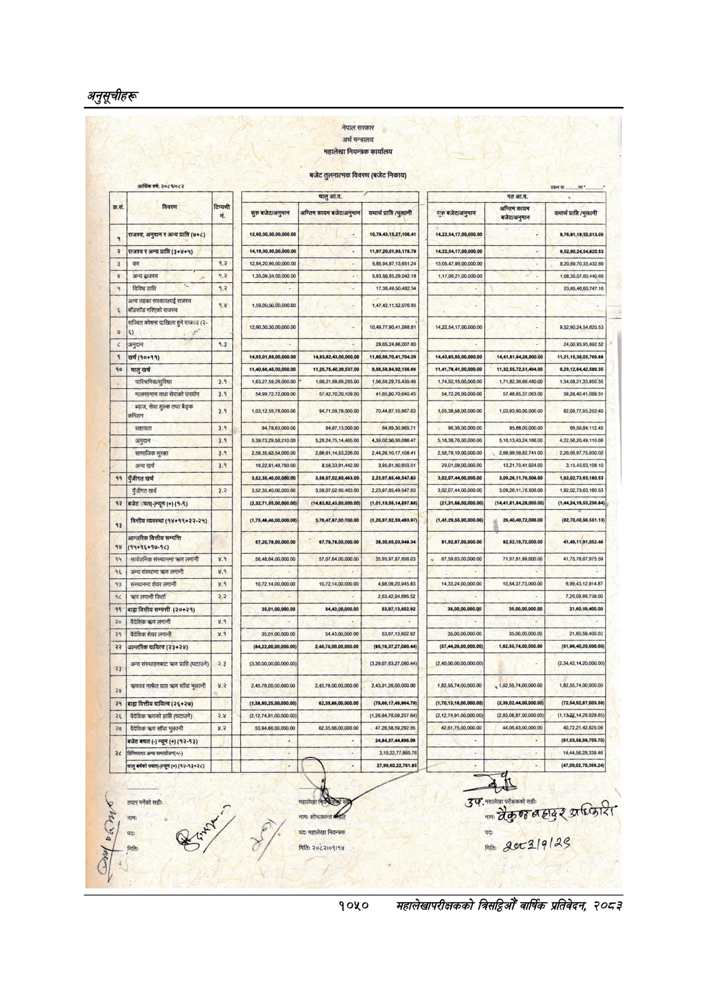

# Page 1112 QA

## Rendered page


## Extracted text

```text
अनुतूचीहरू
नेपाल
सरकार
अर्थ
मन्त्रालय
महालेखा
नियन्त्रक
कार्यालय
बजेट
तुलनात्मक
विवरण
(बजेट
निकाय)
आर्थिक
वर्ष;
२०८%०८२
अक
चालु
आ.व.
सि
टिप्पणी
अन्तिम
कायम
सुरु
बजेट/अनुमान
कायम
बजेट/अनुमान|
यथार्थ
प्राप्त
/भुक्तानी
शुरु
बजेट/अनुमान
बजेट/अनुमान
यथार्थ
प्राप्ति
/भुक्तानी
[राजस्व,
अनुदान
र
अन्य
प्राप्त
(७१८)
१२,६०,३०,३०,००,०००.००
१४.२२,५४,१७,०००००.००
९७६९१,१८५०,५१३.०५
[राजस्व
र
अन्य
प्राप्त
(३४५५)
१४,१९,३०,३०,००,०००.००
११,९७.२००१,९२,१७८.७८
१४.२२,५४,१७,०००००.००
९,५२.००२४,५४,६२०५३
कर
५,८५,९४,६७,१३,६५१२४.
१३,०५,४७,९६,०००००००
८२०६९,७०,३३,४३२.६९
५९३,८६,६५.२९,०४२१८
१७,०८२१,००,०००.००
१,०८,३५.०७,६०,४४०६८
विविध
प्राप्ति
३.२
।
२
१७,३८.४९.५०४८२.३४
२३८५.४६६०७४७.१६
अन्य
तहका
सरकारलाई
राजस्व
त
१५५९,००,००,००,०००.००
१४७४२१५२०७६९५
र
बाँडफाँड
गरिएको
राजस्व
सञ्चित
कोषमा
दाखिला
हुने
राजस्व
(२-
१
१२,६०,३०,३०,००,०००.००
१०४९,७७,९०,४१,०९८.८१
१४२२,५४,१७,०००००००
८,५२,९०,२४,५४,६२०५३
[अनुदान
हि
२०,६५.२४,८६,००७.६०
२४००९३९५८९२५२
(३०+९९)
१४,९३,०१,८५,००,०००.००
१४,८३,८२,४३,०००००.००
११,८०,५६,७०,४१,७०४.२९
१४,४२,८५,८५,००,०००.००
१४,४१,८१,८४,२६,०००.००
११,४०,६६,४५,००,०००.००
११,२५७५,४०,३९,५३७.००
११,४१,७८,४१,०००००००
११,३२,८६,७२,५१,४९४.००
१,६३.२७,५०.२६,०००.००
१६६२१८९६२९५००
१५६,५९.२०.७५४३५.४८.
१,७४,५२.१५,००,०००.००
१,७१,८२,३६,६६,४८०.००
१,५४,६६,२१,३३,९५०३५.
मालसामान
तथा
सेवाको
उपयोग
३१]
५४,९०,७२,७२,०००.००
५७.४२,७०२०,१०९.००
४१,६५.९०,७०,६४०.४५
५४,७२,२६,००,०००.००
५७.४८.८५.३७,०६३.००
३०.२६,४०४१,०८०.३१
ब्याज,
सेवा
शुल्क
तथा
बैङ्क
-१
१,०३,१२,५९७८,०००००
९४७१५०७८०००००
७०४४,०७,१०,९६७६३.
१,०५,३८,५६,००,०००००
१,०३.९३.९०,००,०००.००
८२,००,७७,९५२६२४०
४
९४,९७,१३,०००.००
६४,६९.३०९६५.७१
९६३८०००००००
९५,८८,००,०००००
६९,५९,८४,११२:४५.
[५
७८
अनुदान
१
:३९,७३.२९,५८:२१०.००
५२०२४७५१४४६५०
४३९,०२३६,३६,०८८.४७
५१८,३८,७६,००,०००.००
५१६१३४३२४१८६०
४२२५६२०४९,११६६८
सामाजिक
सुरक्षा
३५१
२,५९,३५,६३,५४,०००००.
२,६८६१,१४,५३२२६.००
२,४४.२६,१०,१७,१०८.४१
२,५८७९,१९.००,०००००
२,६८,९९,५६,६२,७४१.००
२,२६,६६.९७,७५.९३०.०८
अन्य
खर्च
३.१
१
१०.२२.६१,४८.७९०.००
३५८३३०१४४२००
३९५६१५०९५०५१
२९.०१,०९.००,०००००
१३.२१,७०४१०२४.००
३१५४०६३१०८१०
११]
९
|पुँजीगत
खर्च
३,६२,२६,४०,००,०००.००
३,८८,०७,०२,६०,४८३.००.
१८५,४०.५४७.६३
३,०२,०७,४४,००,०००.००
३,०९,२६,११,७६,५०६.००
१९२,०२७३,६२,१८०.५
पुँजीगत
खर्च
५
३,५२,३५.४०,००,०००.००
३५८०७,०२६०४६३.००
२,२३,०७.८५४०५४७.६३
३,०२,०७,४४,००,०००.००
३,००.२६११,७६,५०६.००
१,०२,०२,७३,६३,१८०.५३
बजेट
“वत(-न्यून
(१-९)
(२३२७१,५५,०००००००)|
(१४,८३,८२६३,००,०००.००)
(२१३१,६८,००,०००.००)(
(१४,४१,८१,८४,२८,०००.००)
वित्तीय
व्यवस्था
(१४५१९५२२-२५)
(१,७५,४६,४६,००,०००:००
३७६.४७,८७,०००००००
(१,२६,९७,९२,५९,४९९.९७),
(१,४५२९,५५,०००००००)
२६,४०,४९,७२,०००.००
(६२,७०,६०,५६.५५१.१३)
५
आन्तरिक
वित्तीय
सम्पत्ति
छ
६७,२०,७८,००,०००.००
७,७९,७८,००,०००.००
$१,९२,८७,००,०००००
८२,५२,१९,७२,०००.००
१४८,११९१,०५२.४८
त
(१४+३५+९६-९)
सार्वजनिक
संस्थानमा
क्रण
लगानी
४.१]
५६,४८,६४,००,०००००
५ा०७,६४०००००००
३५,९५,०७,८७,६९८०३|
४
६७,५०,६३,००,०००००
७१,०७,८१,९९,०००.००
४१७५७८६७९७५५०
अन्य
संस्थामा
क्रण
लगानी
२२३
५०५५)
छ
३
१५]
५
संस्थानमा
शेयर
लगानी
४१
।
१०,७२,१४,००,०००.००
१०,७२:१४,००,०००००
४.९८,०९.२०,९४५.८३
१४,३३.२४,००,०००.००
१०,५४,३७,७३,०००.००
६९९४३,१२,८१४.८७
१८
क्रण
लगानी
फिर्ता
छाला
२,६३,४२,०४,६०५.५२
७.२६,००,८९,७३८.००
'बाहा
वित्तीय
सम्पत्ती
(२०१२१)
५३,०७,१३,६०२:९२.
वैदेशिक
कण
लगानी
२१
वैदेशिक
शेयर
लगानी
३५,०१,००,०००.००
५४,४३,००,०००००
५३९७१३६०२९२
२१,६०,५९,४००००
२२]
आन्तरिक
दायित्व
(२३५२४)
(८४.२२,००,००,०००.००)
२,४६,७८,००,००,०००.००
(५७४४,२६,००,०००.००),
१,८२,६५,७४,००,०००.००
(६१,८६,४०,२०,०००.००)
३
अन्य
संस्थाहरुबाट
करण
प्राप्ति
(घटाउने)
२.३
(३,३०,००.००,००,००००.००)|
(३.२९,०७,६३,२७,०८०.४४)|
(२.४०,००,००,००,०००.००)|
(२,३४,४२,१४,२०,०००.००))
क्रणपत्र
मार्फत
प्राप्त
क्रण
साँवा
भुक्तानी
२
२,४५,७८,००,००,०००.००
२४५७६,००,००,०००००
२४३,९१.२६,००,०००.००
१,८२,५५,७४,०००००००
१,८२,५५,७४,००,०००.००
१,८२,५५,७४,००,०००.००
२५
बाह्य
वित्तीय
दायित्व
(२६२७)
१,५८,८०,२५,००,०००.००)
(७९,६६,१७,४९,९६४.७९)
(१,७०१३,१८,०००००.००)|
(२,३९,०२:४४,००,०००.
(७२,५४,९२.८७,००२.५९)
[२६]
६
वैदेशिक
क्रणको
प्राप्ति
(घटाउने)
२४
।
४
(२,१२,७४,९१,००,०००.००)
(१.२६९४,७६,०९.२५७.६४)|
(२.१२,७४,९१,००,०००.००)}
(२,८३,०८,८७,००,०००.००)|
(१,१३:२४,१४,२०,८२८.६५)|
[२७]
वैदेशिक
कण
साँवा
भुक्तानी
४.२
५३,९४,६६,०००००००
४७,२८,५६,५९,२९२.८५.
४२,६१,७५,००,०००.००
४४,०६४३
```

## Flags
- None
