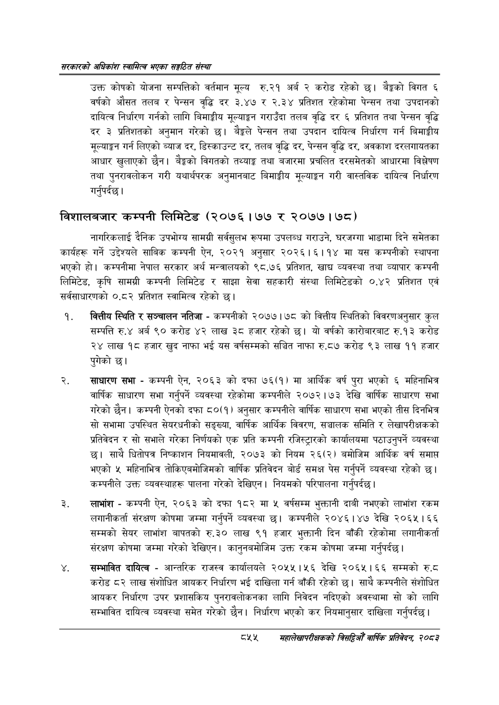

# Page 901 QA

## Rendered page


## Extracted text

```text
सरकारको अधिकांश स्वामित्व भएका सङ्गठित संस्था
उक्त कोषको योजना सम्पत्तिको वर्तमान मूल्य रु.२१ अर्ब २ करोड रहेको छ। बेङ्गको विगत ६ वर्षको औसत तलब र पेन्सन वृद्धि दर ३.४७ र २.३४ प्रतिशत रहेकोमा पेन्सन तथा उपदानको दायित्व निर्धारण गर्नको लागि बिमाङ्गीय मूल्याङ्कन गराउँदा तलब वृद्धि दर ६ प्रतिशत तथा पेन्सन वृद्धि दर ३ प्रतिशतको अनुमान गरेको छ। बेङ्गले पेन्सन तथा उपदान दायित्व निर्धारण गर्न बिमाङ्गीय मूल्याङ्कन गर्न लिएको ब्याज दर, डिस्काउन्ट दर, तलब वृद्धि दर, पेन्सन वृद्धि दर, अवकाश दरलगायतका आधार खुलाएको छैन। बैङ्कको विगतको तथ्याङ्क तथा बजारमा प्रचलित दरसमेतको आधारमा विश्लेषण तथा पुनरावलोकन गरी यथार्थपरक अनुमानबाट बिमाङ्गीय मूल्याङ्कन गरी वास्तविक दायित्व निर्धारण गर्नुपर्दछ |
विशालबजार कम्पनी लिमिटेड (२०७६।७७ २०७७। ७८)
नागरिकलाई दैनिक उपभोग्य सामग्री सर्वसुलभ रूपमा उपलब्ध गराउने, घरजग्गा भाडामा दिने समेतका कार्यहरू गर्ने उद्देश्यले साबिक कम्पनी ऐन, २०२१ अनुसार २०२६।१ ६११४ मा यस कम्पनीको स्थापना भएको हो। कम्पनीमा नेपाल सरकार अर्थ मन्त्रालयको ९८.७६ प्रतिशत, खाद्य व्यवस्था तथा व्यापार कम्पनी लिमिटेड, कृषि सामग्री कम्पनी लिमिटेड र साझा सेवा सहकारी संस्था लिमिटेडको ०.४२ प्रतिशत एवं सर्वसाधारणको ०.८२ प्रतिशत स्वामित्व रहेको छ।
वित्तीय स्थिति र सञ्चालन नतिजा -कम्पनीको २०७७।७८ को वित्तीय स्थितिको विवरणअनुसार कुल सम्पत्ति रु.४ अर्ब ० करोड लाख ३८ हजार रहेको छ। यो वर्षको कारोबारबाट रु.१३ करोड २४ लाख १८ हजार खुद नाफा भई यस वर्षसम्मको सञ्चित नाफा रु.८७ करोड ९३ लाख ११ हजार पुगेको
साधारण सभा -कम्पनी ऐन, २०६३ को दफा ७६(१) मा आर्थिक वर्ष पुरा भएको महिनाभित्र वार्षिक साधारण सभा गर्नुपर्ने व्यवस्था रहेकोमा कम्पनीले २०७२।७३ देखि वार्षिक साधारण सभा गरेको छैन। कम्पनी ऐनको दफा ८०(१) अनुसार कम्पनीले वार्षिक साधारण सभा भएको तीस दिनभित्र सो सभामा उपस्थित सेयरधनीको सङ्ख्या, वार्षिक आर्थिक विवरण, सञ्चालक समिति र लेखापरीक्षकको प्रतिवेदन र सो सभाले गरेका निर्णयको एक प्रति कम्पनी रजिस्ट्रारको कार्यालयमा पठाउनुपर्ने व्यवस्था छ। साथै धितोपत्र निष्काशन नियमावली, २०७३ को नियम २६(२) बमोजिम आर्थिक वर्ष समाप्त भएको ५ महिनाभित्र तोकिएबमोजिमको वार्षिक प्रतिवेदन बोर्ड समक्ष पेस गर्नुपर्ने व्यवस्था रहेको छ। कम्पनीले उक्त व्यवस्थाहरू पालना गरेको देखिएन। नियमको परिपालना गर्नुपर्दछ |
लाभांश -कम्पनी ऐन, २०६३ को दफा १८२ मा ४ वर्षसम्म भुक्तानी दाबी नभएको लाभांश रकम लगानीकर्ता संरक्षण कोषमा जम्मा गर्नुपर्ने व्यवस्था | कम्पनीले २०४६।४७ देखि २०६५।६६ सम्मको सेयर लाभांश बापतको रु.३० लाख ९१ हजार भुक्तानी दिन बाँकी रहेकोमा लगानीकर्ता संरक्षण कोषमा जम्मा गरेको देखिएन। कानुनबमोजिम उक्त रकम कोषमा जम्मा गर्नुपर्दछ।
सम्भावित दायित्व -आन्तरिक राजस्व कार्यालयले २०५५।५६ देखि २०६५। ६६ सम्मको रु.८ करोड ८२ लाख संशोधित आयकर निर्धारण भई दाखिला गर्न बाँकी रहेको छ। साथै कम्पनीले संशोधित आयकर निर्धारण उपर प्रशासकिय पुनरावलोकनका लागि निवेदन नदिएको अवस्थामा सो को लागि सम्भावित दायित्व व्यवस्था समेत गरेको छैन। निर्धारण भएको कर नियमानुसार दाखिला गर्नुपर्दछ )
दश५
सहालेखापरीक्षकको बिदिओँ वार्षिक प्रतिवेदन २०८२
```

## Flags
- None
