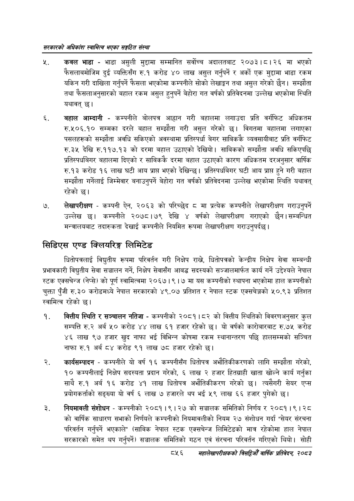

# Page 902 QA

## Rendered page


## Extracted text

```text
सरकारको अधिकांश स्वामित्व भएका सङ्गठित संस्था
न्‌. 'कवल भाडा -भाडा असुली मुद्दामा सम्मानित सर्वोच्च अदालतबाट २०७३।८।२६ मा भएको फैसलाबमोजिम दुई व्यक्तिसँग रु.१ करोड ४० लाख असुल गर्नुपर्ने र अर्को एक मुद्दामा भाडा रकम यकिन गरी दाखिला गर्नुपर्ने फेसला भएकोमा कम्पनीले सोको लेखाङ्गन तथा असुल गरेको छैन। सम्झौता तथा फैसलाअनुसारको बहाल रकम असुल हुनुपर्ने बेहोरा गत वर्षको प्रतिवेदनमा उल्लेख भएकोमा स्थिति यथावत्‌ छ।
बहाल आम्दानी -कम्पनीले बोलपत्र आह्वान गरी बहालमा लगाउदा प्रति वर्गफिट अधिकतम रु.५०६.१० सम्मका दरले बहाल सम्झौता गरी असुल गरेको छ। विगतमा बहालमा लगाएका पसलहरूको सम्झौता अवधि सकिएको अवस्थामा प्रतिस्पर्धा बेगर साबिककै व्यवसायीबाट प्रति वर्गफिट रु.३५ देखि रु.११७.१३ को दरमा बहाल उठाएको देखियो। साबिकको सम्झौता अवधि सकिएपछि प्रतिस्पघबेगर बहालमा दिएको र साबिककै दरमा बहाल उठाएको कारण अधिकतम दरअनुसार वार्षिक रु.१३ करोड १६ लाख घटी आय प्राप्त भएको देखिन्छ। प्रतिस्पधबेगर घटी आय प्राप्त हुने गरी बहाल सम्झौता गर्नेलाई जिम्मेवार बनाउनुपर्ने बेहोरा गत वर्षको प्रतिवेदनमा उल्लेख भएकोमा स्थिति यथावत्‌ रहेको छ।
लेखापरीक्षण -कम्पनी ऐन, २०६३ को परिच्छेद मा प्रत्यक कम्पनीले लेखापरीक्षण गराउनुपर्ने उल्लेख छ। कम्पनीले २०७८।७९ देखि ४ वर्षको लेखापरीक्षण गराएको छैन | सम्बन्धित मन्त्रालयबाट तदारुकता देखाई कम्पनीले नियमित रूपमा लेखापरीक्षण गराउनुपर्दछ।
सिडिएस एण्ड क्लियरिङ्ग लिमिटेड
धितोपत्रलाई विद्युतीय रूपमा परिवर्तन गरी निक्षेप राख्ने, धितोपत्रको केन्द्रीय निक्षेप सेवा सम्बन्धी प्रभावकारी विद्युतीय सेवा सञ्चालन गर्ने, निक्षेप सेवासँग आबद्ध सदस्यको सञ्जालमार्फत कार्य गर्ने उद्देश्यले नेपाल स्टक एक्सचेन्ज (नेप्से) को पूर्ण स्वामित्वमा २०६७। ९।७ मा यस कम्पनीको स्थापना भएकोमा हाल कम्पनीको चुक्ता पुँजी रु.३० करोडमध्ये नेपाल सरकारको ४९.०७ प्रतिशत र नेपाल स्टक एक्सचेञ्जको ५०.९३ प्रतिशत स्वामित्व रहेको छ।
वित्तीय स्थिति र सञ्चालन नतिजा -कम्पनीको २०८१।८२ को वित्तीय स्थितिको विवरणअनुसार कुल सम्पत्ति रु.२ अर्ब ५० करोड ४४ लाख ६१ हजार रहेको छ। यो वर्षको कारोबारबाट रु.७५ करोड ४६ लाख ९७ हजार खुद नाफा भई विभिन्न कोषमा रकम स्थानान्तरण पछि हालसम्मको सञ्चित नाफा रु.१ अर्ब ८४ करोड ९१ लाख ७८ हजार रहेको छ।
कार्यसम्पादन -कम्पनीले यो वर्ष १६ कम्पनीसँग धितोपत्र अभौतिकीकरणको लागि सम्झौता गरेको, १० कम्पनीलाई निक्षेप सदस्यता प्रदान गरेको, ६ लाख २ हजार हितग्राही खाता खोल्ने कार्य गर्नुका साथै रु.१ अर्ब १६ करोड ४१ लाख धितोपत्र अभौतिकीकरण गरेको छ। त्यसैगरी सेयर एप्स प्रयोगकर्ताको सङ्ख्या यो वर्ष ६ लाख ७ हजारले थप भई ५९ लाख ६६ हजार पुगेको छ।
नियमावली संशोधन -कम्पनीको २०८१।९।२७ को सञ्चालक समितिको निर्णय र २०८१।९। २८ को वार्षिक साधारण सभाको निर्णयले कम्पनीको नियमावलीको नियम २७ संशोधन गर्दा "सेयर संरचना परिवर्तन गर्नुपर्ने भएकाले" (साबिक नेपाल स्टक एक्सचेन्ज लिमिटेडको मात्र रहेकोमा हाल नेपाल सरकारको समेत थप गर्नुपर्ने) सञ्चालक समितिको गठन एवं संरचना परिवर्तन गरिएको थियो। सोही
८५६
सहालेखापरीक्षकको बिदिओँ वार्षिक प्रतिवेदन २०८२
```

## Flags
- None
