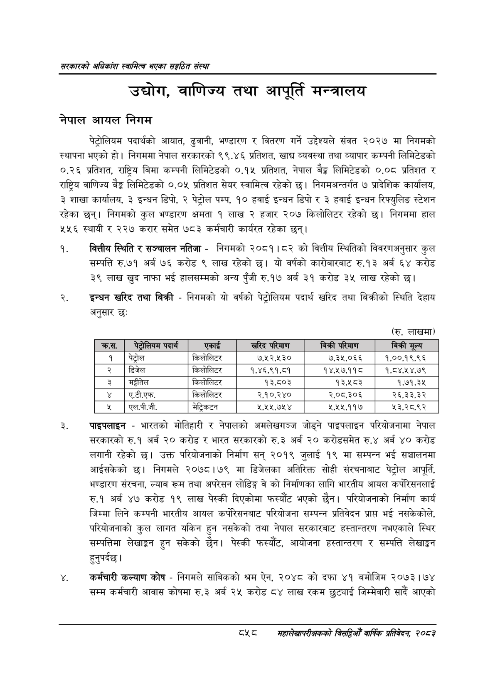

# Page 904 QA

## Rendered page


## Extracted text

```text
सरकारको अधिकांश स्वामित्व भएका सङ्गठित संस्था
उद्योग, वाणिज्य तथा आपूर्ति मन्त्रालय
नेपाल आयल निगम
पेट्रोलियम पदार्थको आयात, ढुवानी, भण्डारण र वितरण गर्ने उद्देश्यले संवत २०२७ मा निगमको स्थापना भएको हो। निगममा नेपाल सरकारको ९९,.४६ प्रतिशत, खाद्य व्यवस्था तथा व्यापार कम्पनी लिमिटेडको ०.२६ प्रतिशत, राष्ट्रिय बिमा कम्पनी लिमिटेडको ०.९ प्रतिशत, नेपाल बैङ्क लिमिटेडको ०.०८ प्रतिशत र राष्ट्रिय वाणिज्य बैङ्क लिमिटेडको ०.०५ प्रतिशत सेयर स्वामित्व रहेको छ। निगमअन्तर्गत ७ प्रादेशिक कार्यालय, ३ शाखा कार्यालय, ३ इन्धन डिपो, २ पेट्रोल पम्प, १० हवाई इन्धन डिपो र ३ हवाई इन्धन रिफ्युलिङ स्टेशन रहेका छन्‌। निगमको कुल भण्डारण क्षमता १ लाख २ हजार २०७ किलोलिटर रहेको छ। निगममा हाल ४५६ स्थायी र २२७ करार समेत ७८३ कर्मचारी कार्यरत रहेका छन्‌।
वित्तीय स्थिति र सञ्चालन नतिजा -निगमको २०८१।८२ को वित्तीय स्थितिको विवरणअनुसार कुल सम्पत्ति रु.७१ अर्ब ७६ करोड ९ लाख रहेको छ। यो वर्षको कारोबारबाट रु.१३ अर्ब ६४ करोड ३९ लाख खुद नाफा भई हालसम्मको अन्य पुँजी रु.१७ अर्ब ३९ करोड ३५ लाख रहेको
इन्धन खरिद तथा बिक्री -निगमको यो वर्षको पेट्रोलियम पदार्थ खरिद तथा बिक्रीको स्थिति देहाय अनुसार छः
पाइपलाइन -भारतको मोतिहारी र नेपालको अमलेखगञ्ज जोड्ने पाइपलाइन परियोजनामा नेपाल सरकारको रु.१ अर्ब २० करोड र भारत सरकारको रु.३ अर्ब २० करोडसमेत रु.४ अर्ब ४० करोड लगानी रहेको छ। उक्त परियोजनाको निर्माण सन्‌ २०१९ जुलाई १९ मा सम्पन्न भई सञ्चालनमा आईसकेको निगमले २०७८।७९ मा डिजेलका अतिरिक्त सोही संरचनाबाट पेट्रोल आपूर्ति, भण्डारण संरचना, ल्याब रूम तथा अपरेसन लोडिङ्ग वे को निर्माणका लागि भारतीय आयल कर्परिसनलाई रु.१ अर्ब ४७ करोड १९ लाख पेस्की दिएकोमा फस्यौट भएको छैन। परियोजनाको निर्माण कार्य जिम्मा लिने कम्पनी भारतीय आयल कर्पेरिसनबाट परियोजना सम्पन्न प्रतिवेदन प्रापत भई नसकेकोले, परियोजनाको कुल लागत यकिन हुन नसकेको तथा नेपाल सरकारबाट हस्तान्तरण नभएकाले स्थिर सम्पत्तिमा लेखाङ्गन हुन सकेको छैन। पेस्की फस्यौट, आयोजना हस्तान्तरण र सम्पत्ति लेखाङ्गन हुनुपर्दछ |
कर्मचारी कल्याण कोष -निगमले साबिकको श्रम ऐन, २०४८ को दफा ४१ बमोजिम २०७३ | ७४ सम्म कर्मचारी आवास कोषमा रु.३ अर्ब २५ करोड ८४ लाख रकम छुट्याई जिम्मेवारी सार्दै आएको
(रु. लाखमा)
८५८
महालेखापरीक्षकको बिद्या वाषिकि प्रतिवेदन २०८२

(रु. लाखमा)

|   क्र.स. | पेट्रोलियम पदार्थ   | एकाई      | खरिद परिमाण   | बिक्री परिमाण   | बिक्री मूल्य   |
|----------|---------------------|-----------|---------------|-----------------|----------------|
|        १ | पेट्रोल             | किलोलिटर  | ७,५२,५३०      | ७,३५,०६६        | १,००,१९,९६     |
|        २ | डिजेल               | किलोलिटर  | १,४६,९१,८१    | १४,१७,११८       | १,८४,१४,७९     |
|        ३ | मट्टीतेल            | किलोलिटर  | १३,८०३        | १३,५८३          | १,७१,३५        |
|        ४ | ।ए.टी.एफ.           | किलोलिटर  | २,१०,२४०      | २,०८,३०६        | २६,३३,३२       |
|        ५ | एल.पी.जी.           | मेट्रिकटन | २,५२५,७५४     | 4,494,990       | ५३,२८,९२       |
```

## Flags
- table_page
- medium_quality_table
