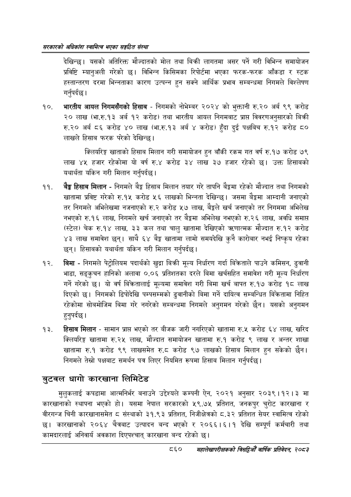

# Page 906 QA

## Rendered page


## Extracted text

```text
सरकारको अधिकांश स्वामित्व भएका सङ्गठित संस्था
देखिन्छ। यसको अतिरिक्त मौज्दातको मोल तथा बिक्री लागतमा असर पर्ने गरी विभिन्न समायोजन प्रविष्टि म्यानुअली गरेको छ। विभिन्न किसिमका रिपोर्टमा भएका फरक-फरक आँकडा र स्टक हस्तान्तरण दरमा भिन्नताका कारण उत्पन्न हुन सक्ने आर्थिक प्रभाव सम्बन्धमा निगमले विश्लेषण गर्नुपर्दछ |
भारतीय आयल निगमसँगको हिसाब -निगमको नोभेम्बर २०२४ को भुक्तानी रु.२० अर्ब ९९ करोड ० लाख (भा.रु.१३ अर्ब १२ करोड) तथा भारतीय आयल निगमबाट प्राप्त विवरणअनुसारको बिक्री रु.२० अर्ब ८६ करोड ४० लाख (भा.रु.१३ अर्ब ४ करोड) हुँदा दुई पक्षबिच रु.१२ करोड ८० लाखले हिसाब फरक परेको देखिन्छ।
क्लियरिङ्ग खाताको हिसाब मिलान गरी समायोजन हुन बाँकी रकम गत वर्ष रु.१७ करोड ७९ लाख ४५ हजार रहेकोमा यो वर्ष रु.४ करोड ३४ लाख ३७ हजार रहेको उक्त हिसावको यथार्थता यकिन गरी मिलान गर्नुपर्दछ।
बेङ्ग हिसाब मिलान -निगमले बेङ्ग हिसाब मिलान तयार गरे तापनि बैङ्कमा रहेको मौज्दात तथा निगमको खातामा प्रविष्ट गरेको रु.१५ करोड ५६ लाखको भिन्नता देखिन्छ। जसमा बैङ्कमा आम्दानी जनाएको तर निगमले अभिलेखमा नजनाएको रु.२ करोड ५७ लाख, बेङ्गले खर्च जनाएको तर निगममा अभिलेख नभएको रु.१६ लाख, निगमले खर्च जनाएको तर बैङ्कमा अभिलेख नभएको रु.२६ लाख, अवधि समाप्त (स्टेल) चेक रु.१४ लाख, ३३ कल तथा चालु खातामा देखिएको त्रणात्मक मौज्दात रु.१२ करोड ४३ लाख समावेश छन्‌। साथै ६४ बेङ्ग खातामा लामो समयदेखि कुनै कारोबार नभई निष्कृय रहेका छन्‌। हिसाबको यथार्थता यकिन गरी मिलान गर्नुपर्दछ |
बिमा -निगमले पेट्रोलियम पदार्थको खुद्रा बिक्री मूल्य निर्धारण गर्दा बिक्रेताले पाउने कमिसन, ढुवानी भाडा, सङ्कुचन हानिको अलावा ०.०६ प्रतिशतका दरले बिमा खर्चसहित समावेश गरी मूल्य निर्धारण गर्ने गरेको छ। यो वर्ष बिक्रतालाई मूल्यमा समावेश गरी बिमा खर्च बापत रु.१७ करोड १८ लाख दिएको छ। निगमको डिपोदेखि पम्पसम्मको ढुवानीको बिमा गर्ने दायित्व सम्बन्धित बिक्रतामा निहित रहेकोमा सोबमोजिम बिमा गरे नगरेको सम्बन्धमा निगमले अनुगमन गरेको छैन। यसको अनुगमन हुनुपर्दछ |
हिसाब मिलान -सामान प्रापत भएको तर बीजक जारी नगरिएको खातामा रु.५ करोड ६४ लाख, खरिद क्लियरिङ्ग खातामा रु.२५ लाख, मौज्दात समायोजन खातामा रु.१ करोड ९ लाख र अन्तर शाखा खातामा रु.१ करोड ९९ लाखसमेत रु.८ करोड ९७ लाखको हिसाव मिलान हुन सकेको छैन। निगमले तेस्रो पक्षबाट समर्थन पत्र लिएर नियमित रूपमा हिसाब मिलान गर्नुपर्दछ |
बुटवल धागो कारखाना लिमिटेड
मुलुकलाई कपडामा आत्मनिर्भर बनाउने उद्देश्यले कम्पनी ऐन, २०२१ अनुसार २०३९।१२। ३ मा कारखानाको स्थापना भएको हो। यसमा नेपाल सरकारको ५९.७५ प्रतिशत, जनकपुर चुरोट कारखाना वीरगन्ज चिनी कारखानासमेत ८ संस्थाको ३१.९३ प्रतिशत, निजीक्षेत्रको ८.३२ प्रतिशत सेयर स्वामित्व रहेको छ। कारखानाको २०६४ चैत्रबाट उत्पादन बन्द भएको र २०६६।६।१ देखि सम्पूर्ण कर्मचारी तथा कामदारलाई अनिवार्य अवकाश दिएपश्चात्‌ कारखाना बन्द रहेको |
८६०
सहालेखापरीक्षकको बिदिओँ वार्षिक प्रतिवेदन २०८२
```

## Flags
- None
