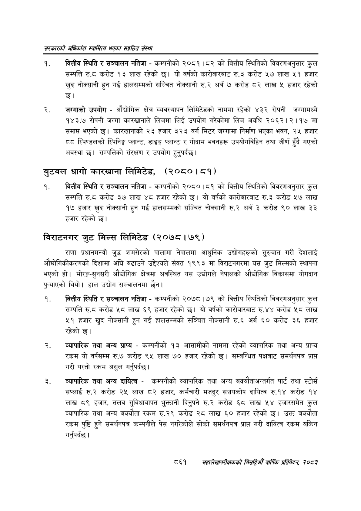

# Page 907 QA

## Rendered page


## Extracted text

```text
सरकारको अधिकांश स्वामित्व भएका सङ्गठित संस्था
वित्तीय स्थिति र सञ्चालन नतिजा -कम्पनीको २०८१।८२ को वित्तीय स्थितिको विवरणअनुसार कुल सम्पत्ति ६.६ करोड १३ लाख रहेको छ। यो वर्षको कारोबारबाट रु.३ करोड «५७ लाख ५१ हजार खुद नोक्सानी हुन गई हालसम्मको सञ्चित नोक्सानी रु.२ अर्ब ७ करोड ८२ लाख ५ हजार रहेको
जग्गाको उपयोग -औद्योगिक क्षेत्र व्यवस्थापन लिमिटेडको नाममा रहेको ४३२ रोपनी जग्गामध्ये १४३.७ रोपनी जग्गा कारखानाले लिजमा लिई उपयोग गरेकोमा लिज अवधि २०६२।२।१७ मा समाप्त भएको छ। कारखानाको २३ हजार ३२३ वर्ग मिटर जग्गामा निर्माण भएका भवन, २४ हजार स्पिण्डलको स्पिनिङ्ग प्लान्ट, डाइङ्ग प्लान्ट र गोदाम भवनहरू उपयोगविहिन तथा जीर्ण हुँदै रएको अवस्था छ। सम्पत्तिको संरक्षण र उपयोग हुनुपर्दछ |
बुटवल धागो कारखाना लिमिटेड, (२०८०। ८१)
वित्तीय स्थिति र सञ्चालन नतिजा -कम्पनीको २०८०।८१ को वित्तीय स्थितिको विवरणअनुसार कुल सम्पत्ति रु.८ करोड ३७ लाख ४८ हजार रहेको | यो वर्षको कारोबारबाट रु.३ करोड ५७ लाख १७ हजार खुद नोक्सानी हुन गई हालसम्मको सञ्चित नोक्सानी रु.२ अर्ब ३ करोड ९० लाख ३३ हजार रहेको छ।
विराटनगर जुट मिल्स लिमिटेड (२०७८। ७९)
राणा प्रधानमन्त्री जुद्ध शमसेरको पालामा नेपालमा आधुनिक उद्योगहरूको सुरुवात गरी देशलाई औद्योगिकीकरणको दिशामा अघि बढाउने उद्देश्यले संवत १९९३ मा विराटनगरमा यस जुट मिल्सको स्थापना भएको हो। मोरङ्ग-सुनसरी औद्योगिक क्षेत्रमा अवस्थित यस उद्योगले नेपालको औद्योगिक विकासमा योगदान पुन्याएको थियो। हाल उद्योग सञ्चालनमा छैन।
बकित्तीय स्थिति र सञ्चालन नतिजा -कम्पनीको २०७८।७९ को वित्तीय स्थितिको विवरणअनुसार कुल सम्पत्ति रु.ट करोड «५८ लाख ६९ हजार रहेको | यो वर्षको कारोबारबाट रु.४४ करोड ५८ लाख ५१ हजार खुद नोक्सानी हुन गई हालसम्मको सञ्चित नोक्सानी रु.६ अर्ब ६० करोड ३६ हजार रहेको छ।
व्यापारिक तथा अन्य प्राप्य -कम्पनीको १३ आसामीको नाममा रहेको व्यापारिक तथा अन्य प्राप्य रकम यो वर्षसम्म रु.७ करोड ९४५ लाख ७० हजार रहेको छ। सम्बन्धित पक्षबाट समर्थनपत्र प्राप्त गरी यस्तो रकम असुल गर्नुपर्दछ |
व्यापारिक तथा अन्य दायित्व -कम्पनीको व्यापारिक तथा अन्य बक्यौताअन्तर्गत पार्ट तथा स्टोर्स सप्लाई रु.२ करोड २५ लाख ८२ हजार, कर्मचारी मजदुर सञ्चयकोष दायित्व रु.१४ करोड १४ लाख ८९ हजार, तलव सुविधाबापत भुक्तानी दिनुपर्ने रु.२ करोड ६८ लाख ५४ हजारसमेत कुल व्यापारिक तथा अन्य बक्यौता रकम रु.२९ करोड २८ लाख ६० हजार रहेको छ। उक्त बक्यौता रकम पुष्टि हुने समर्थनपत्र कम्पनीले पेस नगरेकोले सोको समर्थनपत्र प्राप्त गरी दायित्व रकम यकिन गर्नुपर्दछ।
८६१
सहालेखापरीक्षकको बिदिओँ वार्षिक प्रतिवेदन २०८२
```

## Flags
- None
