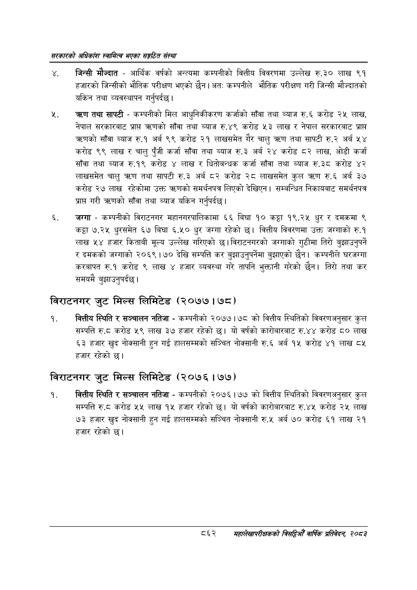

# Page 908 QA

## Rendered page


## Extracted text

```text
सरकारको अधिकांश स्वामित्व भएका सङ्गठित संस्था
जिन्सी मौज्दात -आर्थिक वर्षको अन्त्यमा कम्पनीको वित्तीय विवरणमा उल्लेख रु.३० लाख ९१ हजारको जिन्सीको भौतिक परीक्षण भएको छैन। अत: कम्पनीले भौतिक परीक्षण गरी जिन्सी मौज्दातको यकिन तथा व्यवस्थापन गर्नुपर्दछ |
च्रण तथा सापटी -कम्पनीको मिल आधुनिकीकरण कर्जाको साँवा तथा ब्याज रु.६ करोड २५ लाख, नेपाल सरकारबाट प्राप्त क्रणको साँवा तथा ब्याज रु.४९ करोड ५३ लाख र नेपाल सरकारबाट प्राप्त क्णको साँवा ब्याज रु.१ अर्ब ९९ करोड २१ लाखसमेत गैर चालु त्रण तथा सापटी रु.२ अर्ब ५४ करोड ९९ लाख र चालु पुँजी कर्जा साँवा तथा ब्याज रु.३ अर्ब २४ करोड ८२ लाख, ओडी कर्जा साँवा तथा ब्याज रु.१९ करोड ४ लाख र धितोबन्धक कर्जा साँवा तथा ब्याज रु.३८ करोड ४२ लाखसमेत चालु तथा सापटी रु.३ अर्ब ८२ करोड २८ लाखसमेत कुल रु.६ अर्ब ३० करोड २७ लाख रहेकोमा उक्त त्रहणको समर्थनपत्र लिएको देखिएन | सम्बन्धित निकायबाट समर्थनपत्र प्राप्त गरी त्रहणको साँवा तथा ब्याज यकिन गर्नुपर्दछ |
जग्गा -कम्पनीको विराटनगर महानगरपालिकामा ६६ बिघा १० कट्ठा १९.२५ धुर र दमकमा ९ कट्टा ७.२५ धुरसमेत ६७ बिघा ६.५० धुर जग्गा रहेको छ। वित्तीय विवरणमा उक्त जग्गाको रु.१ लाख ५४ हजार किताबी मूल्य उल्लेख गरिएको छ। विराटनगरको जग्गाको गुठीमा तिरो बुझाउनुपर्ने र दमकको जग्गाको २०६९ | ७० देखि सम्पत्ति कर बुझाउनुपर्नेमा बुझाएको छैन। कम्पनीले घरजग्गा करबापत रु.१ करोड ९ लाख ४ हजार व्यवस्था गरे तापनि भुक्तानी गरेको छैन। तिरो तथा कर समयमै बुझाउनुपर्दछ।
विराटनगर जुट मिल्स लिमिटेड (२०७७ | ७८)
वित्तीय स्थिति र सञ्चालन नतिजा -कम्पनीको २०७७।७८ को वित्तीय स्थितिको विवरणअनुसार कुल सम्पत्ति रु.ट करोड ५९ लाख ३७ हजार रहेको | यो वर्षको कारोबारबाट रु.४४ करोड ८० लाख ६३ हजार खुद नोक्सानी हुन गई हालसम्मको सञ्चित नोक्सानी रु.६ अर्ब १५ करोड ४१ लाख ८५ हजार रहेको छ।
विराटनगर जुट मिल्स लिमिटेड (२०७६ १७७)
वित्तीय स्थिति र सञ्चालन नतिजा -कम्पनीको २०७६।७७ को वित्तीय स्थितिको विवरणअनुसार कुल सम्पत्ति रु.८ करोड ५५ लाख १५ हजार रहेको | यो वर्षको कारोबारबाट रु.४५ करोड २५ लाख ७३ हजार खुद नोक्सानी हुन गई हालसम्मको सञ्चित नोक्सानी रु.५ अर्ब ७० करोड ६१ लाख २१ हजार रहेको छ।
६२
सहालेखापरीक्षकको बिदिओँ वार्षिक प्रतिवेदन २०८२
```

## Flags
- None
