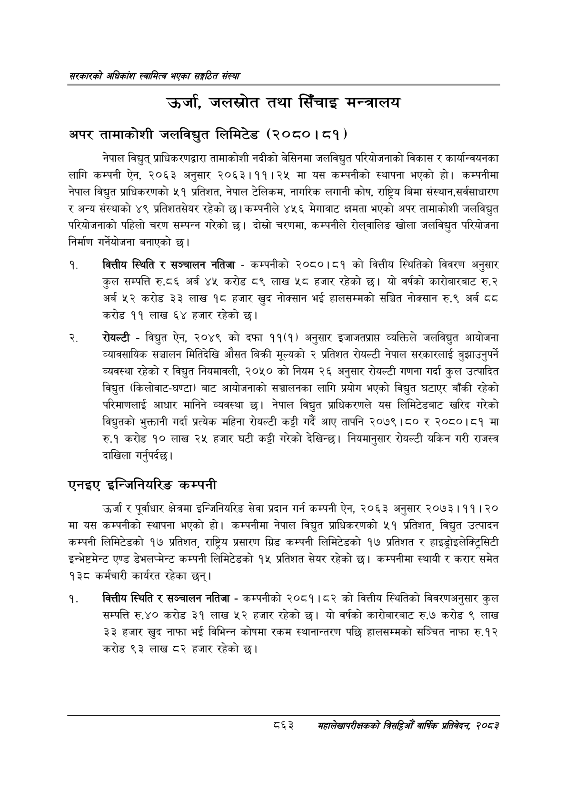

# Page 909 QA

## Rendered page


## Extracted text

```text
सरकारको अधिकांश स्वामित्व भएका सङ्गठित संस्था
उर्जा, जलस्रोत तथा सिँचाइ मन्त्रालय
अपर तामाकोशी जलविद्युत लिमिटेड (२०८०। ८१)
नेपाल विद्युत्‌ प्राधिकरणद्वारा तामाकोशी नदीको बेसिनमा जलविद्युत परियोजनाको विकास र कार्यान्वयनका लागि कम्पनी ऐन, २०६३ अनुसार २०६३।११।२५ मा यस कम्पनीको स्थापना भएको हो। कम्पनीमा नेपाल विद्युत प्राधिकरणको ५१ प्रतिशत, नेपाल टेलिकम, नागरिक लगानी कोष, राष्ट्रिय बिमा संस्थान,सर्वसाधारण र अन्य संस्थाको ४९ प्रतिशतसेयर रहेको छ। कम्पनीले ४५६ मेगावाट क्षमता भएको अपर तामाकोशी जलविद्युत परियोजनाको पहिलो चरण सम्पन्न गरेको छ। दोस्रो चरणमा, कम्पनीले रोल्वालिङ खोला जलविद्युत परियोजना निर्माण गर्नेयोजना बनाएको छ।
वित्तीय स्थिति र सञ्चालन नतिजा -कम्पनीको २०८०।८१ को वित्तीय स्थितिको विवरण अनुसार कुल सम्पत्ति रु.८६ अर्ब ४५ करोड ८९ लाख ५८ हजार रहेको छ। यो वर्षको कारोबारबाट रु.२ अर्ब ५२ करोड ३३ लाख १८ हजार खुद नोक्सान भई हालसम्मको सञ्चित नोक्सान रु.९ अर्ब ६ करोड ९९ लाख ६४ हजार रहेको छ।
रोयल्टी -विद्युत ऐन, २०४९ को दफा ११(१) अनुसार इजाजतप्रापत व्यक्तिले जलविद्युत आयोजना व्यावसायिक सञ्चालन मितिदेखि औसत बिक्री मूल्यको २ प्रतिशत रोयल्टी नेपाल सरकारलाई बुझाउनुपर्ने व्यवस्था रहेको र विद्युत नियमावली, २०५० को नियम २६ अनुसार रोयल्टी गणना गर्दा कुल उत्पादित विद्युत (किलोवाट-घण्टा) बाट आयोजनाको सञ्चालनका लागि प्रयोग भएको विद्युत घटाएर बाँकी रहेको परिमाणलाई आधार मानिने व्यवस्था छ। नेपाल विद्युत प्राधिकरणले यस लिमिटेडबाट खरिद गरेको विद्युतको भुक्तानी गर्दा प्रत्येक महिना रोयल्टी कट्टी गर्दै आए तापनि २०७९।८० र २०८०।८१ मा रु.१ करोड १० लाख २५ हजार घटी कट्टी गरेको देखिन्छ। नियमानुसार रोयल्टी यकिन गरी राजस्व दाखिला गर्नुपर्दछ |
एनइए इन्जिनियरिङ कम्पनी
उर्जा र पूर्वाधार क्षेत्रमा इन्जिनियरिङ सेवा प्रदान गर्न कम्पनी ऐन, २०६३ अनुसार २०७३।११। २० मा यस कम्पनीको स्थापना भएको हो। कम्पनीमा नेपाल विद्युत प्राधिकरणको ५१ प्रतिशत, विद्युत उत्पादन कम्पनी लिमिटेडको १७ प्रतिशत, राष्ट्रिय प्रसारण ग्रिड कम्पनी लिमिटेडको १७ प्रतिशत र हाइड्रोइलेक्ट्रिसिटी इन्भेष्टमेन्ट एण्ड डेभलप्मेन्ट कम्पनी लिमिटेडको १५ प्रतिशत सेयर रहेको छ। कम्पनीमा स्थायी र करार समेत १३८ कर्मचारी कार्यरत रहेका छन्‌।
बकित्तीय स्थिति र सञ्चालन नतिजा -कम्पनीको २०८१।८२ को वित्तीय स्थितिको विवरणअनुसार कुल सम्पत्ति रु.४० करोड ३१ लाख ५२ हजार रहेको छ। यो वर्षको कारोबारबाट रु.७ करोड ९ लाख ३३ हजार खुद नाफा भई विभिन्न कोषमा रकम स्थानान्तरण पछि हालसम्मको सञ्चित नाफा रु.१२ करोड ९३ लाख ८२ हजार रहेको छ।
८६३
सहालेखापरीक्षकको बिदिओँ वार्षिक प्रतिवेदन २०८२
```

## Flags
- None
