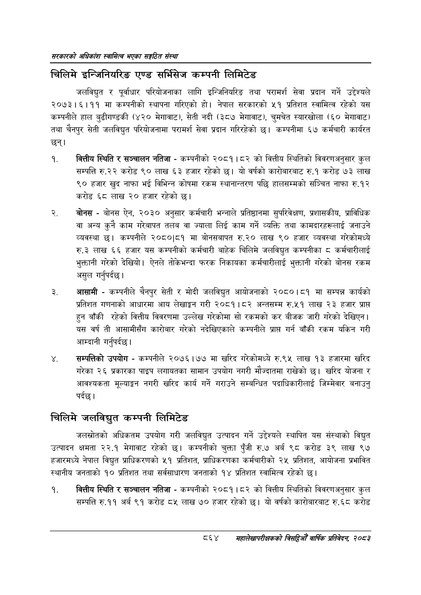

# Page 910 QA

## Rendered page


## Extracted text

```text
सरकारको अधिकांश स्वामित्व भएका सङ्गठित संस्था
चिलिमे इन्जिनियरिङ एण्ड सर्भिसेज कम्पनी लिमिटेड
जलविद्युत र पूर्वाधार परियोजनाका लागि इन्जिनियरिङ तथा परामर्श सेवा प्रदान गर्ने उद्देश्यले २०७३। ६१११ मा कम्पनीको स्थापना गरिएको हो। नेपाल सरकारको ५१ प्रतिशत स्वामित्व रहेको यस कम्पनीले हाल बुढीगण्डकी (४२० मेगावाट), सेती नदी (३८७ मेगावाट), चुमचेत स्यारखोला (६० मेगावाट) तथा चैनपुर सेती जलविद्युत परियोजनामा परामर्श सेवा प्रदान गरिरहेको छ। कम्पनीमा ६७ कर्मचारी कार्यरत छन्‌।
वित्तीय स्थिति र सञ्चालन नतिजा -कम्पनीको २०८१।८२ को वित्तीय स्थितिको विवरणअनुसार कुल सम्पत्ति रु.२२ करोड ९० लाख ३ हजार रहेको छ। यो वर्षको कारोबारबाट रु.१ करोड ९३ लाख ९० हजार खुद नाफा भई विभिन्न कोषमा रकम स्थानान्तरण पछि हालसम्मको सञ्चित नाफा रु.१२ करोड ६८ लाख २० हजार रहेको छ।
बोनस -बोनस ऐन, २०३० अनुसार कर्मचारी भन्नाले प्रतिष्ठानमा सुपरिवेक्षण, प्रशासकीय, प्राविधिक वा अन्य कुनै काम गरेबापत तलब वा ज्याला लिई काम गर्ने व्यक्ति तथा कामदारहरूलाई जनाउने व्यवस्था | कम्पनीले २०८०|८१ मा बोनसबापत रु.२० लाख ९० हजार व्यवस्था गरेकोमध्ये रु.३ लाख ६६ हजार यस कम्पनीको कर्मचारी बाहेक चिलिमे जलविद्युत कम्पनीका ८ कर्मचारीलाई भुक्तानी गरेको देखियो। ऐनले तोकेभन्दा फरक निकायका कर्मचारीलाई भुक्तानी गरेको बोनस रकम असुल गर्नुपर्दछ।
आसामी -कम्पनीले चैनपुर सेती र मोदी जलविद्युत आयोजनाको २०८०।८१ मा सम्पन्न कार्यको प्रतिशत गणनाको आधारमा आय लेखाङ्गन गरी २०८१।८२ अन्तसम्म रु.५१ लाख २३ हजार प्राप्त हुन बाँकी रहेको वित्तीय विवरणमा उल्लेख गरेकोमा सो रकमको कर बीजक जारी गरेको देखिएन | यस वर्ष ती आसामीसँग कारोबार गरेको नदेखिएकाले कम्पनीले प्राप्त गर्न बाँकी रकम यकिन गरी आम्दानी गर्नुपर्दछ |
सम्पत्तिको उपयोग -कम्पनीले २०७६।७७ मा खरिद गरेकोमध्ये रु.९४५ लाख ९३ हजारमा खरिद गरेका २६ प्रकारका पाइप लगायतका सामान उपयोग नगरी मौज्दातमा राखेको छ। खरिद योजना र आवश्यकता मूल्याङ्कन नगरी खरिद कार्य गर्ने गराउने सम्बन्धित पदाधिकारीलाई जिम्मेवार बनाउनु पर्दछ।
चिलिमे जलविद्युत कम्पनी लिमिटेड
जलस्रोतको अधिकतम उपयोग गरी जलविद्युत उत्पादन गर्ने उद्देश्यले स्थापित यस संस्थाको विद्युत उत्पादन क्षमता २२.१ मेगावाट रहेको छ। कम्पनीको चुक्ता पुँजी रु.७ अर्ब ९८ करोड ३९ लाख ९७ हजारमध्ये नेपाल विद्युत प्राधिकरणको ५१ प्रतिशत, प्राधिकरणका कर्मचारीको २५ प्रतिशत, आयोजना प्रभावित स्थानीय जनताको १० प्रतिशत तथा सर्वसाधारण जनताको १४ प्रतिशत स्वामित्व रहेको छ।
वित्तीय स्थिति र सञ्चालन नतिजा -कम्पनीको २०८१।८२ को वित्तीय स्थितिको विवरणअनुसार कुल सम्पत्ति रु.११ अर्ब ९१ करोड ८५ लाख ७० हजार रहेको छ। यो वर्षको कारोबारबाट रु.६८ करोड
८६४
महालेखापरीक्षकको बिद्या वाषिकि प्रतिवेदन २०८२
```

## Flags
- None
