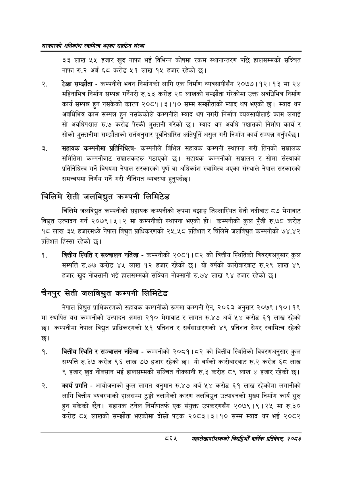

# Page 911 QA

## Rendered page


## Extracted text

```text
सरकारको अधिकांश स्वामित्व भएका सङ्गठित संस्था
३३ लाख ५५ हजार खुद नाफा भई विभिन्न कोषमा रकम स्थानान्तरण पछि हालसम्मको सञ्चित नाफा रु.२ अर्ब ६८ करोड ५१ लाख १५ हजार रहेको छ।
छक्का सम्झौता -कम्पनीले भवन निर्माणको लागि एक निर्माण व्यवसायीसँग २०७७।१२।१३ मा २४ महिनाभित्र निर्माण सम्पन्न गर्नेगरी रु.६३ करोड २८ लाखको सम्झौता गरेकोमा उक्त अवधिभित्र निर्माण कार्य सम्पन्न हुन नसकेको कारण २०८१। ३।१० सम्म सम्झौताको म्याद थप भएको छ। म्याद थप अवधिभित्र काम सम्पन्न हुन नसकेकोले कम्पनीले म्याद थप नगरी निर्माण व्यवसायीलाई काम लगाई सो अवधिपश्चात रु.७ करोड पेस्की भुक्तानी गरेको छ। म्याद थप अवधि पश्चातको निर्माण कार्य र सोको भुक्तानीमा सम्झौताको सर्तअनुसार पूर्वनिर्धारित क्षतिपूर्ति असुल गरी निर्माण कार्य सम्पन्न गर्नुपर्दछ |
सहायक कम्पनीमा प्रतिनिधित्वकम्पनीले विभिन्न सहायक कम्पनी स्थापना गरी तिनको सञ्चालक समितिमा कम्पनीबाट सञ्चालकहरू पठाएको | सहायक कम्पनीको सञ्चालन र सोमा संस्थाको प्रतिनिधित्व गर्ने विषयमा नेपाल सरकारको पूर्ण वा अधिकांश स्वामित्व भएका संस्थाले नेपाल सरकारको समन्वयमा निर्णय गर्ने गरी नीतिगत व्यवस्था हुनुपर्दछ |
चिलिमे सेती जलविद्युत कम्पनी लिमिटेड
चिलिमे जलविद्युत कम्पनीको सहायक कम्पनीको रूपमा बझाङ्ग जिल्लास्थित सेती नदीबाट ८७ मेगावाट विद्युत उत्पादन गर्न २०७९।५।२ मा कम्पनीको स्थापना भएको हो। कम्पनीको कुल पुँजी रु.७८ करोड १८ लाख ३५ हजारमध्ये नेपाल विद्युत प्राधिकरणको २५.५८ प्रतिशत र चिलिमे जलविद्युत कम्पनीको १५४.४२ प्रतिशत हिस्सा रहेको छ।
वित्तीय स्थिति र सञ्चालन नतिजा -कम्पनीको २०८१।८२ को वित्तीय स्थितिको विवरणअनुसार कुल सम्पत्ति रु७७ करोड ४५ लाख १२ हजार रहेको छ। यो वर्षको कारोबारबाट रु.२९ लाख ४९ हजार खुद नोक्सानी भई हालसम्मको सञ्चित नोक्सानी रु.७४ लाख ९४ हजार रहेको छ।
चैनपुर सेती जलविद्युत कम्पनी लिमिटेड
नेपाल विद्युत प्राधिकरणको सहायक कम्पनीको रूपमा कम्पनी ऐन, २०६३ अनुसार २०७९ १९०१९८ मा स्थापित यस कम्पनीको उत्पादन क्षमता २१० मेगावाट र लागत रु.४७ अर्ब ५४ करोड ६१ लाख रहेको छ। कम्पनीमा नेपाल विद्युत प्राधिकरणको ५१ प्रतिशत र सर्वसाधारणको ४९ प्रतिशत सेयर स्वामित्व रहेको छ।
वित्तीय स्थिति र सञ्चालन नतिजा -कम्पनीको २०८१।८२ को वित्तीय स्थितिको विवरणअनुसार कुल सम्पत्ति रु.३७ करोड ९६ लाख ७७ हजार रहेको | यो वर्षको कारोबारबाट रु.२ करोड ६८ लाख ९ हजार खुद नोक्सान भई हालसम्मको सञ्चित नोक्सानी रु.३ करोड ८९ लाख ४ हजार रहेको
कार्य प्रगति -आयोजनाको कुल लागत अनुमान रु.४७ अर्ब ५४ करोड ६१ लाख रहेकोमा लगानीको लागि वित्तीय व्यवस्थाको हालसम्म टुङ्गो नलागेको कारण जलविद्युत उत्पादनको मुख्य निर्माण कार्य सुरु हुन सकेको छैन। सहायक टनेल निर्माणतर्फ एक संयुक्त उपकरणसँग २०७९।९। २५ मा रु.३० करोड ८५ लाखको सम्झौता भएकोमा दोस्रो पटक २०८३।३।१० सम्म म्याद थप भई २०८२
६५
सहालेखापरीक्षकको बिदिओँ वार्षिक प्रतिवेदन २०८२
```

## Flags
- None
