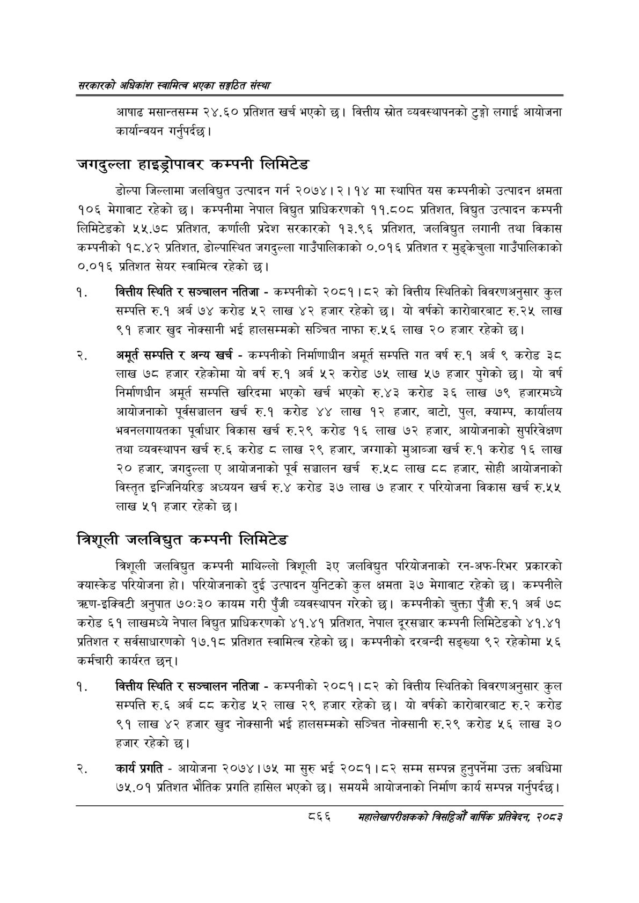

# Page 912 QA

## Rendered page


## Extracted text

```text
सरकारको अधिकांश स्वामित्व भएका सङ्गठित संस्था
आषाढ मसान्तसम्म २४. ६० प्रतिशत खर्च भएको छ। वित्तीय स्रोत व्यवस्थापनको टुङ्गो लगाई आयोजना कार्यान्वयन गर्नुपर्दछ |
जगदुल्ला हाइड्रोपावर कम्पनी लिमिटेड
डोल्पा जिल्लामा जलविद्युत उत्पादन गर्न २०७४। २।१४ मा स्थापित यस कम्पनीको उत्पादन क्षमता १०६ मेगावाट रहेको | कम्पनीमा नेपाल विद्युत प्राधिकरणको ११.८०८ प्रतिशत, विद्युत उत्पादन कम्पनी लिमिटेडको ५५.७८ प्रतिशत, कर्णाली प्रदेश सरकारको १३.९६ प्रतिशत, जलविद्युत लगानी तथा विकास कम्पनीको १८.४२ प्रतिशत, डोल्पास्थित जगदुल्ला गाउँपालिकाको ०,०९ प्रतिशत र मुड्केचुला गाउँपालिकाको ०.०१६ प्रतिशत सेयर स्वामित्व रहेको छ।
चवकित्तीय स्थिति र सञ्चालन नतिजा -कम्पनीको २०८१।८२ को वित्तीय स्थितिको विवरणअनुसार कुल सम्पत्ति रु.१ अर्ब ७४ करोड ५२ लाख ४२ हजार रहेको | यो वर्षको कारोबारबाट रु.२५ लाख ९१ हजार खुद नोक्सानी भई हालसम्मको सञ्चित नाफा रु.५६ लाख २० हजार रहेको छ।
अमूर्त सम्पत्ति र अन्य खर्च -कम्पनीको निर्माणाधीन अमूर्त सम्पत्ति गत वर्ष रु.१ अर्ब ९ करोड ३८ लाख ७८ हजार रहेकोमा यो वर्ष रु.१ अर्ब ५२ करोड ७५ लाख ५७ हजार पुगेको छ। यो वर्ष निर्माणधीन अमूर्त सम्पत्ति खरिदमा भएको खर्च भएको रु.४३ करोड ३६ लाख ७९ हजारमध्ये आयोजनाको पूर्वसञ्चालन खर्च रु.१ करोड ४४ लाख १२ हजार, बाटो, पुल, क्याम्प, कार्यालय भवनलगायतका पूर्वाधार विकास खर्च रु.२९ करोड १६ लाख ७२ हजार, आयोजनाको सुपरिवेक्षण तथा व्यवस्थापन खर्च रु.६ करोड लाख २९ हजार, जग्गाको मुआब्जा खर्च रु.१ करोड १६ लाख २० हजार, जगदुल्ला ए आयोजनाको पूर्व सञ्चालन खर्च रु.५८ लाख ५ हजार, सोही आयोजनाको विस्तृत इन्जिनियरिङ अध्ययन खर्च रु.४ करोड ३७ लाख ७ हजार र परियोजना विकास खर्च रु.५५ लाख ५१ हजार रहेको |
त्रिशूली जलविद्युत कम्पनी लिमिटेड
त्रिशूली जलविद्युत कम्पनी माथिल्लो त्रिशूली ३ए जलविद्युत परियोजनाको रन-अफ-रिभर प्रकारको क्यास्केड परियोजना हो। परियोजनाको दुई उत्पादन युनिटको कुल क्षमता ३७ मेगावाट रहेको छ। कम्पनीले त्रहण-इक्विटी अनुपात ७०:३० कायम गरी पुँजी व्यवस्थापन गरेको छ। कम्पनीको चुक्ता पुँजी रु.१ अर्ब ७८ करोड ६१ लाखमध्ये नेपाल विद्युत प्राधिकरणको ४१.४१ प्रतिशत, नेपाल दूरसञ्चार कम्पनी लिमिटेडको ४१.४१ प्रतिशत र सर्वसाधारणको १७.१८ प्रतिशत स्वामित्व रहेको | कम्पनीको दरबन्दी सङ्ख्या ९२ रहेकोमा ५६ कर्मचारी कार्यरत छन्‌।
बित्तीय स्थिति र सञ्चालन नतिजा -कम्पनीको २०८१।८२ को वित्तीय स्थितिको विवरणअनुसार कुल सम्पत्ति रु.६ अर्ब ६६ करोड लाख २९ हजार रहेको छ। यो वर्षको कारोबारबाट रु.२ करोड ९१ लाख ४२ हजार खुद नोक्सानी भई हालसम्मको सञ्चित नोक्सानी रु.२९ करोड ५६ लाख ३० हजार रहेको छ।
कार्य प्रगति -आयोजना २०७४।७५ मा सुरु भई २०८१।८२ सम्म सम्पन्न हुनुपर्नेमा उक्त अवधिमा ७५.०१ प्रतिशत भौतिक प्रगति हासिल भएको छ। समयमै आयोजनाको निर्माण कार्य सम्पन्न गर्नुपर्दछ।
८६६
सहालेखापरीक्षकको बिदिओँ वार्षिक प्रतिवेदन २०८२
```

## Flags
- None
