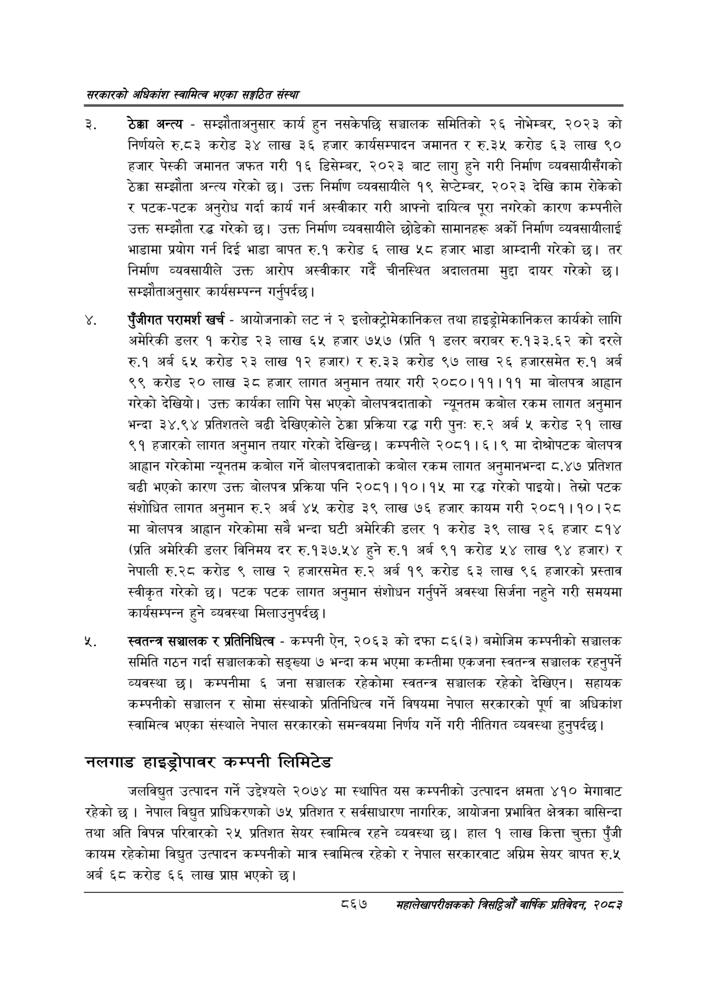

# Page 913 QA

## Rendered page


## Extracted text

```text
सरकारको अधिकांश स्वामित्व भएका सङ्गठित संस्था
ठेक्का अन्त्य -सम्झौताअनुसार कार्य हुन नसकेपछि सञ्चालक समितिको २६ नोभेम्बर, २०२३ को निर्णयले रु.८३ करोड ३४ लाख ३६ हजार कार्यसम्पादन जमानत र रु.३५ करोड ६३ लाख ९० हजार पेस्की जमानत जफत गरी १६ डिसेम्बर, २०२३ बाट लागु हुने गरी निर्माण व्यवसायीसँगको ठेक्का सम्झौता अन्त्य गरेको छ। उक्त निर्माण व्यवसायीले १९ सेप्टेम्बर, २०२३ देखि काम रोकेको र पटक-पटक अनुरोध गर्दा कार्य गर्न अस्वीकार गरी आफ्नो दायित्व पूरा नगरेको कारण कम्पनीले उक्त सम्झौता रद्ध गरेको छ। उक्त निर्माण व्यवसायीले छोडेको सामानहरू अर्को निर्माण व्यवसायीलाई भाडामा प्रयोग गर्न दिई भाडा बापत रु.१ करोड लाख ४५८ हजार भाडा आम्दानी गरेको छ। तर निर्माण व्यवसायीले उक्त आरोप अस्वीकार गर्दै चीनस्थित अदालतमा मुद्दा दायर गरेको छ। सम्झौताअनुसार कार्यसम्पन्न गर्नुपर्दछु।
पुँजीगत परामर्श खर्च -आयोजनाको लट नं २ इलोक्ट्रोमकानिकल तथा हाइड्रोमकानिकल कार्यको लागि अमेरिकी डलर १ करोड २३ लाख ६५ हजार ७५७ (प्रति १ डलर बराबर रु.१३३.६२ को दरले रु.१ अर्ब ६५ करोड २३ लाख १२ हजार) र रु.३३ करोड ९७ लाख २६ हजारसमेत रु.१ अर्ब ९९ करोड २० लाख ३८ हजार लागत अनुमान तयार गरी २०८०।११।११ मा बोलपत्र आह्वान गरेको देखियो। उक्त कार्यका लागि पेस भएको बोलपत्रदाताको न्यूनतम कबोल रकम लागत अनुमान भन्दा ३४.९४ प्रतिशतले बढी देखिएकोले ठेक्का प्रक्रिया रद्ध गरी पुन: रु.२ अर्ब ५ करोड २१ लाख ९१ हजारको लागत अनुमान तयार गरेको देखिन्छ। कम्पनीले २०८१।६।९ मा दोश्रोपटक बोलपत्र आह्वान गरेकोमा न्यूनतम कबोल गर्ने बोलपत्रदाताको कबोल रकम लागत अनुमानभन्दा ८.४७ प्रतिशत बढी भएको कारण उक्त बोलपत्र प्रक्रिया पनि २०८१।१०।१५ मा रद्ध गरेको पाइयो। तेस्रो पटक संशोधित लागत अनुमान रु.२ अर्ब ४५ करोड ३९ लाख ७६ हजार कायम गरी २०८१।१०। २८ मा बोलपत्र आह्वान गरेकोमा सबै भन्दा घटी अमेरिकी डलर १ करोड ३९ लाख २६ हजार ८१४ (प्रति अमेरिकी डलर विनिमय दर रु.१३७.५४ हुने रु.१ अर्ब ९१ करोड ५४ लाख ९४ हजार) र नेपाली रु.२८ करोड ९ लाख २ हजारसमेत रु.२ अर्ब १९ करोड ६३ लाख ९६ हजारको प्रस्ताव स्वीकृत गरेको | पटक पटक लागत अनुमान संशोधन गर्नुपर्ने अवस्था सिर्जना नहुने गरी समयमा कार्यसम्पन्न हुने व्यवस्था मिलाउनुपर्दछ।
स्वतन्त्र सञ्चालक र प्रतिनिधित्व -कम्पनी ऐन, २०६३ को दफा ८६(३) बमोजिम कम्पनीको सञ्चालक समिति गठन गर्दा सञ्चालकको सङ्ख्या ७ भन्दा कम भएमा कम्तीमा एकजना स्वतन्त्र सञ्चालक रहनुपर्ने व्यवस्था | कम्पनीमा ६ जना सञ्चालक रहेकोमा स्वतन्त्र सञ्चालक रहेको देखिएन। सहायक कम्पनीको सञ्चालन र सोमा संस्थाको प्रतिनिधित्व गर्ने विषयमा नेपाल सरकारको पूर्ण वा अधिकांश स्वामित्व भएका संस्थाले नेपाल सरकारको समन्वयमा निर्णय गर्ने गरी नीतिगत व्यवस्था हुनुपर्दछ |
नलगाड हाइड्रोपावर कम्पनी लिमिटेड
जलविद्युत उत्पादन गर्ने उद्देश्यले २०७४ मा स्थापित यस कम्पनीको उत्पादन क्षमता ४१० मेगावाट रहेको छ | नेपाल विद्युत प्राधिकरणको १७५ प्रतिशत र सर्वसाधारण नागरिक, आयोजना प्रभावित क्षेत्रका बासिन्दा तथा अति विपन्न परिवारको २५ प्रतिशत सेयर स्वामित्व रहने व्यवस्था छ। हाल १ लाख कित्ता चुक्ता पुँजी कायम रहेकोमा विद्युत उत्पादन कम्पनीको मात्र स्वामित्व रहेको र नेपाल सरकारवाट अग्रिम सेयर बापत रु.५ अर्ब ६८ करोड ६६ लाख प्राप भएको छ।
८६७
महालेखापरीक्षकको वाषिकि प्रतिवेदन २०८२
```

## Flags
- None
