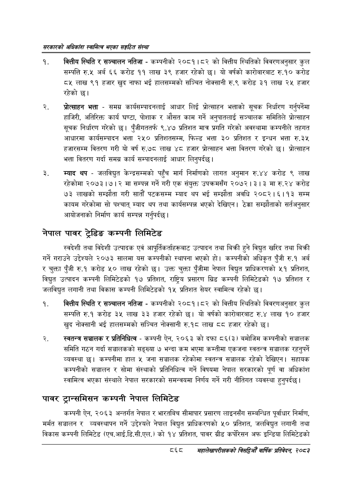

# Page 914 QA

## Rendered page


## Extracted text

```text
सरकारको अधिकांश स्वामित्व भएका सङ्गठित संस्था
वित्तीय स्थिति र सञ्चालन नतिजा -कम्पनीको २०८१।८२ को वित्तीय स्थितिको विवरणअनुसार कुल सम्पत्ति रु.५ अर्ब ६६ करोड ११ लाख ३९ हजार रहेको छ। यो वर्षको कारोबारबाट रु.१० करोड ८५ लाख ९१ हजार खुद नाफा भई हालसम्मको सञ्चित नोक्सानी रु.९ करोड ३१ लाख २५ हजार रहेको छ।
प्रोत्साहन भत्ता -समग्र कार्यसम्पादनलाई आधार लिई प्रोत्साहन भत्ताको सूचक निर्धारण गर्नुपर्नेमा हाजिरी, अतिरिक्त कार्य घण्टा, पोशाक र औसत काम गर्ने अनुपातलाई सञ्चालक समितिले प्रोत्साहन सूचक निर्धारण गरेको छ। पुँजीगततर्फ ९.४७ प्रतिशत मात्र प्रगति गरेको अवस्थामा कम्पनीले तहगत आधारमा कार्यसम्पादन भत्ता २५० प्रतिशतसम्म, फिल्ड भत्ता ३० प्रतिशत र इन्धन भत्ता रु.३५ हजारसम्म वितरण गरी यो वर्ष रु.७८ लाख ४८ हजार प्रोत्साहन भत्ता वितरण गरेको छ। प्रोत्साहन भत्ता वितरण गर्दा समग्र कार्य सम्पादनलाई आधार लिनुपर्दछ |
म्याद थप -जलविद्युत केन्द्रसम्मको पहुँच मार्ग निर्माणको लागत अनुमान रु.४४ करोड ९ लाख रहेकोमा २०७३।७।२ मा सम्पन्न गर्ने गरी एक संयुक्त उपक्रमसँग २०७२।३। ३ मा रु.२४ करोड ७३ लाखको सम्झौता गरी सातौं पटकसम्म म्याद थप भई सम्झौता अवधि २०८२।६।१३ सम्म कायम गरेकोमा सो पश्चात्‌ म्याद थप तथा कार्यसम्पन्न भएको देखिएन। ठेक्का सम्झौताको सर्तअनुसार आयोजनाको निर्माण कार्य सम्पन्न गर्नुपर्दछ |
नेपाल पावर ट्रेडिङ कम्पनी लिमिटेड
स्वदेशी तथा विदेशी उत्पादक एवं आपूर्तिकर्ताहरूबाट उत्पादन तथा बिक्री हुने विद्युत खरिद तथा बिक्री गर्ने गराउने उद्देश्यले २०७३ सालमा यस कम्पनीको स्थापना भएको हो। कम्पनीको अधिकृत पुँजी रु.१ अर्ब र चुक्ता पुँजी रु.१ करोड ५० लाख रहेको छ। उक्त चुक्ता पुँजीमा नेपाल विद्युत प्राधिकरणको ५१ प्रतिशत, विद्युत उत्पादन कम्पनी लिमिटेडको १७ प्रतिशत, राष्ट्रिय प्रसारण ग्रिड कम्पनी लिमिटेडको १७ प्रतिशत र जलविद्युत लगानी तथा विकास कम्पनी लिमिटेडको १५ प्रतिशत सेयर स्वामित्व रहेको छ।
वित्तीय स्थिति र सञ्चालन नतिजा -कम्पनीको २०८१।८२ को वित्तीय स्थितिको विवरणअनुसार कुल सम्पत्ति रु.१ करोड ३५ लाख ३३ हजार रहेको छ। यो वर्षको कारोबारबाट रु.४ लाख १० हजार खुद नोक्सानी भई हालसम्मको सञ्चित नोक्सानी रु.१८ लाख ८८ हजार रहेको छ।
स्वतन्त्र सञ्चालक र प्रतिनिधित्व -कम्पनी ऐन, २०६३ को दफा ८६(३) बमोजिम कम्पनीको सञ्चालक समिति गठन गर्दा सञ्चालकको सङ्ख्या ७ भन्दा कम भएमा कम्तीमा एकजना स्वतन्त्र सञ्चालक रहनुपर्ने व्यवस्था | कम्पनीमा हाल ५ जना सञ्चालक रहेकोमा स्वतन्त्र सञ्चालक रहेको देखिएन। सहायक कम्पनीको सञ्चालन र सोमा संस्थाको प्रतिनिधित्व गर्ने विषयमा नेपाल सरकारको पूर्ण वा अधिकांश स्वामित्व भएका संस्थाले नेपाल सरकारको समन्वयमा निर्णय गर्ने गरी नीतिगत व्यवस्था हुनुपर्दछ |
पावर ट्रान्समिसन कम्पनी नेपाल लिमिटेड
कम्पनी ऐन, २०६३ अन्तर्गत नेपाल र भारतबिच सीमापार प्रसारण लाइनसँग सम्बन्धित पूर्वाधार निर्माण, मर्मत सञ्चालन र व्यवस्थापन गर्ने उद्देश्यले नेपाल विद्युत प्राधिकरणको ५० प्रतिशत, जलविद्युत लगानी तथा विकास कम्पनी लिमिटेड (एच.आई.डि.सी.एल.) को १४ प्रतिशत, पावर ग्रीड कर्पोरिसन अफ इन्डिया लिमिटेडको
८६८
महालेखापरीक्षकको वाषिकि प्रतिवेदन २०८२
```

## Flags
- None
