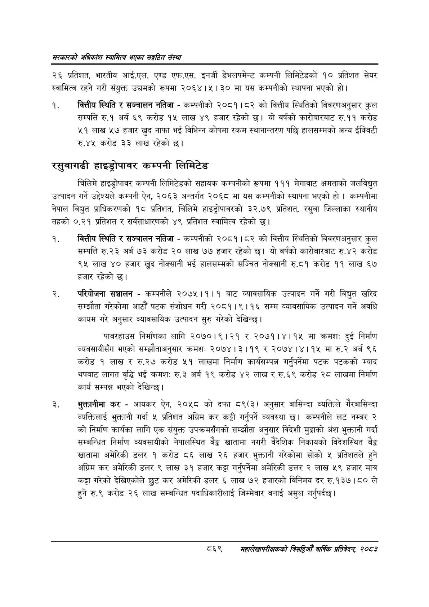

# Page 915 QA

## Rendered page


## Extracted text

```text
सरकारको अधिकांश स्वामित्व भएका सङ्गठित संस्था
२६ प्रतिशत, भारतीय आई.एल. एण्ड एफ.एस. इनर्जी डेभलपमेन्ट कम्पनी लिमिटेडको १० प्रतिशत सेयर स्वामित्व रहने गरी संयुक्त उद्यमको रूपमा २०६४।५। ३० मा यस कम्पनीको स्थापना भएको हो।
वित्तीय स्थिति र सञ्चालन नतिजा -कम्पनीको २०८१।८२ को वित्तीय स्थितिको विवरणअनुसार कुल सम्पत्ति रु.१ अर्ब ६९ करोड १५ लाख ४९ हजार रहेको छ। यो वर्षको कारोबारबाट रु.११ करोड ५१ लाख ५७ हजार खुद नाफा भई विभिन्न कोषमा रकम स्थानान्तरण पछि हालसम्मको अन्य ईक्विटी रु.४५ करोड ३३ लाख रहेको छ।
रसुवागढी हाइड्रोपावर कम्पनी लिमिटेड
चिलिमे हाइड्रोपावर कम्पनी लिमिटेडको सहायक कम्पनीको रूपमा १११ मेगावाट क्षमताको जलविद्युत उत्पादन गर्ने उद्देश्यले कम्पनी ऐन, २०६३ अन्तर्गत २०६८ मा यस कम्पनीको स्थापना भएको हो। कम्पनीमा नेपाल विद्युत प्राधिकरणको १८ प्रतिशत, चिलिमे हाइड्रोपावरको ३२.७९ प्रतिशत, रसुवा जिल्लाका स्थानीय तहको ०.२१ प्रतिशत र सर्वसाधारणको ४९ प्रतिशत स्वामित्व रहेको |
वित्तीय स्थिति र सञ्चालन नतिजा -कम्पनीको २०८१।८२ को वित्तीय स्थितिको विवरणअनुसार कुल सम्पत्ति रु. २३ अर्ब ७३ करोड ० लाख ७७ हजार रहेको छ। यो वर्षको कारोबारबाट रु.४२ करोड ९५ लाख ४० हजार खुद नोक्सानी भई हालसम्मको सञ्चित नोक्सानी रु.८१ करोड ११ लाख ६७ हजार रहेको छ।
परियोजना सञ्चालन -कम्पनीले २०७५।१।१ बाट व्यावसायिक उत्पादन गर्ने गरी विद्युत खरिद सम्झौता गरेकोमा आठौं पटक संशोधन गरी २०८१।९।१६ सम्म व्यावसायिक उत्पादन गर्ने अवधि कायम गरे अनुसार व्यावसायिक उत्पादन सुरु गरेको देखिन्छ।
पावरहाउस निर्माणका लागि २०७०।९।२१ र २०७१।४।१५ मा क्रमशः दुई निर्माण व्यवसायीसँग भएको सम्झौताअनुसार क्रमशः २०७४। ३११९ र २०७४।४।१५ मा रु.२ अर्ब ९६ करोड १ लाख र रु.२७ करोड ५१ लाखमा निर्माण कार्यसम्पन्न गर्नुपर्नेमा पटक पटकको म्याद थपबाट लागत वृद्धि भई क्रमशः रु.३ अर्ब १९ करोड ४२ लाख र रु.६९ करोड २८ लाखमा निर्माण कार्य सम्पन्न भएको देखिन्छ।
भुक्तानीमा कर -आयकर ऐन, २०५८ को दफा ८९(३) अनुसार बासिन्दा व्यक्तिले गैरबासिन्दा व्यक्तिलाई भुक्तानी गर्दा ५ प्रतिशत अग्रिम कर कट्टी गर्नुपर्ने व्यवस्था छ। कम्पनीले लट नम्बर २ को निर्माण कार्यका लागि एक संयुक्त उपक्रमसँगको सम्झौता अनुसार विदेशी मुद्राको अंश भुक्तानी गर्दा सम्बन्धित निर्माण व्यवसायीको नेपालस्थित बैङ्क खातामा नगरी वैदेशिक निकायको विदेशस्थित बैङ्क खातामा अमेरिकी डलर १ करोड ८६ लाख २६ हजार भुक्तानी गरेकोमा सोको ५ प्रतिशतले हुने अग्रिम कर अमेरिकी डलर ९ लाख ३९ हजार कट्टा गर्नुपर्नेमा अमेरिकी डलर २ लाख ५९ हजार मात्र कट्टा गरेको देखिएकोले छुट कर अमेरिकी डलर ६ लाख ७२ हजारको विनिमय दर रु.१३७।८० ले हुने रु.९ करोड २६ लाख सम्बन्धित पदाधिकारीलाई जिम्मेवार बनाई असुल गर्नुपर्दछ।
६९
सहालेखापरीक्षकको बिदिओँ वार्षिक प्रतिवेदन २०८२
```

## Flags
- None
