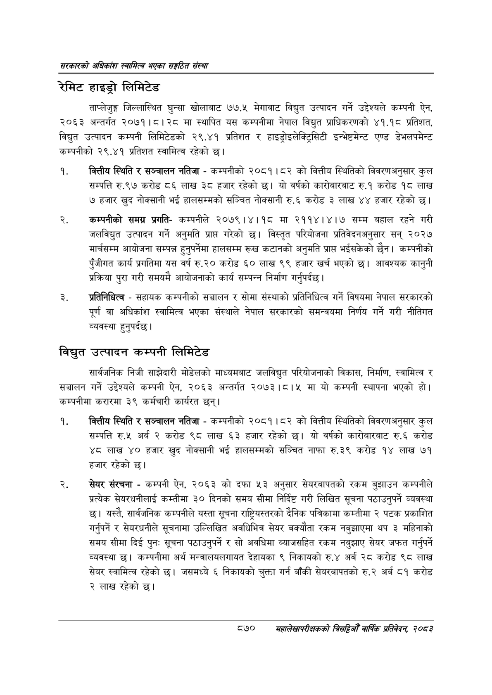

# Page 916 QA

## Rendered page


## Extracted text

```text
सरकारको अधिकांश स्वामित्व भएका सङ्गठित संस्था
रेमिट हाइड्रो लिमिटेड
ताप्लेजुङ्ग जिल्लास्थित घुन्सा खोलाबाट ७७.५ मेगावाट विद्युत उत्पादन गर्ने उद्देश्यले कम्पनी ऐन, २०६३ अन्तर्गत २०७१।८।२८ मा स्थापित यस कम्पनीमा नेपाल विद्युत प्राधिकरणको ४१.१८ प्रतिशत, विद्युत उत्पादन कम्पनी लिमिटेडको २९.४१ प्रतिशत र हाइड्रोइलेक्ट्रिसिटी इन्भेष्टमेन्ट एण्ड डेभलपमेन्ट कम्पनीको २९.४१ प्रतिशत स्वामित्व रहेको छ।
वित्तीय स्थिति र सञ्चालन नतिजा -कम्पनीको २०८१।८२ को वित्तीय स्थितिको विवरणअनुसार कुल सम्पत्ति रु.९७ करोड ८६ लाख ३८ हजार रहेको छ। यो वर्षको कारोबारबाट रु.१ करोड १८ लाख ७ हजार खुद नोक्सानी भई हालसम्मको सञ्चित नोक्सानी रु.६ करोड ३ लाख ४४ हजार रहेको छ।
कम्पनीको समग्र प्रगतिकम्पनीले २०७९।४।१८ मा २११४।४।७ सम्म बहाल रहने गरी जलविद्युत उत्पादन गर्ने अनुमति प्राप्त गरेको छ। विस्तृत परियोजना प्रतिवेदनअनुसार सन्‌ २०२७ मार्चसम्म आयोजना सम्पन्न हुनुपर्नेमा हालसम्म रूख कटानको अनुमति प्राप्त भईसकेको छैन। कम्पनीको पुँजीगत कार्य प्रगतिमा यस वर्ष रु.२० करोड ६० लाख ९९ हजार खर्च भएको | आवश्यक कानुनी प्रक्रिया पुरा गरी समयमै आयोजनाको कार्य सम्पन्न निर्माण गर्नुपर्दछ |
प्रतिनिधित्व -सहायक कम्पनीको सञ्चालन र सोमा संस्थाको प्रतिनिधित्व गर्ने विषयमा नेपाल सरकारको पूर्ण वा अधिकांश स्वामित्व भएका संस्थाले नेपाल सरकारको समन्वयमा निर्णय गर्ने गरी नीतिगत व्यवस्था हुनुपर्दछ |
विद्युत उत्पादन कम्पनी लिमिटेड
सार्वजनिक निजी साझेदारी मोडेलको माध्यमबाट जलविद्युत परियोजनाको विकास, निर्माण, स्वामित्व र सञ्चालन गर्ने उद्देश्यले कम्पनी ऐन, २०६३ अन्तर्गत २०७३।८।५ मा यो कम्पनी स्थापना भएको हो। कम्पनीमा करारमा ३९ कर्मचारी कार्यरत छन्‌।
वित्तीय स्थिति र सञ्चालन नतिजा -कम्पनीको २०८१।८२ को वित्तीय स्थितिको विवरणअनुसार कुल सम्पत्ति रु.५ अर्ब २ करोड ९८ लाख ६३ हजार रहेको | यो वर्षको कारोबारबाट रु.६ करोड ४८ लाख ४० हजार खुद नोक्सानी भई हालसम्मको सञ्चित नाफा रु.३९ करोड १४ लाख ७१ हजार रहेको छ।
सेयर संरचना -कम्पनी ऐन, २०६३ को दफा ५३ अनुसार सेयरबापतको रकम बुझाउन कम्पनीले प्रत्येक सेयरधनीलाई कम्तीमा ३० दिनको समय सीमा निर्दिष्ट गरी लिखित सूचना पठाउनुपर्ने व्यवस्था छ। यस्तै, सार्वजनिक कम्पनीले यस्ता सूचना राष्ट्रियस्तरको दैनिक पत्रिकामा कम्तीमा २ पटक प्रकाशित गर्नुपर्ने र सेयरधनीले सूचनामा उल्लिखित अवधिभित्र सेयर बक्यौता रकम नबुझाएमा थप ३ महिनाको समय सीमा दिई पुनः सूचना पठाउनुपर्ने र सो अवधिमा व्याजसहित रकम नबुझाए सेयर जफत गर्नुपर्ने व्यवस्था छ। कम्पनीमा अर्थ मन्त्रालयलगायत देहायका ९ निकायको रु.४ अर्ब २८ करोड ९८ लाख सेयर स्वामित्व रहेको छ। जसमध्ये ६ निकायको चुक्ता गर्न बाँकी सेयरबापतको रु.२ अर्ब ८१ करोड २ लाख रहेको छ।
८७० सहालेखापरीक्षकको बिदिओँ वार्षिक प्रतिवेदन २०८२
```

## Flags
- None
