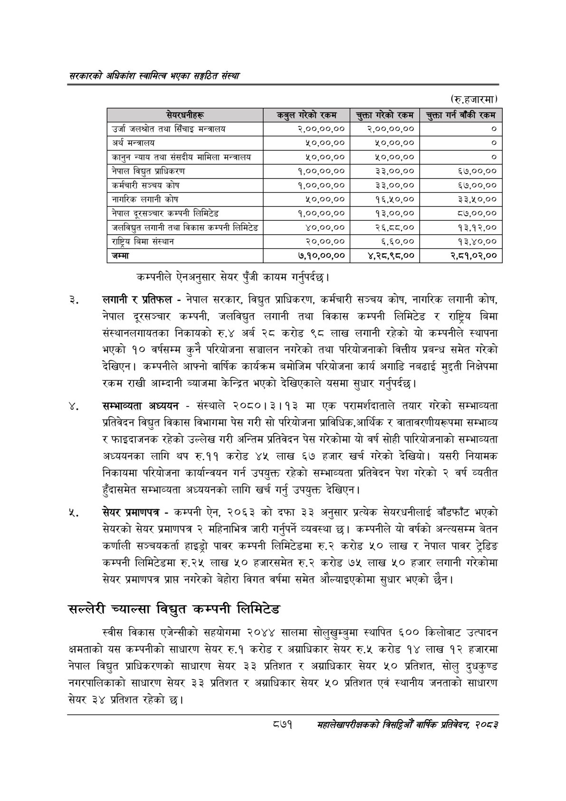

# Page 917 QA

## Rendered page


## Extracted text

```text
सरकारको अधिकांश स्वामित्व भएका सङ्गठित संस्था
(रु.हजारमा)
कम्पनीले ऐनअनुसार सेयर पुँजी कायम गर्नुपर्दछ |
लगानी र प्रतिफल -नेपाल सरकार, विद्युत प्राधिकरण, कर्मचारी सञ्चय कोष, नागरिक लगानी कोष, नेपाल दूरसञ्चार कम्पनी, जलविद्युत लगानी तथा विकास कम्पनी लिमिटेड र राष्ट्रिय बिमा संस्थानलगायतका निकायको रु.४ अर्ब २८ करोड ९८ लाख लगानी रहेको यो कम्पनीले स्थापना भएको १० वर्षसम्म कुनै परियोजना सञ्चालन नगरेको तथा परियोजनाको वित्तीय प्रबन्ध समेत गरेको देखिएन। कम्पनीले आफ्नो वार्षिक कार्यक्रम बमोजिम परियोजना कार्य अगाडि नबढाई मुद्दती निक्षेपमा रकम राखी आम्दानी ब्याजमा केन्द्रित भएको देखिएकाले यसमा सुधार गर्नुपर्दछ |
सम्भाव्यता अध्ययन -संस्थाले २०८०।३।१३ मा एक परामर्शदाताले तयार गरेको सम्भाव्यता प्रतिवेदन विद्युत विकास विभागमा पेस गरी सो परियोजना प्राविधिक,आर्थिक र वातावरणीयरूपमा सम्भाव्य र फाइदाजनक रहेको उल्लेख गरी अन्तिम प्रतिवेदन पेस गरेकोमा यो वर्ष सोही पारियोजनाको सम्भाव्यता अध्ययनका लागि थप रु.११ करोड ४५ लाख ६७ हजार खर्च गरेको देखियो। यसरी नियामक निकायमा परियोजना कार्यान्वयन गर्न उपयुक्त रहेको सम्भाव्यता प्रतिवेदन पेश गरेको २ वर्ष व्यतीत हुँदासमेत सम्भाव्यता अध्ययनको लागि खर्च गर्नु उपयुक्त देखिएन |
सेयर प्रमाणपत्र -कम्पनी ऐन, २०६३ को दफा ३३ अनुसार प्रत्येक सेयरधनीलाई बाँडफाँट भएको सेयरको सेयर प्रमाणपत्र २ महिनाभित्र जारी गर्नुपर्ने व्यवस्था छ। कम्पनीले यो वर्षको अन्त्यसम्म बेतन कर्णाली सञ्चयकर्ता हाइड्रो पावर कम्पनी लिमिटेडमा रु.२ करोड ५० लाख र नेपाल पावर ट्रेडिङ कम्पनी लिमिटेडमा रु.२५ लाख ५० हजारसमेत रु.२ करोड ७५ लाख ५० हजार लगानी गरेकोमा सेयर प्रमाणपत्र प्राप्त नगरेको बेहोरा विगत वर्षमा समेत औल्याइएकोमा सुधार भएको छैन।
सल्लेरी च्याल्सा विद्युत कम्पनी लिमिटेड
स्वीस विकास एजेन्सीको सहयोगमा २०४४ सालमा सोलुखुम्बुमा स्थापित ६०० किलोवाट उत्पादन क्षमताको यस कम्पनीको साधारण सेयर रु.१ करोड र अग्राधिकार सेयर रु.५ करोड १४ लाख १२ हजारमा नेपाल विद्युत प्राधिकरणको साधारण सेयर ३३ प्रतिशत र अग्राधिकार सेयर ५० प्रतिशत, सोलु दुधकुण्ड नगरपालिकाको साधारण सेयर ३३ प्रतिशत र अग्राधिकार सेयर ५० प्रतिशत एवं स्थानीय जनताको साधारण सेयर ३४ प्रतिशत रहेको
८७१
सहालेखापरीक्षकको बिदिओँ वार्षिक प्रतिवेदन २०८२

(रु.हजारमा)

| सेयरधनीहरू                               | कबुल गरेको रकम   | चुक्ता गरेको रकम   | &#124; चुक्ता गर्न बाँकी रकम   |
|------------------------------------------|------------------|--------------------|--------------------------------|
| उर्जा जलश्रोत तथा सिँचाइ मन्त्रालय       | २,००,००,००       | २,००,००,००         | । ०]                           |
| अर्थ मन्त्रालय                           | ५०,००,००         | ५०,००,००           | &#124; ०]                      |
| कानुन न्याय तथा संसदीय मामिला मन्त्रालय  | 40,00,00         | 40,00,00           | _                              |
| नेपाल विद्युत प्राधिकरण                  | १,००,००,००       | 33,00,00           | ६७,००,००                       |
| कर्मचारी सञ्चय कोष                       | १,००,००,००       | 33,00,00           | ६७,००,००                       |
| नागरिक लगानी कोष                         | ५०,००,००         | १६,५०,००           | 33,%0,00                       |
| नेपाल दूरसञ्चार कम्पनी लिमिटेड           | १,००,००,००       | १३,००,००           | ८७,००,००                       |
| जलविद्युत लगानी तथा विकास कम्पनी लिमिटेड | ४०,००,००         | २६,८८,००           | १३,१२,००                       |
| राष्ट्रिय बिमा संस्थान                   |                  |                    |                                |
| जम्मा                                    | ७,१०,००,००       | ४,२८,९८,००         | २,८१,०२,००                     |
```

## Flags
- table_page
- medium_quality_table
