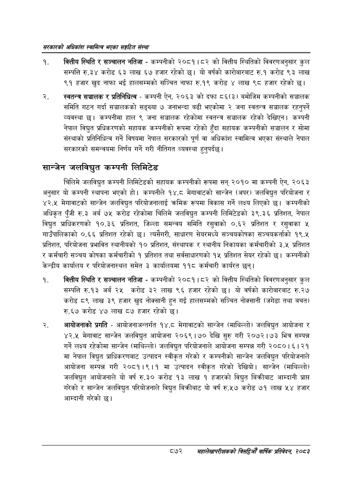

# Page 918 QA

## Rendered page


## Extracted text

```text
सरकारको अधिकांश स्वामित्व भएका सङ्गठित संस्था
वित्तीय स्थिति र सञ्चालन नतिजा -कम्पनीको २०८१।८२ को वित्तीय स्थितिको विवरणअनुसार कुल सम्पत्ति €.३ करोड ३ लाख ६७ हजार रहेको छ। यो वर्षको कारोबारबाट रु.१ करोड ९३ लाख ९१ हजार खुद नाफा भई हालसम्मको सञ्चित नाफा रु.१९ करोड ४ लाख ९८ हजार रहेको छ।
स्वतन्त्र सञ्चालक र प्रतिनिधित्व -कम्पनी ऐन, २०६३ को दफा ८६(३) बमोजिम कम्पनीको सञ्चालक समिति गठन गर्दा सञ्चालकको सङ्ख्या ७ जनाभन्दा बढी भएकोमा २ जना स्वतन्त्र सञ्चालक रहनुपर्ने व्यवस्था | कम्पनीमा हाल ९ जना सञ्चालक रहेकोमा स्वतन्त्र सञ्चालक रहेको देखिएन। कम्पनी नेपाल विद्युत प्रधिकरणको सहायक कम्पनीको रूपमा रहेको हुँदा सहायक कम्पनीको सञ्चालन र सोमा संस्थाको प्रतिनिधित्व गर्ने विषयमा नेपाल सरकारको पूर्ण वा अधिकांश स्वामित्व भएका संस्थाले नेपाल सरकारको समन्वयमा निर्णय गर्ने गरी नीतिगत व्यवस्था हुनुपर्दछ |
सान्जेन जलविद्युत कम्पनी लिमिटेड
चिलिमे जलविद्युत कम्पनी लिमिटेडको सहायक कम्पनीको रूपमा सन्‌ २०१० मा कम्पनी ऐन, २०६३ अनुसार यो कम्पनी स्थापना भएको हो। कम्पनीले १४,८ मेगावाटको सान्जेन (अपर) जलविद्युत परियोजना र ४२.५ मेगावाटको सान्जेन जलविद्युत परियोजनालाई क्रमिक रूपमा विकास गर्ने लक्ष्य लिएको छ। कम्पनीको अधिकृत पुँजी रु.३ अर्ब ७५ करोड रहेकोमा चिलिमे जलविद्युत कम्पनी लिमिटेडको ३९.३६ प्रतिशत, नेपाल विद्युत प्राधिकरणको १०.३६ प्रतिशत, जिल्ला समन्वय समिति रसुवाको ०.६२ प्रतिशत र रसुवाका ५ गाउँपालिकाको ०.६६ प्रतिशत रहेको छ। त्यसैगरी, साधारण सेयरमध्ये सञ्चयकोषका सञ्चयकर्ताको १९.५ प्रतिशत, परियोजना प्रभावित स्थानीयको १० प्रतिशत, संस्थापक र स्थानीय निकायका कर्मचारीको ३.५ प्रतिशत र कर्मचारी सञ्चय कोषका कर्मचारीको १ प्रतिशत तथा सर्वसाधारणको १५ प्रतिशत सेयर रहेको छ। कम्पनीको केन्द्रीय कार्यालय र परियोजनास्थल समेत ३ कार्यालयमा ११८ कर्मचारी कार्यरत छन्‌।
वित्तीय स्थिति र सञ्चालन नतिजा -कम्पनीको २०८१।८२ को वित्तीय स्थितिको विवरणअनुसार कुल सम्पत्ति रु.१३ अर्ब २५ करोड ३२ लाख ९६ हजार रहेको छ। यो वर्षको कारोबारबाट रु.२७ करोड ८९ लाख ३९ हजार खुद नोक्सानी हुन गई हालसम्मको सञ्चित नोक्सानी (जगेडा तथा बचत) रु.६७ करोड ४७ लाख ८७ हजार रहेको |
आयोजनाको प्रगति -आयोजनाअन्तर्गत १४.८ मेगावाटको सान्जेन (माथिल्लो) जलविद्युत आयोजना र ४२.५ मेगावाट सान्जेन जलविद्युत आयोजना २०६९ |९० देखि सुरु गरी २०७२।७३ भित्र सम्पन्न गर्ने लक्ष्य रहेकोमा सान्जेन (माथिल्लो) जलविद्युत परियोजनाले आयोजना सम्पन्न गरी २०८०।६। २१ मा नेपाल विद्युत प्राधिकरणबाट उत्पादन स्वीकृत गरेको र कम्पनीको सान्जेन जलविद्युत परियोजनाले आयोजना सम्पन्न गरी २०८१।९।१ मा उत्पादन स्वीकृत गरेको देखियो। सान्जेन (माथिल्लो) जलविद्युत आयोजनाले यो वर्ष रु.३० करोड १३ लाख १ हजारको विद्युत बिक्रीबाट आम्दानी प्राप्त गरेको र सान्जेन जलविद्युत परियोजनाले विद्युत बिक्रीबाट यो वर्ष रु.५७ करोड ७१ लाख ५४ हजार आम्दानी गरेको छ।
८७२
सहालेखापरीक्षकको बिदिओँ वार्षिक प्रतिवेदन २०८२
```

## Flags
- None
