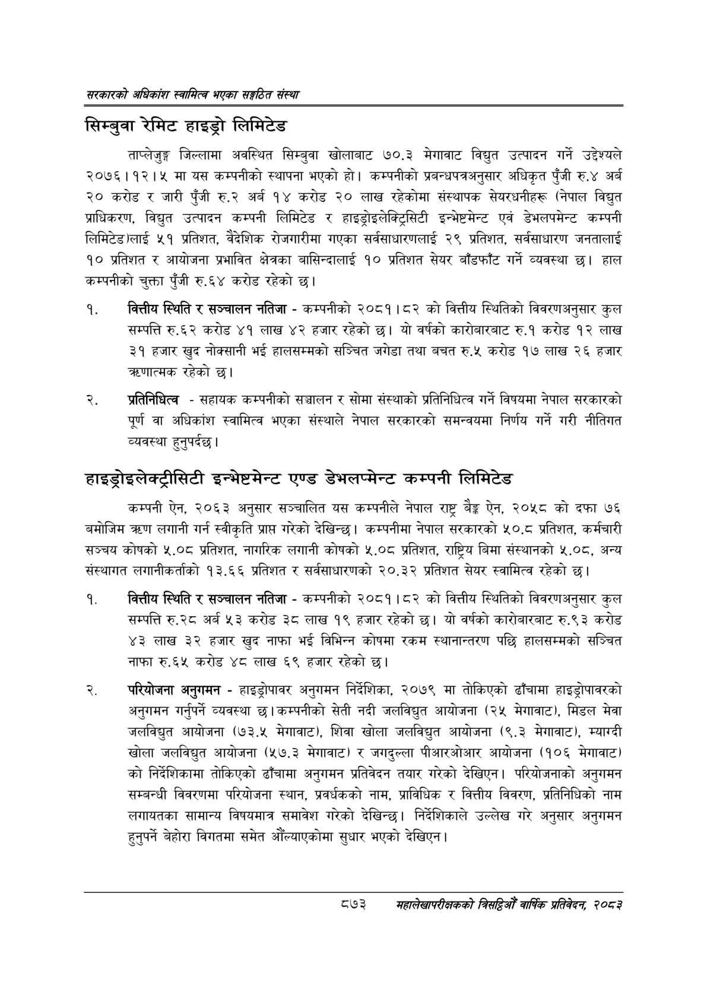

# Page 919 QA

## Rendered page


## Extracted text

```text
सरकारको अधिकांश स्वामित्व भएका सङ्गठित संस्था
सिम्बुवा रेमिट हाइड्रो लिमिटेड
ताप्लेजुङ्ग जिल्लामा अवस्थित सिम्बुवा खोलाबाट ७०.३ मेगावाट विद्युत उत्पादन गर्ने उद्देश्यले २०७६।१२।५ मा यस कम्पनीको स्थापना भएको हो। कम्पनीको प्रबन्धपत्रअनुसार अधिकृत पुँजी रु.४ अर्ब २० करोड र जारी पुँजी रु.२ अर्ब १४ करोड २० लाख रहेकोमा संस्थापक सेयरधनीहरू (नेपाल विद्युत प्राधिकरण, विद्युत उत्पादन कम्पनी लिमिटेड र हाइड्रोइलेक्ट्रिसिटी इन्भेष्टमेन्ट एवं डेभलपमेन्ट कम्पनी लिमिटेड)लाई ५१ प्रतिशत, वैदेशिक रोजगारीमा गएका सर्वसाधारणलाई २९ प्रतिशत, सर्वसाधारण जनतालाई १० प्रतिशत र आयोजना प्रभावित क्षेत्रका बासिन्दालाई १० प्रतिशत सेयर बाँडफाँट गर्ने व्यवस्था छ। हाल कम्पनीको चुक्ता पुँजी रु.६४ करोड रहेको छ।
वित्तीय स्थिति र सञ्चालन नतिजा -कम्पनीको २०८१।८२ को वित्तीय स्थितिको विवरणअनुसार कुल सम्पत्ति रु.६२ करोड ४१ लाख ४२ हजार रहेको छ। यो वर्षको कारोबारबाट रु.१ करोड १२ लाख ३१ हजार खुद नोक्सानी भई हालसम्मको सञ्चित जगेडा तथा बचत रु.५ करोड १७ लाख २६ हजार क्रणात्मक रहेको छ।
प्रतिनिधित्व -सहायक कम्पनीको सञ्चालन र सोमा संस्थाको प्रतिनिधित्व गर्ने विषयमा नेपाल सरकारको पूर्ण वा अधिकांश स्वामित्व भएका संस्थाले नेपाल सरकारको समन्वयमा निर्णय गर्ने गरी नीतिगत व्यवस्था हुनुपर्दछ |
हाइड्रोइलेक्ट्रीसिटी इन्भेष्टमेन्ट एण्ड डेभलप्मेन्ट कम्पनी लिमिटेड
कम्पनी ऐन, २०६३ अनुसार सञ्चालित यस कम्पनीले नेपाल राष्ट्र बैङ्क ऐन, २०५८ को दफा ७६ बमोजिम त्ररण लगानी गर्न स्वीकृति प्राप्त गरेको देखिन्छ। कम्पनीमा नेपाल सरकारको ५०.८ प्रतिशत, कर्मचारी सञ्चय कोषको ५.०८ प्रतिशत, नागरिक लगानी कोषको ५.०८ प्रतिशत, राष्ट्रिय बिमा संस्थानको ५.०८, अन्य संस्थागत लगानीकर्ताको १३.६६ प्रतिशत र सर्वसाधारणको २०.३२ प्रतिशत सेयर स्वामित्व रहेको छ।
वित्तीय स्थिति र सञ्चालन नतिजा -कम्पनीको २०८१।८२ को वित्तीय स्थितिको विवरणअनुसार कुल सम्पत्ति रु. २८ अर्ब ५३ करोड ३८ लाख १९ हजार रहेको | यो वर्षको कारोबारबाट रु.९३ करोड ४३ लाख ३२ हजार खुद नाफा भई विभिन्न कोषमा रकम स्थानान्तरण पछि हालसम्मको सञ्चित नाफा रु.६५ करोड ४८ लाख ६९ हजार रहेको छ।
परियोजना अनुगमन -हाइड्रोपावर अनुगमन निर्देशिका, २०७९ मा तोकिएको ढाँचामा हाइड्रोपावरको अनुगमन गर्नुपर्ने व्यवस्था | कम्पनीको सेती नदी जलविद्युत आयोजना (२५ मेगावाट), मिडल मेवा जलविद्युत आयोजना (७३.५ मेगावाट), शिवा खोला जलविद्युत आयोजना (९.३ मेगावाट), म्याग्दी खोला जलविद्युत आयोजना (५७.३ मेगावाट) र जगदुल्ला पीआरओआर आयोजना (१०६ मेगावाट) को निर्देशिकामा तोकिएको ढाँचामा अनुगमन प्रतिवेदन तयार गरेको देखिएन। परियोजनाको अनुगमन सम्बन्धी विवरणमा परियोजना स्थान, प्रवर्धकको नाम, प्राविधिक र वित्तीय विवरण, प्रतिनिधिको नाम लगायतका सामान्य विषयमात्र समावेश गरेको देखिन्छ। निर्देशिकाले उल्लेख गरे अनुसार अनुगमन हुनुपर्ने बेहोरा विगतमा समेत औंल्याएकोमा सुधार भएको देखिएन |
८७३ सहालेखापरीक्षकको बिदिओँ वार्षिक प्रतिवेदन २०८२
```

## Flags
- None
