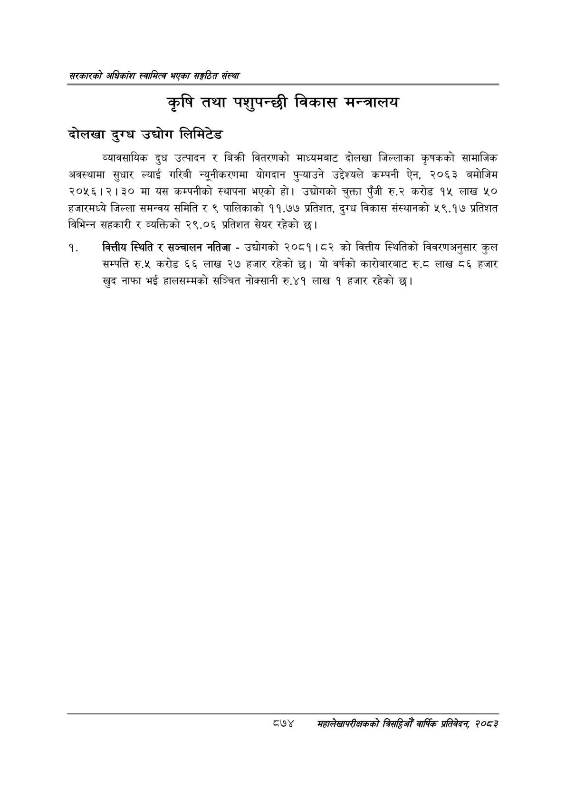

# Page 920 QA

## Rendered page


## Extracted text

```text
सरकारको अधिकांश स्वामित्व भएका सङ्गठित संस्था
कृषि तथा पशुपन्छी विकास मन्त्रालय
दोलखा दुग्ध उद्योग लिमिटेड
व्यावसायिक दुध उत्पादन र बिक्री वितरणको माध्यमबाट दोलखा जिल्लाका कृषकको सामाजिक अवस्थामा सुधार ल्याई गरिबी न्यूनीकरणमा योगदान पुन्याउने उद्देश्यले कम्पनी ऐन, २०६३ बमोजिम २०५६।२।३० मा यस कम्पनीको स्थापना भएको | उद्योगको चुक्ता पुँजी रु.२ करोड १५ लाख ५० हजारमध्ये जिल्ला समन्वय समिति र ९ पालिकाको ११.७७ प्रतिशत, दुग्ध विकास संस्थानको ५९.१७ प्रतिशत विभिन्न सहकारी र व्यक्तिको २९.०६ प्रतिशत सेयर रहेको छ।
वित्तीय स्थिति र सञ्चालन नतिजा -उद्योगको २०८१।८२ को वित्तीय स्थितिको विवरणअनुसार कुल सम्पत्ति रु.५ करोड ६६ लाख २७ हजार रहेको छ। यो वर्षको कारोबारबाट रु.८ लाख ८६ हजार खुद नाफा भई हालसम्मको सञ्चित नोक्सानी रु.४१ लाख १ हजार रहेको छ।
८७४
महालेखापरीक्षकको बिद्या वाषिकि प्रतिवेदन २०८२
```

## Flags
- None
