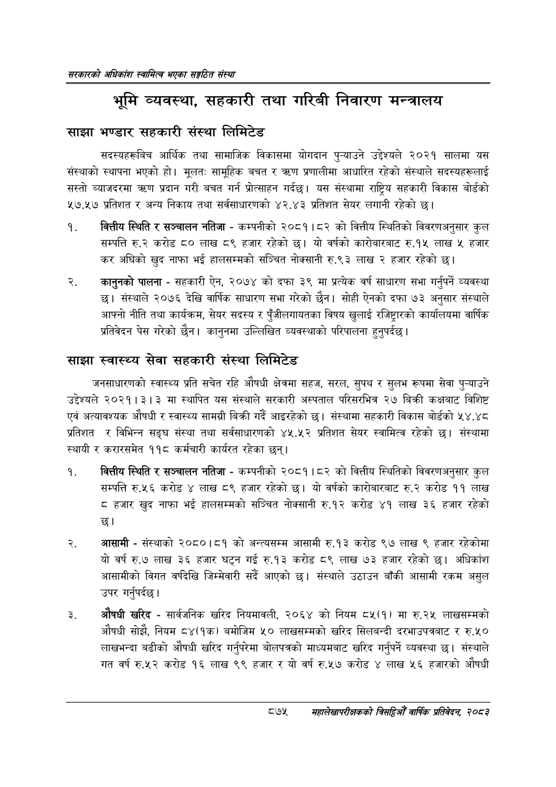

# Page 921 QA

## Rendered page


## Extracted text

```text
सरकारको अधिकांश स्वामित्व भएका सङ्गठित संस्था
भूमि व्यवस्था, सहकारी तथा गरिबी निवारण मन्त्रालय
साझा भण्डार सहकारी संस्था लिमिटेड
सदस्यहरूबिच आर्थिक तथा सामाजिक विकासमा योगदान पुन्याउने उद्देश्यले २०२१ सालमा यस संस्थाको स्थापना भएको हो। मूलतः सामूहिक बचत ० प्रणालीमा आधारित रहेको संस्थाले सदस्यहरूलाई सस्तो ब्याजदरमा तरण प्रदान गरी बचत गर्न प्रोत्साहन गर्दछ। यस संस्थामा राष्ट्रिय सहकारी विकास बोर्डको ४७.४५७ प्रतिशत र अन्य निकाय तथा सर्वसाधारणको ४२.४३ प्रतिशत सेयर लगानी रहेको छ।
वित्तीय स्थिति र सञ्चालन नतिजा -कम्पनीको २०८१।८२ को वित्तीय स्थितिको विवरणअनुसार कुल सम्पत्ति रु.२ करोड ८० लाख ८९ हजार रहेको छ। यो वर्षको कारोबारबाट रु.१५ लाख ५ हजार कर अघिको खुद नाफा भई हालसम्मको सञ्चित नोक्सानी रु.९३ लाख २ हजार रहेको छ।
कानुनको पालना -सहकारी ऐन, २०७४ को दफा ३९ मा प्रत्येक वर्ष साधारण सभा गर्नुपर्ने व्यवस्था छु। संस्थाले २०७६ देखि वार्षिक साधारण सभा गरेको छैन। सोही ऐनको दफा ७३ अनुसार संस्थाले आफ्नो नीति तथा कार्यक्रम, सेयर सदस्य र पुँजीलगायतका विषय खुलाई रजिष्ट्रारको कार्यालयमा वार्षिक प्रतिवेदन पेस गरेको छैन। कानुनमा उल्लिखित व्यवस्थाको परिपालना हुनुपर्दछ |
'साझा स्वास्थ्य सेवा सहकारी संस्था लिमिटेड
जनसाधारणको स्वास्थ्य प्रति सचेत रहि औषधी क्षेत्रमा सहज, सरल, सुपथ र सुलभ रूपमा सेवा पुन्याउने उद्देश्यले २०२१।३। ३ मा स्थापित यस संस्थाले सरकारी अस्पताल परिसरभित्र २७ बिक्री कक्षबाट विशिष्ट एवं अत्यावश्यक औषधी र स्वास्थ्य सामग्री बिक्री गर्दे आइरहेको छ। संस्थामा सहकारी विकास बोर्डको ५४.४८ प्रतिशत र विभिन्न सङ्घ संस्था तथा सर्वसाधारणको ४५.५२ प्रतिशत सेयर स्वामित्व रहेको छ। संस्थामा स्थायी र करारसमेत ११८ कर्मचारी कार्यरत रहेका छन्‌।
वित्तीय स्थिति र सञ्चालन नतिजा -कम्पनीको २०८१।८२ को वित्तीय स्थितिको विवरणअनुसार कुल सम्पत्ति रु.५६ करोड ४ लाख ८९ हजार रहेको छ। यो वर्षको कारोबारबाट रु.२ करोड ११ लाख ८ हजार खुद नाफा भई हालसम्मको सञ्चित नोक्सानी रु.१२ करोड ४१ लाख ३६ हजार रहेको छ।
आसामी -संस्थाको २०८०।८१ को अन्त्यसम्म आसामी रु.१३ करोड ९७ लाख ९ हजार रहेकोमा यो वर्ष रु७ लाख ३६ हजार घट्न गई रु.१३ करोड ८९ लाख ७३ हजार रहेको छ। अधिकांश आसामीको विगत वर्षदेखि जिम्मेवारी सदै आएको छ। संस्थाले उठाउन बाँकी आसामी रकम असुल उपर गर्नुपर्दछ |
औषधी खरिद -सार्वजनिक खरिद नियमावली, २०६४ को नियम ८५(१) मा रु.२५ लाखसम्मको औषधी सोझै, नियम ८४(१क) बमोजिम ५० लाखसम्मको खरिद सिलबन्दी दरभाउपत्रबाट र रु.५० लाखभन्दा बढीको औषधी खरिद गर्नुपरेमा बोलपत्रको माध्यमबाट खरिद गर्नुपर्ने व्यवस्था छ। संस्थाले गत वर्ष रु.५२ करोड १६ लाख ९९ हजार र यो वर्ष रु.५७ करोड ४ लाख ५६ हजारको औषधी
८७५
सहालेखापरीक्षकको बिदिओँ वार्षिक प्रतिवेदन २०८२
```

## Flags
- None
