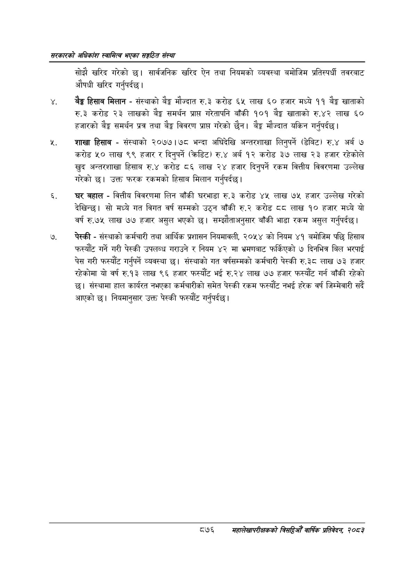

# Page 922 QA

## Rendered page


## Extracted text

```text
सरकारको अधिकांश स्वामित्व भएका सङ्गठित संस्था
सोझै खरिद गरेको छ। सार्वजनिक खरिद ऐन तथा नियमको व्यवस्था बमोजिम प्रतिस्पर्धी तवरबाट औषधी खरिद गर्नुपर्दछ |
बेङ्ग हिसाब मिलान -संस्थाको बैङ्क मौज्दात रु.३ करोड ६५ लाख ६० हजार मध्ये ११ बैङ्क खाताको रु.३ करोड २३ लाखको बेङ्ग समर्थन प्राप्त गरेतापनि बाँकी १०१ खाताको रु.४२ लाख ६० हजारको बेङ्ग समर्थन प्रत्र तथा बैङ्क विवरण प्राप्त गरेको छैन। बैङ्क मौज्दात यकिन गर्नुपर्दछ।
शाखा हिसाब -संस्थाको २०७७।७८ भन्दा अघिदेखि अन्तरशाखा लिनुपर्ने (डेबिट) रु.४ अर्ब ७ करोड ५० लाख ९९ हजार र दिनुपर्ने (क्रेडिट) रु.४ अर्ब १२ करोड ३७ लाख ३ हजार रहेकोले खुद अन्तरशाखा हिसाब रु.४ करोड ८६ लाख २४ हजार दिनुपर्ने रकम वित्तीय विवरणमा उल्लेख गरेको | उक्त फरक रकमको हिसाब मिलान गर्नुपर्दछ।
घर बहाल -वित्तीय विवरणमा लिन बाँकी घरभाडा रु.३ करोड ४५ लाख ७५ हजार उल्लेख गरेको देखिन्छ। सो मध्ये गत विगत वर्ष सम्मको उठ्न बाँकी रु.२ करोड ६६ लाख १० हजार मध्ये यो वर्ष रु.७५ लाख ७७ हजार असुल भएको | सम्झौताअनुसार बाँकी भाडा रकम असुल गर्नुपर्दछ |
पेस्की -संस्थाको कर्मचारी तथा आर्थिक प्रशासन नियमावली, २०५४ को नियम ४१ बमोजिम पछि हिसाब फस्यौट गर्ने गरी पेस्की उपलब्ध गराउने र नियम ४२ मा भ्रमणबाट फर्किएको ७ दिनभित्र बिल भरपाई पेस गरी फस्यौट गर्नुपर्ने व्यवस्था छ। संस्थाको गत वर्षसम्मको कर्मचारी पेस्की रु.३८ लाख ७३ हजार रहेकोमा यो वर्ष रु.१३ लाख ९६ हजार फस्यौट भई रु.२४ लाख ७७ हजार फस्यौट गर्न बाँकी रहेको छ। संस्थामा हाल कार्यरत नभएका कर्मचारीको समेत पेस्की रकम फस्यौट नभई हरेक वर्ष जिम्मेवारी सदै आएको छ। नियमानुसार उक्त पेस्की फस्यौट गर्नुपर्दछ।
८७६ सहालेखापरीक्षकको बिदिओँ वार्षिक प्रतिवेदन २०८२
```

## Flags
- None
