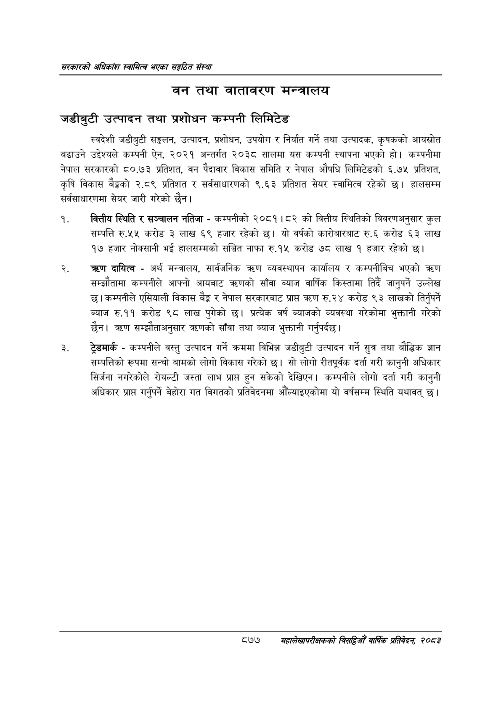

# Page 923 QA

## Rendered page


## Extracted text

```text
सरकारको अधिकांश स्वामित्व भएका सङ्गठित संस्था
नन तथा वातावरण मन्त्रालय
जडीबुटी उत्पादन तथा प्रशोधन कम्पनी लिमिटेड
स्वदेशी जडीबुटी सङ्कलन, उत्पादन, प्रशोधन, उपयोग र निर्यात गर्ने तथा उत्पादक, कृषकको आयस्रोत बढाउने उद्देश्यले कम्पनी ऐन, २०२१ अन्तर्गत २०३८ सालमा यस कम्पनी स्थापना भएको हो। कम्पनीमा नेपाल सरकारको ८०.७३ प्रतिशत, वन पैदावार विकास समिति र नेपाल औषधि लिमिटेडको ६.७५ प्रतिशत, कृषि विकास बैङ्कको २.८९ प्रतिशत र सर्वसाधारणको ९.६३ प्रतिशत सेयर स्वामित्व रहेको छ। हालसम्म सर्वसाधारणमा सेयर जारी गरेको छैन।
वित्तीय स्थिति र सञ्चालन नतिजा -कम्पनीको २०८१।८२ को वित्तीय स्थितिको विवरणअनुसार कुल सम्पत्ति रु.५५ करोड ३ लाख ६९ हजार रहेको छ। यो वर्षको कारोबारबाट रु.६ करोड ३ लाख १७ हजार नोक्सानी भई हालसम्मको सञ्चित नाफा रु.१५ करोड ७८ लाख १ हजार रहेको छ।
दायित्व -अर्थ मन्त्रालय, सार्वजनिक त्रहण व्यवस्थापन कार्यालय र कम्पनीबिच भएको सम्झौतामा कम्पनीले आफ्नो आयबाट क्रणको साँवा ब्याज वार्षिक किस्तामा तिर्दै जानुपर्ने उल्लेख छ। कम्पनीले एसियाली विकास बैङ्क र नेपाल सरकारबाट प्राप्त रु.२४ करोड ९३ लाखको तिर्नुपर्ने ब्याज रु.११ करोड ९८ लाख पुगेको छ। प्रत्येक वर्ष ब्याजको व्यवस्था गरेकोमा भुक्तानी गरेको छैन। ) सम्झौताअनुसार त्ररणको साँवा तथा ब्याज भुक्तानी गर्नुपर्दछ।
ट्रेडमार्क -कम्पनीले वस्तु उत्पादन गर्ने क्रममा विभिन्न जडीबुटी उत्पादन गर्ने सुत्र तथा वौद्धिक ज्ञान सम्पत्तिको रूपमा सन्चो बामको लोगो विकास गरेको छ। सो लोगो रीतपूर्वक दर्ता गरी कानुनी अधिकार सिर्जना नगरेकोले रोयल्टी जस्ता लाभ प्राप्त हुन सकेको देखिएन। कम्पनीले लोगो दर्ता गरी कानुनी अधिकार प्राप्त गर्नुपर्ने बेहोरा गत विगतको प्रतिवेदनमा औंल्याइएकोमा यो वर्षसम्म स्थिति यथावत्‌ छ।
८७७ महालेखापरीक्षकको बिद्या वाषिकि प्रतिवेदन २०८२
```

## Flags
- None
