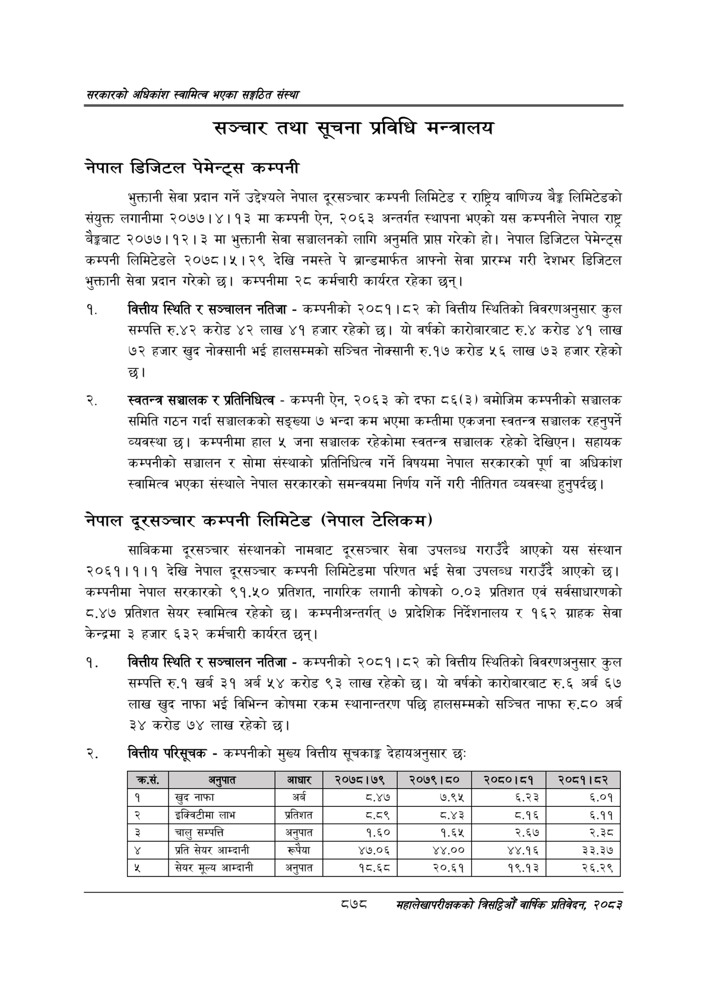

# Page 924 QA

## Rendered page


## Extracted text

```text
सरकारको अधिकांश स्वामित्व भएका सङ्गठित संस्था
सञ्चार तथा सूचना प्रविधि मन्त्रालय
नेपाल डिजिटल पेमेन्ट्स कम्पनी
भुक्तानी सेवा प्रदान गर्ने उद्देश्यले नेपाल दूरसञ्चार कम्पनी लिमिटेड र राष्ट्रिय वाणिज्य बेङ्ग लिमिटेडको संयुक्त लगानीमा २०७७।४। ९३ मा कम्पनी ऐन, २०६३ अन्तर्गत स्थापना भएको यस कम्पनीले नेपाल राष्ट्र बैङ्कबाट २०७७।१२। ३ मा भुक्तानी सेवा सञ्चालनको लागि अनुमति प्राप्त गरेको हो। नेपाल डिजिटल पेमेन्ट्स कम्पनी लिमिटेडले २०७८।५।२९ देखि नमस्ते पे ब्रान्डमार्फत आफ्नो सेवा प्रारम्भ गरी देशभर डिजिटल भुक्तानी सेवा प्रदान गरेको | कम्पनीमा २८ कर्मचारी कार्यरत रहेका छन्‌।
वित्तीय स्थिति र सञ्चालन नतिजा -कम्पनीको २०८१।८२ को वित्तीय स्थितिको विवरणअनुसार कुल सम्पत्ति रु.४२ करोड ४२ लाख ४१ हजार रहेको छ। यो वर्षको कारोबारबाट रु.४ करोड ४१ लाख ७२ हजार खुद नोक्सानी भई हालसम्मको सञ्चित नोक्सानी रु.१७ करोड ५६ लाख ७३ हजार रहेको छ।
स्वतन्त्र सञ्चालक र प्रतिनिधित्व -कम्पनी ऐन, २०६३ को दफा ८६(३) बमोजिम कम्पनीको सञ्चालक समिति गठन गर्दा सञ्चालकको सङ्ख्या ७ भन्दा कम भएमा कम्तीमा एकजना स्वतन्त्र सञ्चालक रहनुपर्ने व्यवस्था | कम्पनीमा हाल ५ जना सञ्चालक रहेकोमा स्वतन्त्र सञ्चालक रहेको देखिएन। सहायक कम्पनीको सञ्चालन र सोमा संस्थाको प्रतिनिधित्व गर्ने विषयमा नेपाल सरकारको पूर्ण वा अधिकांश स्वामित्व भएका संस्थाले नेपाल सरकारको समन्वयमा निर्णय गर्ने गरी नीतिगत व्यवस्था हुनुपर्दछ |
नेपाल दूरसञ्चार कम्पनी लिमिटेड (निपाल टेलिकम)
साबिकमा दूरसञ्चार संस्थानको नामबाट दूरसञ्चार सेवा उपलब्ध गराउँदै आएको यस संस्थान २०६१।१।१ देखि नेपाल दूरसञ्चार कम्पनी लिमिटेडमा परिणत भई सेवा उपलब्ध गराउँदै आएको छ। कम्पनीमा नेपाल सरकारको ९१.५० प्रतिशत, नागरिक लगानी कोषको ०.०३ प्रतिशत एवं सर्वसाधारणको ८.४७ प्रतिशत सेयर स्वामित्व रहेको छ। कम्पनीअन्तर्गत्‌ ७ प्रादेशिक निर्देशनालय र १६२ ग्राहक सेवा केन्द्रमा ३ हजार ६३२ कर्मचारी कार्यरत छन्‌।
वित्तीय स्थिति र सञ्चालन नतिजा -कम्पनीको २०८१।८२ को वित्तीय स्थितिको विवरणअनुसार कुल सम्पत्ति रु.१ खर्ब ३१ अर्ब ५४ करोड ९३ लाख रहेको छ। यो वर्षको कारोबारबाट रु.६ अर्ब ६७ लाख खुद नाफा भई विभिन्न कोषमा रकम स्थानान्तरण पछि हालसम्मको सञ्चित नाफा रु.८० अर्ब ३४ करोड ७४ लाख रहेको छ।
वित्तीय परिसूचक -कम्पनीको मुख्य वित्तीय सूचकाङ्ग देहायअनुसार छः:
८७८
महालेखापरीक्षकको बिद्या वाषिकि प्रतिवेदन २०८२

| क्रस.   | अनुपात             | आधार    | २०७८।७९   | २०७९।८०   |   २०८०।८१ |   २०८१।८२ |
|---------|--------------------|---------|-----------|-----------|-----------|-----------|
| १       | खुद नाफा           | अर्ब    | AL        | ७.९५      |      ६.२३ |      ६.०१ |
| २       | इक्विटीमा लाभ      | प्रतिशत | द.व९      | ठ.४३      |      ८.१६ |      ६.११ |
| 3       | चालु सम्पत्ति      | अनुपात  | १.६०      | १.६५      |      २.६७ |      २.३८ |
| ¥       | प्रति सेयर आम्दानी | रूपैया  | ४७.०६     | ४४.००     |     ४४.१६ |     ३३.३७ |
| %       | सेयर मूल्य आम्दानी | अनुपात  | १८.६८     | २०.६१     |     १९.१३ |     २६.२९ |
```

## Flags
- table_page
